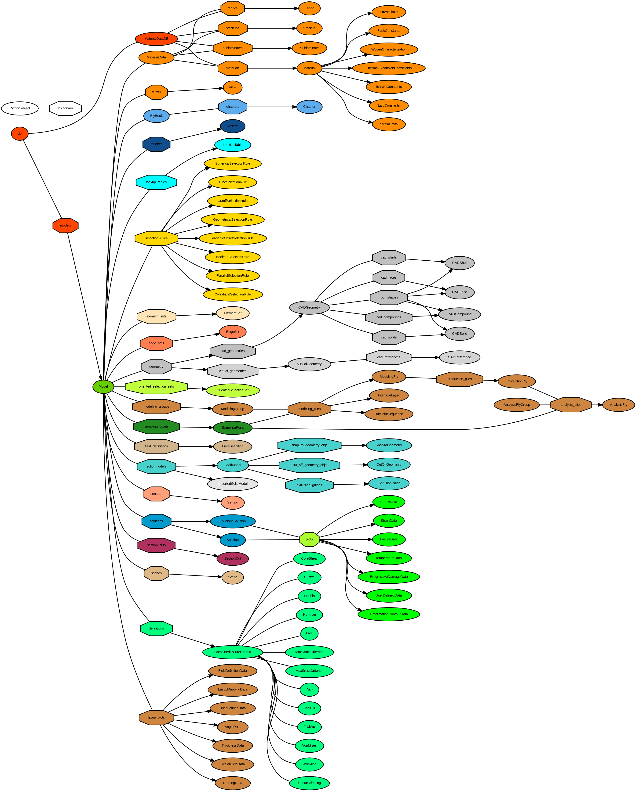

# ShowWindow

## Description

This function allows you to display the Speos Core window.

## Syntax

*object*.ShowWindow\(Int nShowWindow\) As Int

- *object*: SPEOSCore
- *Int nShowWindow*: 1 to show the window, 0 to hide it
- Int return: returns 0 if succeeded

## Example

```ironpython
from System import Type, Activator

#Creates SPEOSCore COM server
type = Type.GetTypeFromProgID("SV5.document")
SPEOSCore = Activator.CreateInstance(type)

#Shows SPEOSCore interface
retval = SPEOSCore.ShowWindow(1)
```

|   Decimal | Binary   | Applied Surfaces   | Applied Surfaces   | Applied Surfaces   | Applied Surfaces   | Applied Surfaces   | Applied Surfaces   |
|-----------|----------|--------------------|--------------------|--------------------|--------------------|--------------------|--------------------|
|         1 | 0b000001 |                    |                    |                    |                    |                    | XMIN               |
|        42 | 0b101010 | ZMAX               |                    | YMAX               |                    | XMAX               |                    |
|        63 | 0b111111 | ZMAX               | ZMIN               | YMAX               | YMIN               | XMAX               | XMIN               |


Since the purpose of this example is to demonstrate the use of Participant
Library APIs for a transient analysis, a simple damping force solver will be
used to couple with Mechanical via System Coupling. This solver receives nodal
displacements $\vec{X}$ from Mechanical and calculates the damping force
$\vec{F}$ using the following formula:

$$
\vec{F} = - c \frac{d\vec{X}}{dt}
$$


