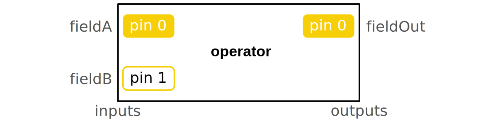
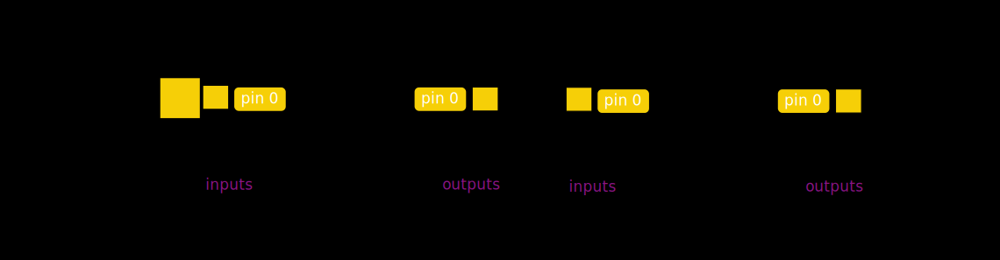

The Operator is the only object used to create and transform the data. It can be seen as an integrated circuit in electronics with a range of pins in input and in output. When the operator is evaluated, it will process the input information to compute its output with respect to its description. The operator is made of:

- Inputs: the input pins allow the user to pass on their data to the operator. DPF data container types, standard types or operators' outputs can be connected on the input pins (connecting an operator output to another operator input doesn't evaluate this input operator). The inputs allow the user to choose the time/frequencies on which to evaluate a result, to specify the files where to find a result, to provide a field on which they want an operation to be computed... Optional input pins to customize even more the operator outputs. Here are some of the most common pins:

    | Input | Name | Expected type(s) | Description |
    |---|---|---|---|
    |<strong>Pin 0</strong>  Required|fields|[`field`](/docs/dpf/dpf-framework/core-concepts/dpf-types), [`fields_container`](/docs/dpf/dpf-framework/core-concepts/dpf-types)| Field(s) containing the data to transform|
    |<strong>Pin 0</strong>  Required|time_scoping|[`scoping`](/docs/dpf/dpf-framework/core-concepts/dpf-types), [`vector`](/docs/dpf/dpf-framework/core-concepts/dpf-types), [`int`](/docs/dpf/dpf-framework/core-concepts/dpf-types), [`double`](/docs/dpf/dpf-framework/core-concepts/dpf-types), [`field`](/docs/dpf/dpf-framework/core-concepts/dpf-types)| Time freq set or time/frequencies needed in output. The sets are ids from 1 to the number of time/freq|
    |pin 1|mesh_scoping|[`scoping`](/docs/dpf/dpf-framework/core-concepts/dpf-types), [`scopings_container`](/docs/dpf/dpf-framework/core-concepts/dpf-types)|Mesh node or elements needed in output|
    |<strong>Pin 4</strong>  Required|data_sources|[`data_sources`](/docs/dpf/dpf-framework/core-concepts/dpf-types)| List of file paths indicating where the data is|
    |<strong>Pin 3</strong>  Required|streams_container|[`streams_container`](/docs/dpf/dpf-framework/core-concepts/dpf-types)| List of files allowed to stay open to cache some data. A result provider needs either a streams_container or a data_sources|
    |pin 7|mesh| [`meshed_region`](/docs/dpf/dpf-framework/core-concepts/dpf-types), [`meshes_container`](/docs/dpf/dpf-framework/core-concepts/dpf-types)| Mesh(es) supporting the results or mesh(es) to transform|

- Configurations: with configurations the user can optionally choose how the operator will run. This is an advanced feature used for deep customization. The different options can change the way loops are done, it can change whether the operator needs to make checks on the input or not... Here are some of the most common configuration options:

    | Name| Expected type(s) |  Description |
    |---|---|---|
    |[`binary_operation`](/docs/dpf/dpf-framework/core-concepts/operator-configurations)|(enum dataProcessing::EBinaryOperation , [`int32`](/docs/dpf/dpf-framework/core-concepts/dpf-types))| This option allows to choose how two inputs will be treated together. Intersection (0) means that the output will only contain the entities shared by all the inputs. Union (1) means that the output will contain all the entities contained in at least one of the inputs.|
    |[`incremental`](/docs/dpf/dpf-framework/core-concepts/operator-configurations)|[`bool`](/docs/dpf/dpf-framework/core-concepts/dpf-types)| This operator can be run several times with different inputs so that the output will take all the inputs of the different runs into account. It can be used to save memory. For example, a large time scoping can be split in smaller ranges of time to compute the result range by range.|
    |[`inplace`](/docs/dpf/dpf-framework/core-concepts/operator-configurations)|[`bool`](/docs/dpf/dpf-framework/core-concepts/dpf-types)| The output is written over the input to save memory if this config is set to true.|
    |[`mutex`](/docs/dpf/dpf-framework/core-concepts/operator-configurations)|[`bool`](/docs/dpf/dpf-framework/core-concepts/dpf-types)| If this option is set to true, the shared memory is prevented from being simultaneously accessed by multiple threads.|
    |[`num_threads`](/docs/dpf/dpf-framework/core-concepts/operator-configurations)|[`int32`](/docs/dpf/dpf-framework/core-concepts/dpf-types)| Number of threads to use to run in parallel.|
    |[`permissive`](/docs/dpf/dpf-framework/core-concepts/operator-configurations)|[`bool`](/docs/dpf/dpf-framework/core-concepts/dpf-types)| If this option is set to true, warning checks (like unit or data sizes) won't be done.|
    |[`read_inputs_in_parallel`](/docs/dpf/dpf-framework/core-concepts/operator-configurations)|[`bool`](/docs/dpf/dpf-framework/core-concepts/dpf-types)| If this option is set to true, the operator's inputs will be evaluated in parallel.|
    |[`run_in_parallel`](/docs/dpf/dpf-framework/core-concepts/operator-configurations)|[`bool`](/docs/dpf/dpf-framework/core-concepts/dpf-types)| Loops are allowed to run in parallel if the value of this config is set to true.|
    |[`use_cache`](/docs/dpf/dpf-framework/core-concepts/operator-configurations)|[`bool`](/docs/dpf/dpf-framework/core-concepts/dpf-types)| Some intermediate data is put in cache if this config is set to true. This option can reduce computation time after the first run.|
    |[`work_by_index`](/docs/dpf/dpf-framework/core-concepts/operator-configurations)|[`bool`](/docs/dpf/dpf-framework/core-concepts/dpf-types)| If this option is set to true, loops and comparisons by entity will be done by index instead of ids.|

- Data transformation: this is the internal operation that will occur when an operator is evaluated. The operation will return outputs depending on the inputs and configurations given by the user. The operation applied by each operator is described in its description.

- Outputs: this is the results of the operation. An Operator can have one or several outputs which are usually DPF data containers.

Operators can be chained together to create workflows. To do so, the user only needs to connect some operator's outputs to another operator's inputs. With workflows, lazy evaluation is performed, which means that when the last operator's outputs are asked by the user, all the connected operators will also be evaluated (and not before) to compute a given result. All the inputs, outputs and description information can be found by clicking on operators on the left panel of this documentation.

## Workflow

The workflow is built by chaining operators. It will evaluate the data processing defined by the used operators. It needs input information, and it will compute the requested output information. The workflow is used to create a black box computing more or less basic transformation of the data. The different operators contained by a workflow can be internally connected together so that the end user doesn't need to be aware of its complexity. The workflow only needs to expose the necessary input pins and output pins. For example, a workflow could expose a "time scoping" input pin and a "data sources" input pin and expose a "result" output pin and have very complex routines inside it. See workflows' examples in the APIs tab.

