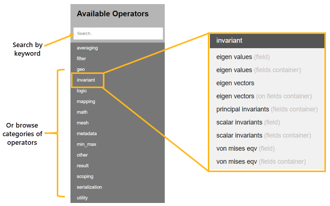

# How to interact with data in DPF

Now that you understand how data is organized in DPF (fields, scopings, supports, and collections), you need to learn how to manipulate it. DPF provides two main tools for working with data: **operators** for individual transformations and **workflows** for automated processing pipelines.

## Understanding operators

### What is an operator

An **operator** is a function that takes input data, performs a specific operation on it, and produces output data. Operators are the building blocks for all data processing in DPF.

**Why operators matter**: Instead of writing custom code to manipulate fields, meshes, or other DPF objects, you use pre-built operators that handle common tasks efficiently. Operators are optimized, tested, and designed to work seamlessly with DPF's data structures.

**Real-world analogy**: Think of operators like tools in a workshop. A drill performs one specific task (making holes), a saw performs another (cutting). Each tool (operator) takes input (material), performs an operation (drilling, cutting), and produces output (modified material). You don't build the tools yourself, you use the right tool for each job.

### How operators work

Every operator follows the same pattern:


1. **Inputs**: Data you provide to the operator (fields, meshes, parameters)
2. **Processing**: The operation performed on the input data
3. **Outputs**: Results produced by the operator

**Input and output types**:
- DPF data structures (Field, FieldsContainer, MeshedRegion, Scoping, etc.)
- Standard Python types (int, float, string, list)
- Outputs from other operators (enabling operator chaining)

### Types of operators by purpose

Operators are organized into categories based on what they do.
Here are a few category examples:

| Category | Purpose | Examples |
|----------|---------|----------|
| **Result operators** | Extract results from files | `displacement`, `stress`, `temperature` |
| **Math operators** | Perform mathematical operations | `add`, `scale`, `dot`, `norm` |
| **Filter operators** | Select subsets of data | `scoping::rescope`, `time_freq_scoping_provider` |
| **Averaging operators** | Average data across entities | `elemental_nodal_to_nodal`, `to_elemental` |
| **Utility operators** | Data conversion and manipulation | `field_to_vtk`, `serializer`, `merge::fields_container` |
| **Mesh operators** | Work with mesh geometry | `mesh_provider`, `nodes_provider`, `elements_provider` |

### Finding operators

DPF provides hundreds of operators. You can explore them in the [Operators Reference](https://developer.ansys.com/docs/dpf-framework-2026-r1/operator-specifications/operator-specifications.md) documentation.

**How to find the right operator**:
1. **Search by keyword**: Use the top-right search box (e.g., "average", "displacement", "extract"). Filter on **Structures** and **Developer Portal** as well as your installation **Version**.
2. **Browse by category**: Look through categories like "math", "result", "averaging"
3. **Read operator descriptions**: Each operator page explains inputs, outputs, and usage



### Using an operator

Using an operator involves three steps:

#### Step1: Instantiate the operator

Create an instance of the operator you want to use:

```python
from ansys.dpf import core as dpf
from ansys.dpf.core import operators as ops

# Create a displacement operator
displacement_op = ops.result.displacement()
```

#### Step2: Connect inputs

Provide the required input data to the operator:

```python
from ansys.dpf.core import DataSources, examples

# Create a DataSources object pointing to the result file
data_sources = DataSources(examples.find_simple_bar())

# Connect inputs to the displacement operator
displacement_op.inputs.data_sources(data_sources)
displacement_op.inputs.time_scoping([1])  # Get results for time step 1
```

**How inputs work**: Each operator has named input pins (like `data_sources`, `time_scoping`, `mesh_scoping`). You connect data to these pins using the `inputs` attribute.

## The Operator API
Python makes connecting inputs simple by providing named properties like `inputs.data_sources()` and `inputs.time_scoping()`. This is a Python-specific convenience feature.

The underlying C++ API uses a more direct approach: `operator.connect(pin_number, object)`, where you specify the pin number (0, 1, 2, etc.) instead of a name. For example:

```cpp
// C++ approach
displacement_op.connect(0, data_sources);  // Pin 0 = data_sources
displacement_op.connect(1, time_scoping);  // Pin 1 = time_scoping
```

Python hides this detail, making the code more readable and self-documenting. When you write `inputs.data_sources()`, Python automatically uses the correct pin number behind the scenes.

**Using raw pin numbers in Python**: You can also use the pin number approach directly in Python by calling `operator.connect(pin_number, object)`. This is useful when:

- Working with operators that don't have a Python wrapper
- The Python wrapper hasn't been updated to expose a new pin
- You're porting C++ code to Python and want to match the structure

```python
# Python using pin numbers (works the same as named properties)
displacement_op.connect(0, data_sources)  # Same as inputs.data_sources()
displacement_op.connect(1, [1])           # Same as inputs.time_scoping([1])
```

You can find pin numbers and names in the [Operators Reference](https://developer.ansys.com/docs/dpf-framework-2026-r1/operator-specifications/operator-specifications.md) documentation for each operator.

#### Step3: Evaluate and get outputs

Execute the operator and retrieve results:

```python
# Evaluate the operator to get output
displacement_fc = displacement_op.outputs.fields_container()

# Display the result
print(displacement_fc)
```

### Complete operator example

Here's a full example that uses the `norm` operator to calculate displacement magnitudes:

```python
from ansys.dpf.core import DataSources, examples
from ansys.dpf.core import operators as ops

# Create DataSources and get displacement using result operator
data_sources = DataSources(examples.find_simple_bar())

# Use displacement result operator
displacement_op = ops.result.displacement()
displacement_op.inputs.data_sources(data_sources)
displacement_fc = displacement_op.outputs.fields_container()

# Create a norm operator to compute displacement magnitude
norm_op = ops.math.norm()

# Connect the first displacement Field as input
# Note: norm takes a Field, not a FieldsContainer
norm_op.inputs.field(displacement_fc[0])

# Evaluate to get magnitude results
magnitude_field = norm_op.outputs.field()

# Display results
print("Original displacement (vector with 3 components):")
print(f"  Components: {displacement_fc[0].component_count}")
print(f"  First node data: {displacement_fc[0].get_entity_data(0)}")

print("\nDisplacement magnitude (scalar with 1 component):")
print(f"  Components: {magnitude_field.component_count}")
print(f"  First node data: {magnitude_field.get_entity_data(0)}")
print(f"  Max value: {magnitude_field.data.max():.6e}")  # .data returns a NumPy array
```

**Expected output**:
```
Original displacement (vector with 3 components):
  Components: 3
  First node data: [[-1.22753781e-08 -1.20861254e-06 -5.02681396e-06]]

Displacement magnitude (scalar with 1 component):
  Components: 1
  First node data: [5.17008254e-06]
  Max value: 5.17008254e-06
```

**What this shows**: The `norm` operator took a vector field (3 components: X, Y, Z) and produced a scalar field (1 component: magnitude). This is a common pattern: operators transform data from one form to another.

### Operator input/output patterns

Understanding common operator patterns helps you chain them together effectively:

| Input → Output | Example operator | Use case |
|---------------|------------------|----------|
| DataSources → FieldsContainer | `result.displacement` | Extract results from files |
| DataSources → MeshedRegion | `mesh.mesh_provider` | Extract mesh from files |
| FieldsContainer → FieldsContainer | `math.add`, `math.scale` | Transform existing fields |
| FieldsContainer → Field | `min_max::min_max_fc` | Reduce multiple fields to one |
| Field → float | `min_max::min_max` | Get single values from fields |
| MeshedRegion + Scoping → MeshedRegion | `mesh::from_scoping` | Extract mesh subsets |

### Common operators you'll use

Here are operators you'll encounter frequently:

**Result extraction**:
- `operators.result.displacement()`: Get displacement results
- `operators.result.stress()`: Get stress results
- `operators.result.strain()`: Get strain results

**Mesh extraction**:
- `operators.mesh.mesh_provider()`: Get mesh data

**Mathematical operations**:
- `operators.math.add()`: Add two fields
- `operators.math.scale()`: Multiply field by scalar
- `operators.math.norm()`: Calculate the magnitude of each entity in a single Field
- `operators.math.norm_fc()`: Calculate the magnitude of each entity for all fields in a FieldsContainer

**Min/Max extraction**:
- `operators.min_max.min_max_fc()`: Find the minimum and maximum over all fields in a FieldsContainer - exposes two Field outputs: `outputs.field_min` and `outputs.field_max`

**Filtering and scoping**:
- `operators.scoping.rescope()`: Extract data for specific entities
- `operators.averaging.elemental_nodal_to_nodal()`: Average ElementalNodal to Nodal

**Utility**:
- `operators.serializer.serialize_to_hdf5()`: Export data to HDF5
- `operators.utility.forward()`: Pass data through unchanged (useful in workflows)

## Understanding workflows

### What is a workflow

A **workflow** is a collection of operators chained together to perform a multi-step data processing pipeline. Workflows automate complex analysis tasks by connecting the output of one operator to the input of another.

**Why workflows matter**: Real-world analysis tasks rarely involve just one operation. You might need to extract results, filter specific entities, average values, and compute magnitudes—all in sequence. Workflows let you build these pipelines once and reuse them with different data sources.

**Real-world analogy**: Think of an assembly line in a factory. Raw materials enter at one end, pass through multiple workstations (each performing a specific task), and finished products emerge at the other end. Each workstation is like an operator, and the entire assembly line is the workflow.

### How workflows work

Workflows are created by connecting operators together. The output of one operator becomes the input of the next:


**Key insight**: A workflow is itself like a single operator: it has inputs (data sources, parameters) and outputs (processed results). The internal operator chain is hidden, making workflows reusable components. You can think of those as packaging for your analysis process.

### Workflow example: Total deformation

Here's a concrete example showing how operators connect to calculate total deformation (displacement magnitude):


**What this workflow does**:
1. **displacement operator**: Extracts displacement field from result file (vector with X, Y, Z components)
2. **norm operator**: Calculates magnitude of displacement vector (scalar representing total deformation)

**Result**: A FieldsContainer with total deformation values at each node.

### Creating a workflow

You can create workflows in two ways:

#### Method 1: Explicit workflow object

Create a `Workflow` object and add operators to it:

```python
from ansys.dpf.core import Workflow, operators as ops
from ansys.dpf.core import DataSources, examples, types

# Create a workflow
workflow = Workflow()

# Create operators
displacement_op = ops.result.displacement()
norm_op = ops.math.norm_fc()

# Chain the operators (connect displacement output to norm input)
norm_op.inputs.fields_container.connect(displacement_op.outputs.fields_container)

# Add operators to workflow
workflow.add_operators([displacement_op, norm_op])

# Expose workflow inputs and outputs using input pin objects
workflow.set_input_name("data_sources", displacement_op.inputs.data_sources)
workflow.set_input_name("time_scoping", displacement_op.inputs.time_scoping)
workflow.set_output_name("total_deformation", norm_op.outputs.fields_container)

# Now use the workflow
data_sources = DataSources(examples.find_simple_bar())
workflow.connect("data_sources", data_sources)
workflow.connect("time_scoping", [1])

# Get output
total_def = workflow.get_output("total_deformation", types.fields_container)
print(total_def)
```

## The `types` module
The second argument to `workflow.get_output()` (and operator output evaluation) tells DPF what Python type to return. Common values:

- `types.fields_container`: returns a `FieldsContainer`
- `types.field`: returns a single `Field`
- `types.meshed_region`: returns a `MeshedRegion`

Import it with `from ansys.dpf.core import types`.

#### Method 2: Implicit chaining

Chain operators directly without creating a workflow object:

```python
from ansys.dpf.core import DataSources, examples
from ansys.dpf.core import operators as ops

# Create DataSources
data_sources = DataSources(examples.find_simple_bar())

# Create and chain operators
displacement_op = ops.result.displacement()
displacement_op.inputs.data_sources(data_sources)
displacement_op.inputs.time_scoping([1])

# Connect displacement output to norm operator input
norm_op = ops.math.norm_fc()
norm_op.inputs.fields_container(displacement_op.outputs.fields_container)

# Evaluate the final operator in the chain
total_deformation = norm_op.outputs.fields_container()

print("Total deformation (magnitude):")
print(total_deformation[0])
```

**Expected output**:
```
Total deformation (magnitude):
DPF U Field
  Location: Nodal
  Unit: m
  81 entities
  Data: 1 components and 81 elementary data
```

**What this shows**: Method 2 is simpler for short workflows and scripting. Method 1 (explicit Workflow) is useful for complex workflows or when you want to save, share, or visualize a workflow.

### Inspecting a workflow

Once you have created a workflow, you can inspect its structure using these properties:

```python
# List the named inputs and outputs you defined
print(workflow.input_names)   # e.g. ['data_sources', 'time_scoping']
print(workflow.output_names)  # e.g. ['min_magnitude', 'max_magnitude']

# Get a full summary as a dictionary
info = workflow.info
print(info['operator_names'])  # e.g. ['U', 'norm_fc', 'min_max_fc']
print(info['input_names'])     # same as workflow.input_names
print(info['output_names'])    # same as workflow.output_names
```

**Visualizing a workflow**: You can export or display the workflow graph:

```python
# Export to Graphviz .dot format (viewable in VS Code with a Graphviz extension)
workflow.to_graphviz(path="my_workflow")

# Open an interactive visual diagram
# Requires Graphviz installed: Windows: choco install graphviz | Linux: sudo apt-get install graphviz | macOS: brew install graphviz
workflow.view()
```

### Benefits of workflows

**Reusability**: Build a Workflow object once, apply it to different models or time steps:
```python
from ansys.dpf.core import Workflow
from ansys.dpf.core import operators as ops

# Create reusable workflow
workflow = Workflow()

# Define operator chain
disp_op = ops.result.displacement()
norm_op = ops.math.norm_fc()
norm_op.inputs.fields_container.connect(disp_op.outputs.fields_container)

# Add operators to workflow
workflow.add_operators([disp_op, norm_op])

# Define workflow inputs and outputs using input pin objects
workflow.set_input_name("data_sources", disp_op.inputs.data_sources)
workflow.set_input_name("time_scoping", disp_op.inputs.time_scoping)
workflow.set_output_name("total_deformation", norm_op.outputs.fields_container)

# Use the same workflow with different inputs
data_sources_1 = DataSources("analysis1.rst")
workflow.connect("data_sources", data_sources_1)
workflow.connect("time_scoping", [1])
result1 = workflow.get_output("total_deformation", types.fields_container)

data_sources_2 = DataSources("analysis2.rst")
workflow.connect("data_sources", data_sources_2)
workflow.connect("time_scoping", [5])
result2 = workflow.get_output("total_deformation", types.fields_container)
```

**What this demonstrates**: The Workflow object allows you to define a processing pipeline once, then reuse it with different data sources and parameters without recreating the operator chain.

**Modularity**: Break complex analysis into manageable steps with clear input/output definitions.

**Efficiency**: DPF optimizes operator chains, executing them efficiently on the server.

**Shareability**: Save workflows to files and share them with colleagues or use them across different scripts.

### When to use workflows

Use workflows when you:
- Perform multi-step data processing repeatedly
- Need to apply the same analysis to different models
- Want to build reusable analysis templates
- Have complex processing pipelines with many operators

For simple, one-time operations, directly using a single operator is often sufficient.

## Exercises

Practice the core concepts of operators and workflows through these progressive exercises.

### Exercise 1: Use a single operator

Practice the basic three-step operator pattern: instantiate, connect inputs, get outputs.

Extract displacement results for time step 1 from the simple bar example (`examples.find_simple_bar()`) using the `result.displacement` operator. Display the resulting FieldsContainer to verify it worked.

<details>
<summary>Expand to see the solution</summary>

```python
from ansys.dpf.core import DataSources, examples
from ansys.dpf.core import operators as ops

# Step1: Instantiate the operator
displacement_op = ops.result.displacement()

# Step2: Connect inputs
data_sources = DataSources(examples.find_simple_bar())
displacement_op.inputs.data_sources(data_sources)
displacement_op.inputs.time_scoping([1])

# Step3: Get outputs
displacement_fc = displacement_op.outputs.fields_container()

# Verify the result
print("Displacement FieldsContainer:")
print(displacement_fc)
print(f"\nFirst field has {displacement_fc[0].component_count} components (X, Y, Z)")
print(f"First field has {len(displacement_fc[0].scoping)} entities (nodes)")
```

**Expected output**:
```
Displacement FieldsContainer:
DPF U Fields Container
  with 1 field(s)
  defined on labels: time

  with:
  - field 0 {time: 1} with Nodal location, 3 components and 81 entities.

First field has 3 components (X, Y, Z)
First field has 81 entities (nodes)
```

**What this demonstrates**: The fundamental operator usage pattern. Every operator follows these three steps regardless of complexity.

</details>

### Exercise 2: Chain two operators

Practice operator chaining by connecting one operator's output directly to another's input.

Extract displacement as in exercise 1, then compute its magnitude using the `math.norm_fc` operator. Display the magnitude field to verify it's now scalar (1 component) instead of vector (3 components).

<details>
<summary>Expand to see the solution</summary>

```python
from ansys.dpf.core import DataSources, examples
from ansys.dpf.core import operators as ops

# Create DataSources
data_sources = DataSources(examples.find_simple_bar())

# First operator: Extract displacement
displacement_op = ops.result.displacement()
displacement_op.inputs.data_sources(data_sources)
displacement_op.inputs.time_scoping([1])

# Second operator: Compute magnitude
# Connect first operator's output to second operator's input
norm_op = ops.math.norm_fc()
norm_op.inputs.fields_container(displacement_op.outputs.fields_container)

# Evaluate final operator
magnitude_fc = norm_op.outputs.fields_container()

# Verify the transformation
print("Original displacement (vector):")
print(f"  Components: {displacement_op.outputs.fields_container()[0].component_count}")

print("\nDisplacement magnitude (scalar):")
print(f"  Components: {magnitude_fc[0].component_count}")
print(f"  Max magnitude: {magnitude_fc[0].data.max():.6e} m")
```

**Expected output**:
```
Original displacement (vector):
  Components: 3

Displacement magnitude (scalar):
  Components: 1
  Max magnitude: 2.523683e-05 m
```

**What this demonstrates**: Chaining - connecting operator outputs to inputs directly. This is the simplest way to build multi-step workflows.

</details>

### Exercise 3: Create a workflow

Practice creating a reusable Workflow object with named inputs and outputs.

Build a workflow that computes displacement magnitude and finds its min/max values. The workflow should have:
- Named inputs: `"data_sources"` and `"time_scoping"`
- Named outputs: `"min_magnitude"` and `"max_magnitude"`
- Three operators chained: `displacement` → `norm_fc` → `min_max_fc`

<details>
<summary>Expand to see the solution</summary>

```python
from ansys.dpf.core import DataSources, examples, Workflow, types
from ansys.dpf.core import operators as ops

# Create a Workflow object
workflow = Workflow()

# Create three operators
displacement_op = ops.result.displacement()
norm_op = ops.math.norm_fc()
minmax_op = ops.min_max.min_max_fc()

# Chain them together
norm_op.inputs.fields_container(displacement_op.outputs.fields_container)
minmax_op.inputs.fields_container(norm_op.outputs.fields_container)

# Add operators to workflow
workflow.add_operators([displacement_op, norm_op, minmax_op])

# Define named inputs using input pin objects
workflow.set_input_name("data_sources", displacement_op.inputs.data_sources)
workflow.set_input_name("time_scoping", displacement_op.inputs.time_scoping)

# Define named outputs (min_max_fc exposes two separate Fields)
workflow.set_output_name("min_magnitude", minmax_op.outputs.field_min)
workflow.set_output_name("max_magnitude", minmax_op.outputs.field_max)

# Use the workflow
data_sources = DataSources(examples.find_simple_bar())
workflow.connect("data_sources", data_sources)
workflow.connect("time_scoping", [1])

# Get outputs using the named outputs
min_field = workflow.get_output("min_magnitude", types.field)
max_field = workflow.get_output("max_magnitude", types.field)

print("Workflow output - Min/Max displacement magnitude:")
print(f"  Minimum: {min_field.data[0]:.6e} m")
print(f"  Maximum: {max_field.data[0]:.6e} m")
```

**Expected output**:
```
Workflow output - Min/Max displacement magnitude:
  Minimum: 0.000000e+00 m
  Maximum: 2.523683e-05 m
```

**What this demonstrates**: Creating a Workflow object with named inputs and outputs. This makes workflows reusable, testable, and shareable across different scripts and models.

</details>

### Exercise 4: Visualize and reuse a workflow

Practice visualizing a workflow structure and reusing it with different inputs.

Take the workflow from Exercise 3 and:
1. Print its structure using `workflow.info` dictionary
2. Reuse it with a different time step (if you had multiple time steps)
3. Show how the same workflow can be applied repeatedly

<details>
<summary>Expand to see the solution</summary>

```python
from ansys.dpf.core import DataSources, examples, Workflow, types
from ansys.dpf.core import operators as ops

# Create the workflow (same as Exercise 3)
workflow = Workflow()

displacement_op = ops.result.displacement()
norm_op = ops.math.norm_fc()
minmax_op = ops.min_max.min_max_fc()

norm_op.inputs.fields_container(displacement_op.outputs.fields_container)
minmax_op.inputs.fields_container(norm_op.outputs.fields_container)

workflow.add_operators([displacement_op, norm_op, minmax_op])
workflow.set_input_name("data_sources", displacement_op.inputs.data_sources)
workflow.set_input_name("time_scoping", displacement_op.inputs.time_scoping)
workflow.set_output_name("min_magnitude", minmax_op.outputs.field_min)
workflow.set_output_name("max_magnitude", minmax_op.outputs.field_max)

# Visualize workflow structure
print("Workflow structure:")
print(f"  Input names: {workflow.input_names}")
print(f"  Output names: {workflow.output_names}")
print(f"  Number of operators: {len(workflow.info['operator_names'])}")

# Use the workflow with time step 1
data_sources = DataSources(examples.find_simple_bar())
workflow.connect("data_sources", data_sources)
workflow.connect("time_scoping", [1])

max_field = workflow.get_output("max_magnitude", types.field)
print(f"\nTime step 1 - Max magnitude: {max_field.data[0]:.6e} m")

# Reuse the same workflow with different time scoping
# (For simple_bar which has only 1 time step, this repeats the same result)
workflow.connect("time_scoping", [1])  # Still time step 1
max_field_again = workflow.get_output("max_magnitude", types.field)
print(f"Reused workflow - Max magnitude: {max_field_again.data[0]:.6e} m")

print("\nWorkflow reusability demonstrated:")
print("  ✓ Same workflow object used multiple times")
print("  ✓ Inputs can be changed without recreating operators")
print("  ✓ Named inputs/outputs make the workflow self-documenting")

# Export workflow to Graphviz format for visualization
workflow.to_graphviz(path="path_to_output")
# You can then open the Graphviz file in a visualizer such as VSCode

# Note: You can also use workflow.view() to open an interactive visualization
# This requires graphviz to be installed on your system:
#   - Windows: choco install graphviz
#   - Linux: sudo apt-get install graphviz
#   - macOS: brew install graphviz
# Then: workflow.view()
```

**Expected output**:
```
Workflow structure:
  Input names: ['data_sources', 'time_scoping']
  Output names: ['max_magnitude', 'min_magnitude']
  Number of operators: 3

Time step 1 - Max magnitude: 2.523683e-05 m
Reused workflow - Max magnitude: 2.523683e-05 m

Workflow reusability demonstrated:
  ✓ Same workflow object used multiple times
  ✓ Inputs can be changed without recreating operators
  ✓ Named inputs/outputs make the workflow self-documenting
```

**What this demonstrates**:
- Inspecting workflow structure using `workflow.info`, `workflow.input_names`, `workflow.output_names`
- Reusing the same workflow object with different inputs
- The benefit of workflows: define once, use many times
- Workflows are self-documenting through named inputs/outputs
- Exporting workflows to Graphviz format for documentation and visualization
- The `view()` method for interactive visualization (requires graphviz installation)

</details>

### Going further

Now that you understand operators and workflows, explore these advanced topics:

- **Operator reference**: Browse the complete [Operators Reference](https://dpf.docs.pyansys.com/version/stable/operator_reference.html) to discover more capabilities
- **Complex workflows**: See the [Operators Examples](https://dpf.docs.pyansys.com/version/stable/examples/00-basic/index.html) for advanced workflow patterns
- **Custom operators**: Learn how to create your own operators for specialized tasks in the [Custom Operators guide](https://dpf.docs.pyansys.com/version/stable/user_guide/custom_operators.html)
