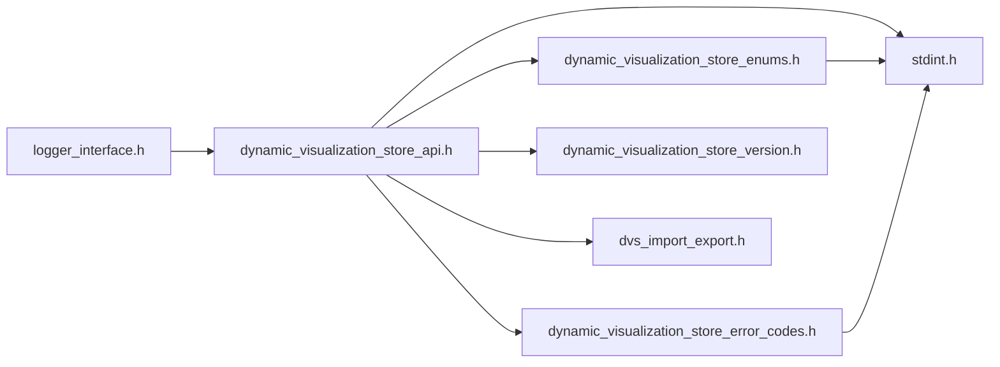
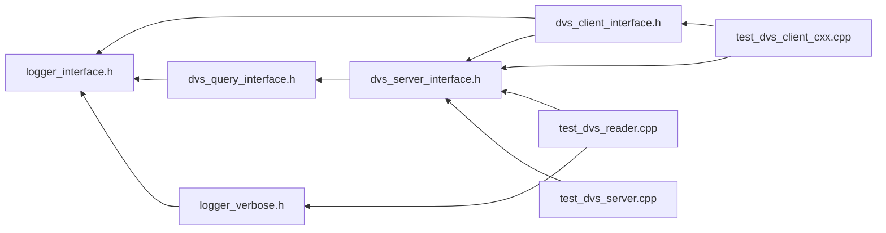

# File logger_interface.h

<a id="logger__interface_8h"></a>

![][C++]

Logger Interface Class.

## Classes

* [DVS::ILogger](../classes/class_d_v_s_1_1_i_logger.md)

## Namespaces

* [DVS](../namespaces/namespace_d_v_s.md)

## Includes

* [dynamic_visualization_store_api.h](dynamic__visualization__store__api_8h.md)



## Included by

* [dvs_client_interface.h](dvs__client__interface_8h.md)
* [dvs_query_interface.h](dvs__query__interface_8h.md)
* [logger_verbose.h](logger__verbose_8h.md)



## Source

```cpp
/*  *************************************************************
 *   Copyright 2018-2025 ANSYS, Inc.
 *   All Rights Reserved.
 *
 *        Restricted Rights Legend
 *
 *   Use, duplication, or disclosure of this
 *   software and its documentation by the
 *   Government is subject to restrictions as
 *   set forth in subdivision [(b)(3)(ii)] of
 *   the Rights in Technical Data and Computer
 *   Software clause at 52.227-7013.
 *  *************************************************************
 */

#ifndef ____DVS_LOGGER_INTERFACE_H____
#define ____DVS_LOGGER_INTERFACE_H____


#include "dynamic_visualization_store_api.h"

namespace DVS
{
class ILogger
{
public:
    ILogger() = default; 
    virtual ~ILogger() = default; 
    ILogger(ILogger&&) = default;  
    ILogger& operator=(ILogger&&) = default; 
    ILogger(const ILogger&) = default; 
    ILogger& operator=(const ILogger&) = default; 

    virtual void log(int type, const char* msg, ...) = 0;

    virtual void release() {};
};
}

#endif //____DVS_LOGGER_INTERFACE_H____
```

[C++]: https://img.shields.io/badge/language-C%2B%2B-blue (C++)