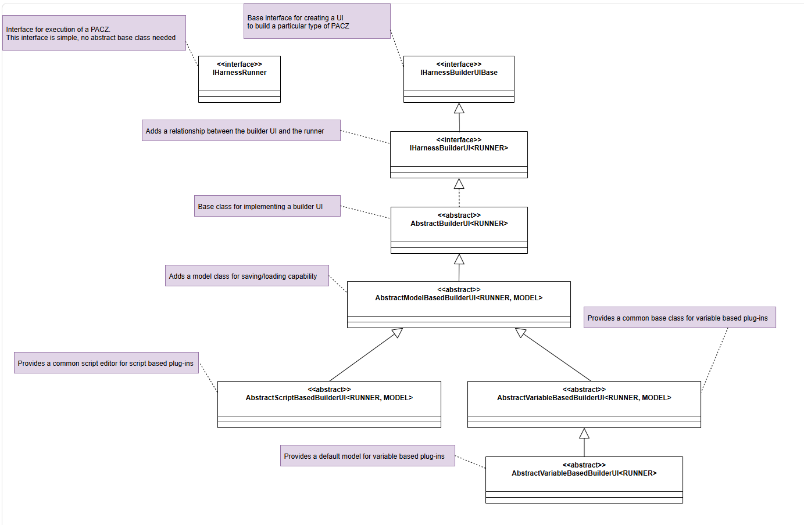

# APIs

- The main interfaces a plug-in must implement:

  - [`IHarnessRunner`](apidocs/Phoenix.ComponentAPI.IHarnessRunner.md)
  - [`IHarnessBuilderUI<RUNNER>`](apidocs/Phoenix.ComponentBuilderAPI.IHarnessBuilderUI-1.md)
- However, for the `BuilderUI` most plug-in writers will prefer to extend one of
  the abstract base class helpers in this SDK:

  - [`AbstractVariableBasedBuilderUI<RUNNER>`](apidocs/Phoenix.ComponentPlugInSDK.AbstractVariableBasedBuilderUI-1.md)
  - [`AbstractScriptBasedBuilderUI<RUNNER, MODEL>`](apidocs/Phoenix.ComponentPlugInSDK.AbstractScriptBasedBuilderUI-2.md)

Here is a class diagram of the interfaces and abstract base classes relevant for a plug-in developer:

