# Getting started

## Overview

This guide walks you through setting up your development environment and creating your first parametric analysis component zipped (PACZ) component plug-in. By the end of this guide, you'll have a working plug-in that you can test and extend.

For terminology used in this guide, please refer to the [Glossary](glossary.md).

## Getting started in .NET

Follow these steps in order. You do not need a Visual Studio solution open until you create a plug-in project.

The SDK zip also includes offline API reference HTML under `apidocs/`. For the latest API on the Developer Portal, see the [APIs](apis.md) page.

### Unzip the SDK and locate TestUI

1. Download and unzip the `PACZComponentPlugInSDK-*` package to a stable path on your development machine (for example, `C:\SDK\PACZComponentPlugInSDK-26.1.1`).
1. Note the location of the `TestUI` folder, which contains `TestUI.exe`. This location is later referred to as `[TestUI_Install_Directory]`.<br>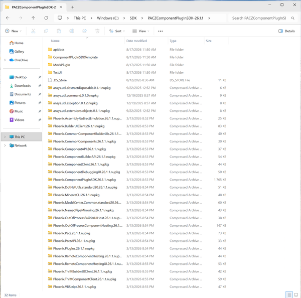

**What's in the zip**

| Item | Location | Purpose |
|------|----------|---------|
| NuGet packages | Root of unzipped folder (`.nupkg` files) | `Phoenix.ComponentPlugInSDK` and dependencies |
| TestUI | `TestUI\` | Local plug-in smoke-test host |
| VSIX wizard | `ComponentPlugInSDKTemplate\Phoenix.ComponentPlugInSDKTemplateWizard.vsix` | Visual Studio project template |
| MockPlugIn | `MockPlugIn\` | Prebuilt sample plug-in for quick verification |
| Offline API | `apidocs\` | Bundled HTML API reference (Dev Portal has the live Markdown API) |

**NOTE**: TestUI is not a production tool. It was written quickly and does not follow the standard software process, so it can behave unexpectedly. However, many developers still find it useful for local testing.

### Optionally install the PACZ component plug-in wizard for Visual Studio

1. Requires **Visual Studio 2022** (Community, Pro, or Enterprise). The wizard should install on typical amd64 machines; we have verified installation on **Visual Studio 2022 Pro**.<br>Other 2022 editions should work but are not yet verified. Support for Visual Studio 2019 is also not confirmed. Versions newer than Visual Studio 2022 have not been tested.
2. In the unzipped SDK folder, open the `ComponentPlugInSDKTemplate` folder.<br>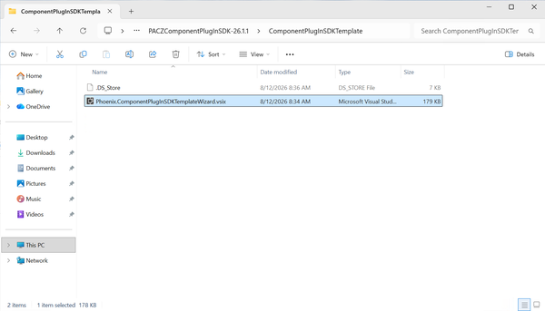
3. Double-click `Phoenix.ComponentPlugInSDKTemplateWizard.vsix`.<br>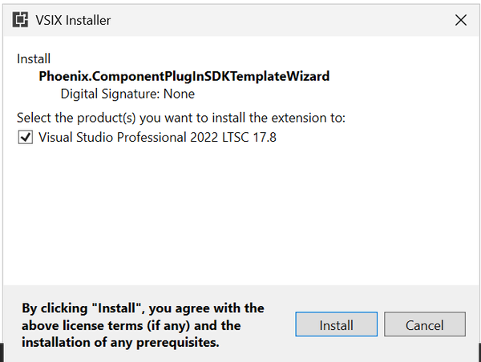
4. Complete the VSIX installer wizard and restart Visual Studio if prompted.<br>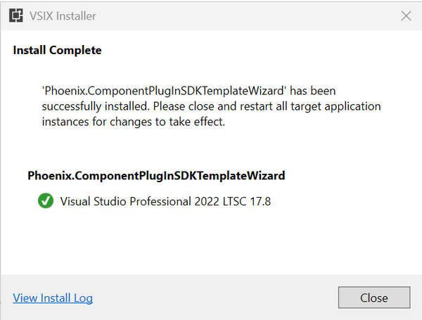

The wizard creates a stub plug-in project ready to implement. If you do not use the wizard, start from a [downloadable sample project](examples.md#downloadable-sample-project) or the code patterns on the [Examples](examples.md) page.

### Configure Visual Studio to use the NuGet repository

This step is **required** whether or not you installed the VSIX wizard. Configure a **global** package source before you create a project (or open a sample). You do not need a solution open for these steps.

The **Optional** `nuget.config` snippet below is only an alternative to **Tools → Options**; it does not replace adding a package source.

1. In Visual Studio, select **Tools → NuGet Package Manager → Package Manager Settings**.
1. Select **Package Sources**.
1. Click **+** to add a new source.
1. Set **Source** to the folder that contains the `.nupkg` files at the **root** of your unzipped `PACZComponentPlugInSDK-*` directory.
1. Set **Name** to a descriptive label (for example, `PACZ SDK packages`).
1. Press the "Update" button.
1. Click **OK**.<br>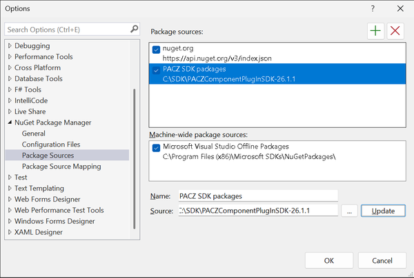
1. The new package source is added:<br>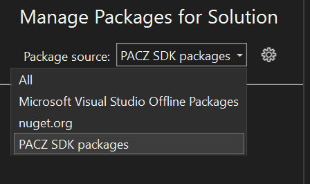

The **Pacz Plug-In Template** already includes a package reference to the SDK. You do not need to add it manually when you use the wizard:

```xml
<PackageReference Include="Phoenix.ComponentPlugInSDK" Version="26.1.1" />
```

**Optional:** Add a `nuget.config` file in your project or solution folder instead of using Visual Studio settings:

```xml
<?xml version="1.0" encoding="utf-8"?>
<configuration>
  <packageSources>
    <add key="PACZ SDK packages" value="C:\SDK\PACZComponentPlugInSDK-26.1.1" />
  </packageSources>
</configuration>
```

Replace the `value` path with your unzipped SDK root.

#### NuGet restore paths

| Path | When to use | NuGet action |
|------|-------------|--------------|
| **Template wizard (recommended)** | You installed the VSIX and create a project from **Pacz Plug-In Template** | Add the local package source, then create and **build** the project. The template already references `Phoenix.ComponentPlugInSDK`; restore pulls the package. Do **not** manually install the SDK package before a project exists. |
| **Manual or copied sample** | You start from the [Examples](examples.md) page or your own project file | Add the local package source, then add a `PackageReference` to `Phoenix.ComponentPlugInSDK` in your `.csproj`. |

<!-- 
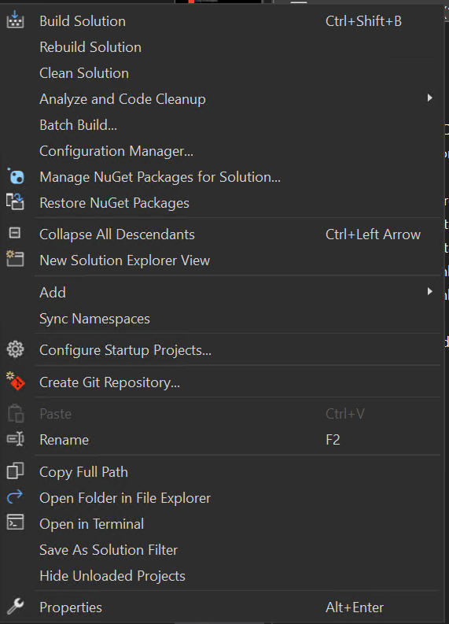

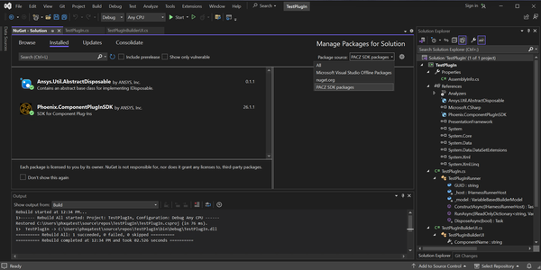

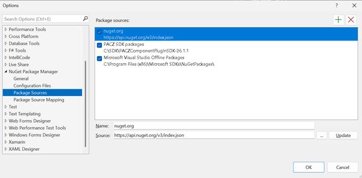

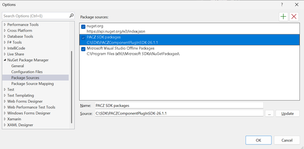

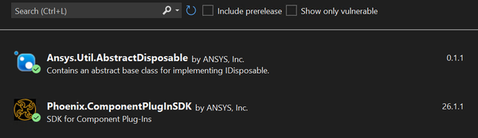 -->

### Create a plug-in project

In Visual Studio, create a new project.

**On the "Create a new project" page:**

1. Select the template installed by the VSIX: **Pacz Plug-In Template** (exact name in the New Project dialog).
1. Press **Next**.<br>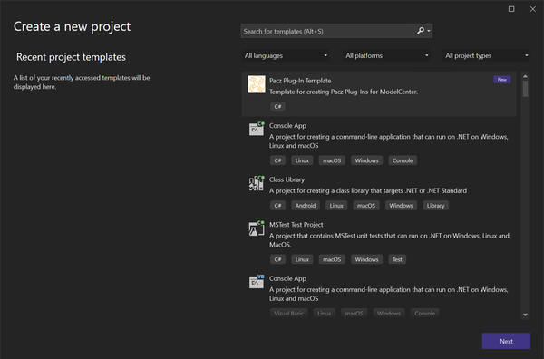

**On the "Configure your new project" page:**

1. Enter the project name (this is used as the default namespace and plug-in name).
1. This name is referred to as `[Name]` throughout this document.
1. **For the walkthrough in [A working example](#a-working-example):** prefer the name **`BasicPaczPlugin`** so namespaces match the bundled sample files and you can copy them with fewer edits. Any other name still works — update namespaces and type names after you copy (screenshots in this guide may show a different name; that is fine).
1. Choose the project location.
1. For **Framework**, choose **.NET Framework 4.7.2** (matches the Phoenix.* package targets).
1. Press **Create**.<br>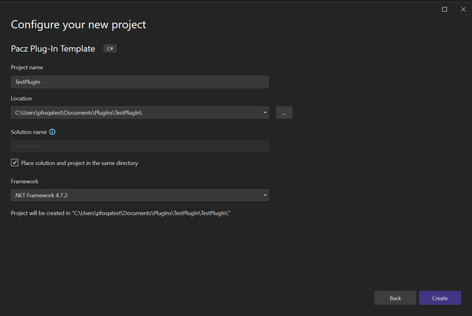

**On the "New PACZ Plug-In Project Wizard" dialog:**

1. Choose **Variable Based**.
1. Press **OK**.<br>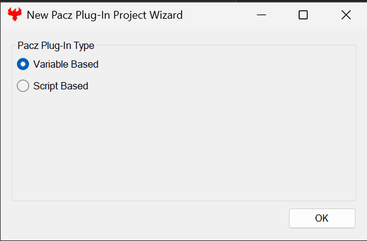<br>Visual Studio creates a new project for you.<br>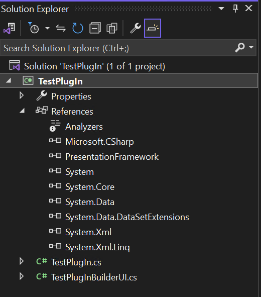

**NOTE**: The first build may take a moment while NuGet restores packages. If the project does not reference `Phoenix.ComponentPlugInSDK`, confirm your package source path, then right-click the solution in Solution Explorer, choose **Restore NuGet Packages**, and rebuild.

### New project overview (.NET)

When you create a new plug-in project, two main class files are generated:

#### The runner - `[Name].cs`

This file implements [`IHarnessRunner`](apidocs/Phoenix.ComponentAPI.IHarnessRunner.md):

- **Purpose**: Executes runs of the plug-in
- **Important**: There MUST be no UI associated with this class
- **Key Methods**:
  - [`ConstructAsync`](apidocs/Phoenix.ComponentAPI.IHarnessRunner.ConstructAsync.md#Phoenix_ComponentAPI_IHarnessRunner_ConstructAsync_Phoenix_ComponentAPI_IHarnessRunnerHost_): Always called first. Provides the [`IHarnessRunnerHost`](apidocs/Phoenix.ComponentAPI.IHarnessRunnerHost.md). Use this for initial setup and loading configuration.
  - [`RunAsync`](apidocs/Phoenix.ComponentAPI.IHarnessRunner.RunAsync.md): Executes a single run evaluation. Receives inputs and must populate outputs.

#### The builder UI - `[Name]BuilderUI.cs`

This class extends [`AbstractVariableBasedBuilderUI<[Name]Runner>`](apidocs/Phoenix.ComponentPlugInSDK.AbstractVariableBasedBuilderUI-1.md):

- **Purpose**: Provides the user interface for configuring the plug-in
- **Features**: Builds on a pre-built UI form for allowing a user to select variables from a list of available ones
- **[`ComponentName` Property](apidocs/Phoenix.ComponentPlugInSDK.AbstractBuilderUI-1.ComponentName.md#Phoenix_ComponentPlugInSDK_AbstractBuilderUI_1_ComponentName)**: Override this to provide a display name for the plug-in
- **Methods You Can Override**:
  - [`LoadFromPaczAsync`](apidocs/Phoenix.ComponentPlugInSDK.AbstractModelBasedBuilderUI-2.LoadFromPaczAsync.md): Load the plug-in instance from a PACZ file
  - [`GetTreeProperties`](apidocs/Phoenix.ComponentPlugInSDK.AbstractVariableBasedBuilderUI-2.GetTreeProperties.md): Customize the properties tree
  - [`GetFileLoadProperties`](apidocs/Phoenix.ComponentPlugInSDK.AbstractVariableBasedBuilderUI-2.GetFileLoadProperties.md): Configure the built-in file open feature
  - [`SetupView`](apidocs/Phoenix.ComponentPlugInSDK.AbstractVariableBasedBuilderUI-2.SetupView.md): Add menu items to the main menu
  - [`SaveToPaczAsync`](apidocs/Phoenix.ComponentPlugInSDK.AbstractModelBasedBuilderUI-2.SaveToPaczAsync.md): Save the plug-in instance to a PACZ file

### A working example

The VSIX template creates a **buildable Class Library** with runner and Builder UI stubs. Those stubs do not yet define variables or an Options dialog. To get a small end-to-end example quickly, use the **bundled BasicPaczPlugin sample** that ships next to this guide:

- Folder: [`examples/basic/BasicPaczPlugin/`](examples/basic/BasicPaczPlugin/) (same docs tree as this page)
- Solution (optional): [`examples/basic/BasicPaczPlugin.sln`](examples/basic/BasicPaczPlugin.sln)

That folder is a local copy of the full BasicPacz sources (runner, Builder UI, and `Form1`). You can open the files in `examples/basic/` and copy sections of them into your project, or just replace the files outright if the names match.

**Naming tip:** If you named the wizard project **`BasicPaczPlugin`**, namespaces already match and the steps below are mostly copy-and-add. If you used a different `[Name]`, still copy the same files, then update namespaces, class names, file names, and any `[Guid(...)]` / plug-in identity attributes so they stay consistent with your project (in which case screenshots may not match your name exactly, but will still show the steps).

#### 1. Add the assembly references the template omits

The VSIX Class Library template does not reference WPF or Windows Forms by default. Without these, methods and forms like `AddMenuItem` and `Form1` fail to compile. A `using` directive alone is not enough — the assembly must appear under **References**.

1. In Solution Explorer, right-click **References** → **Add Reference…** → **Assemblies** → **Framework**.
2. Check these additional items:
   - **PresentationCore**
   - **PresentationFramework**
   - **System.Windows.Forms**
   - **System.Drawing**
1. Click **OK**. Confirm all four names additionally show under **References**.

(The bundled sample `.csproj` already lists these references; if you only copy `.cs` / Form files into a wizard project, you still add them here.)

#### 2. Replace the wizard stubs with the sample sources

From `examples/basic/BasicPaczPlugin/`, copy these files into your Visual Studio project folder (same folder as the wizard-generated `[Name].cs` / `[Name]BuilderUI.cs`):

| Sample file | What to do in your project |
| --- | --- |
| `BasicPaczPlugin.cs` | Replace the contents of `[Name].cs` (or replace the file and rename to match your project). |
| `BasicPaczPluginBuilderUI.cs` | Replace the contents of `[Name]BuilderUI.cs` the same way. |
| `Form1.cs`, `Form1.Designer.cs`, `Form1.resx` | Copy next to the Builder UI file. The template does not include `Form1`, and **Add → Windows Form** is often unavailable on a Class Library. |

Then in Visual Studio:

1. Right-click the project → **Add** → **Existing Item…** → select `Form1.cs`, `Form1.Designer.cs`, and `Form1.resx` → **Add**.
1. If your project is **not** named `BasicPaczPlugin`, open the copied files and update:
   - `namespace BasicPaczPlugin` → your plug-in namespace
   - Class / file names that still say `BasicPaczPlugin` / `BasicPaczPluginBuilderUI` → your `[Name]` / `[Name]BuilderUI`
   - Any plug-in display name or GUID attributes so they stay unique and match your intent
1. Rebuild once so IntelliSense picks up `Form1` and the new references.

**Note:** In the sample, `Form1`'s constructor already calls `Show()`. You do not need an extra `form1.Show()` in `_editOptions`.

#### 3. What you should have after the copy

- **Runner** (`[Name].cs`): `RunAsync` multiplies inputs `a1.a2.x1` and `x2` into output `y`.
- **Builder UI** (`[Name]BuilderUI.cs`): `SetupView` adds an **Options** menu item; `_editOptions` / `_createInputs` / `_createOutputs` create the variables TestUI and ModelCenter will show; `LoadFromPaczAsync` sets a simple run-folder preference when inputs are empty.
- **Form1**: placeholder Options dialog.

For a line-by-line discussion of the same code, see [Examples](examples.md). For this getting-started path, the files under `examples/basic/` are the source of truth.

#### 4. Optional: open the bundled solution instead

If you prefer not to use the VSIX wizard, open `examples/basic/BasicPaczPlugin.sln`, point NuGet at your unzipped SDK package source (same as earlier in this guide), and confirm `Phoenix.ComponentPlugInSDK` in `BasicPaczPlugin.csproj` matches your SDK version (bundled sample targets **26.1.1**). Then build and continue with testing.

When the sample compiles, continue with [Build the plug-in project](#build-the-plug-in-project) and [Test with TestUI](#test-with-testui).

### Build the plug-in project

1. Build the solution (**Build → Build Solution**).
1. NuGet restore downloads `Phoenix.ComponentPlugInSDK` and dependencies from your local package source.
1. Some sample projects (including the bundled BasicPaczPlugin `.csproj`) run a post-build step that invokes `WritePlugInManifest` to prepare plug-in output for deployment. A VSIX wizard project may not show that tool in the build output — that is expected. Either way, deploy the contents of your `bin\Debug\` (or `bin\Release\`) folder in the testing steps below.<br>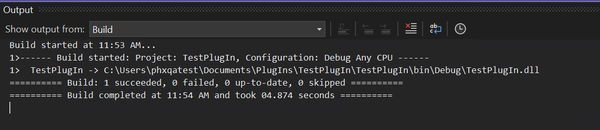

Keep your build output folder path handy (typically `bin\Debug\` or `bin\Release\`) for the testing steps below.

### Custom icons

To add a custom icon to your plug-in:

1. Create a new folder `Images` at the Visual Studio project root level
1. Copy your icon file to this folder
2. Uncomment and update `[PlugInIcon("Images/placeholder.ico")]` on the Runner class, the Builder UI class, or both (see the [Examples](examples.md) page)
3. Rebuild.

## Getting started in Java

**Note** - Java plug-in development support is planned for a future release.

## Testing the plug-in

### Where to deploy plug-ins

You can deploy a built plug-in to any of the following locations. Choose the location that matches how you plan to test.

| Location | Use when |
|----------|----------|
| `[TestUI_Install_Directory]\Plug-Ins\<folderName>\` | Local TestUI smoke test (see below) |
| `<ModelCenter install directory>\Plug-Ins\` | Testing with ModelCenter (machine-wide) |
| `%APPDATA%\Roaming\Phoenix Integration\Plug-Ins\` | Per-user plug-ins when you cannot write to the ModelCenter installation directory |

**Important:** TestUI does not require a specific subfolder name under `Plug-Ins\`. Use any folder name you choose (screenshots in this guide use `TestPlugIn`). TestUI displays that folder name in the plug-in browser.

The prebuilt TestUI in the SDK zip includes sample content under `Plug-Ins\Common` and `Plug-Ins\Script`. Your deployed plug-in appears under the folder name you create.

### Test with TestUI

1. Build your plug-in project.
2. Create a folder under TestUI, for example `[TestUI_Install_Directory]\Plug-Ins\TestPlugIn\`.<br>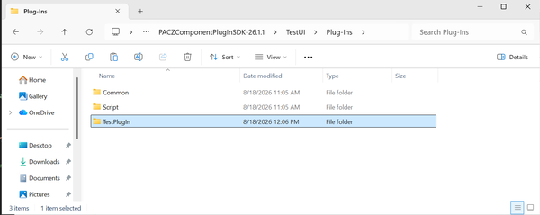
3. Copy the **contents** of your build output folder (for example, `[PlugIn Dir]\bin\Debug\`) into that folder — not the parent `bin` directory and not a folder literally named `Debug` unless you chose that name.
4. Run `TestUI.exe`.
5. Create a new component for your plug-in by using the **Component > New...** menu item.<br>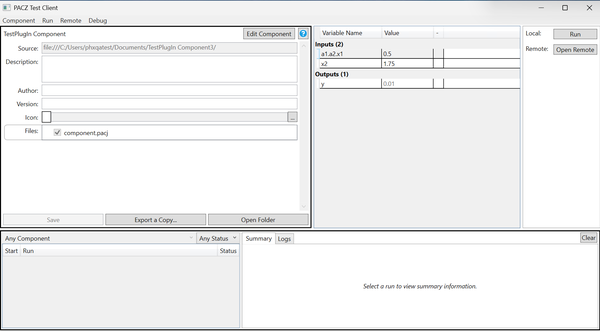
6. In the **CreateComponent** dialog, navigate to **Plug-Ins → `<folderName>` → `[Name]`**, where `<folderName>` is the subfolder you created under `Plug-Ins\` (for example, **Plug-Ins → TestPlugIn → TestPlugIn Component**). Select the plug-in leaf node, then click **OK**.<br>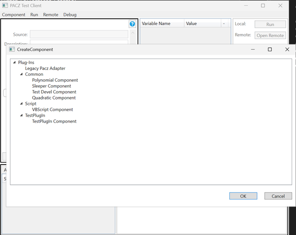
7. The new component wizard appears (same as a component in ModelCenter).<br>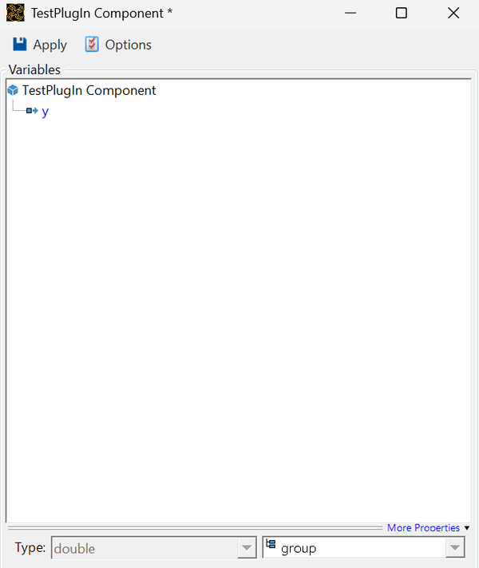

<!-- 
<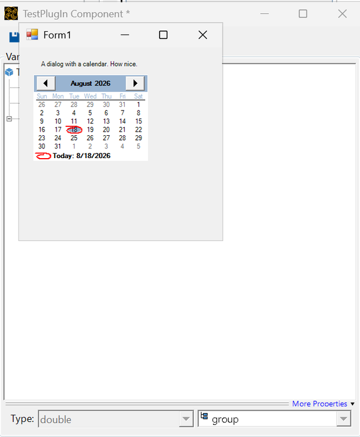

 -->


After you change the plug-in **source code in Visual Studio** (not inside TestUI):

1. Rebuild the project
1. Replace the files in your TestUI plug-in folder (or rely on a directory link — see below)
2. Rerun TestUI to verify your plug-in changes

**Process options:** By default, TestUI runs plug-ins in-process, which is useful for debugging. To simulate ModelCenter's out-of-process execution, run TestUI with the `-oop` command line option.

**Advanced tip:** Use `mklink` to create a directory junction from your TestUI plug-in folder to your project's build output folder, eliminating manual copying after each build (adjust paths to match your SDK and project locations.):

```cmd
mklink /J "C:\SDK\PACZComponentPlugInSDK-26.1.1\TestUI\Plug-Ins\TestPlugIn" "C:\Projects\MyPlugIn\bin\Debug"
```

### Test with ModelCenter

1. Install ModelCenter **2026 R1** or later (or the version provided with your Ansys installation).
1. Copy the **contents** of your build output folder (for example, `[PlugIn Dir]\bin\Debug\`) to the `Plug-Ins` folder of your ModelCenter installation. The exact path depends on your install location (for example, under the Ansys or Phoenix Integration program directory).
1. Alternatively, deploy to `%APPDATA%\Roaming\Phoenix Integration\Plug-Ins\` for a per-user installation.
1. Open ModelCenter and create a new workflow.
1. Locate your plug-in in the Server Browser under `component plug-in / [your plug-in's name]`.<br>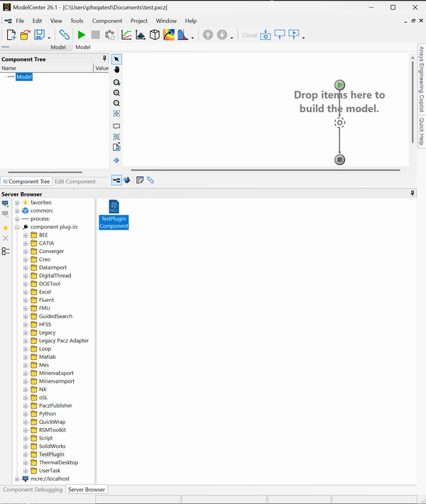
1. Drag the plug-in icon into the workflow to launch the new component wizard.

### Download a sample project

If you are not using the VSIX wizard, you need a complete, buildable sample project — not code fragments alone.

- The SDK zip includes **MockPlugIn**, a prebuilt plug-in you can deploy to TestUI for a quick smoke test.
- Full sample source for the getting-started path is bundled under [`examples/basic/`](examples/basic/) (BasicPaczPlugin). You can also download [BasicPaczPlugin-sample-26.1.1.zip](examples/BasicPaczPlugin-sample-26.1.1.zip) (SDK **26.1.1** / NuGet **26.1.1**). Additional samples and commentary are on the [Examples](examples.md) page.
- If you do not use the VSIX wizard, unzip the sample zip, point NuGet at your SDK package folder, and open `BasicPaczPlugin.sln`, or follow [A working example](#a-working-example) with the bundled folder.

## Debugging with Visual Studio

After building your plug-in and deploying it to ModelCenter or TestUI, you can debug it using Visual Studio:

1. Set breakpoints in your code at key functions like `ConstructAsync`, `RunAsync`, `SetupView`, etc.<br>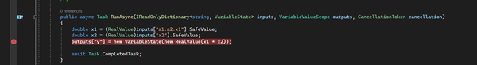

1. In Visual Studio, go to **Debug → Attach to Process…** (or **Ctrl+Alt+P**).<br>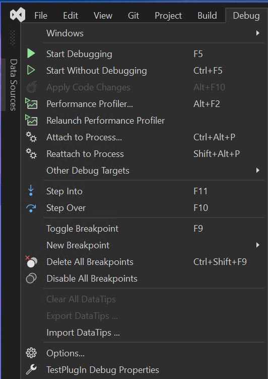

1. Find and attach to `Phoenix.OutOfProcessBuilderUIHost` or `TestUI` depending on how you are running the plug-in. Confirm **Attach to** is set to managed (.NET 4.x) code, then click **Attach**.<br>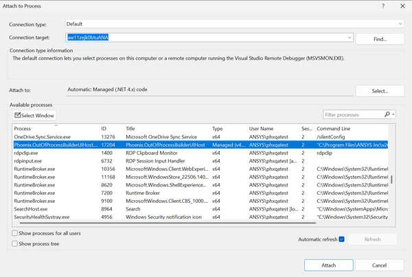

1. Run your component to trigger breakpoints. When a breakpoint hits, you can inspect locals (for example `x1` / `x2` in `RunAsync`) in the Autos / Locals windows.<br>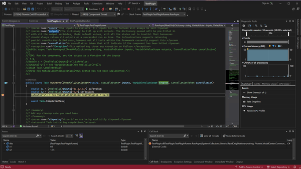

**NOTE**: Breakpoints on `ConstructAsync` do not work when running from ModelCenter as it is called
immediately after starting `Phoenix.OutOfProcessBuilderUIHost`, before you can attach to the process.

## Useful classes

Some classes and interfaces that you may need to work with.

### [`AbstractBuilderUI<RUNNER>`](apidocs/Phoenix.ComponentPlugInSDK.AbstractBuilderUI-1.md)

This base class makes writing your own builder UI easier.

**Properties:**

- [`Host`](apidocs/Phoenix.ComponentPlugInSDK.AbstractBuilderUI-1.Host.md#Phoenix_ComponentPlugInSDK_AbstractBuilderUI_1_Host) of type [`IHarnessBuilderUIHost<RUNNER>`](apidocs/Phoenix.ComponentBuilderAPI.IHarnessBuilderUIHost-1.md)

**Methods:**

- `AddMenuItem()` and `AddAsyncMenuItem()`: Add custom menu items. Wizard projects must add assembly references to **PresentationCore**, **PresentationFramework**, **System.Windows.Forms**, and **System.Drawing** (see [A working example](#a-working-example) and [SetupView()](#setupview)).
- `SelectVariables()`: Open the variable selection form
- `SetPaczIcon()`: Set a custom icon on the current PACZ

### [`IHarnessBuilderUIHost<RUNNER>`](apidocs/Phoenix.ComponentBuilderAPI.IHarnessBuilderUIHost-1.md)

This is the host object passed to your builder UI which gives you access to a variety of useful capabilities:

**Properties:**

- [`ExtractedPacz`](apidocs/Phoenix.ComponentBuilderAPI.IHarnessBuilderUIHost-1.ExtractedPacz.md#Phoenix_ComponentBuilderAPI_IHarnessBuilderUIHost_1_ExtractedPacz): The loaded PACZ object and configuration
- [`Logger`](apidocs/Phoenix.ComponentBuilderAPI.IHarnessBuilderUIHost-1.Logger.md): Logging for the plug-in

**Methods:**

- [`CallRunnerAsync<T>()`](apidocs/Phoenix.ComponentBuilderAPI.IHarnessBuilderUIHost-1.CallRunnerAsync.md): Invoke code on the runner
- [`RaiseTestRunEvent()`](apidocs/Phoenix.ComponentBuilderAPI.IHarnessBuilderUIHost-1.RaiseTestRunEvent.md): Cause a run to be requested from the runner
- [`SaveAsync()`](apidocs/Phoenix.ComponentBuilderAPI.IHarnessBuilderUIHost-1.SaveAsync.md): Save the PACZ

### [`VariableBasedBuilderViewModel`](apidocs/Phoenix.ComponentPlugInSDK.ViewModels.VariableBasedBuilderViewModel.md)

This class provides access to the plug-in's variables:

- Provided as an argument after a new file is opened
- Provided to the [`SetupView()`](apidocs/Phoenix.ComponentPlugInSDK.AbstractVariableBasedBuilderUI-2.SetupView.md) method
- Can be made available to custom menu item click handlers
- Provides collections of [`InputVariables`](apidocs/Phoenix.ComponentPlugInSDK.ViewModels.AbstractPlugInViewModel-1.InputVariables.md) and [`OutputVariables`](apidocs/Phoenix.ComponentPlugInSDK.ViewModels.AbstractPlugInViewModel-1.OutputVariables.md)


## Customizing your plug-in

Use the following members to customize the Builder UI:

### `ComponentName`

To rename the plug-in, override the [`ComponentName`](apidocs/Phoenix.ComponentPlugInSDK.AbstractBuilderUI-1.ComponentName.md#Phoenix_ComponentPlugInSDK_AbstractBuilderUI_1_ComponentName) property in your BuilderUI class:

```csharp
    protected override string ComponentName => "My Custom Plug-In";
```

### [`LoadFromPaczAsync`](apidocs/Phoenix.ComponentPlugInSDK.AbstractModelBasedBuilderUI-2.LoadFromPaczAsync.md)

Called when the plug-in is first created or loaded. Load state from the [`IExtractedPacz`](apidocs/Phoenix.PaczAPI.IExtractedPacz.md):

- Most state is stored in `Config.Properties` (name-value pairs)
- Files are stored in `Config.InstanceFiles`
- Variables are saved/loaded automatically by the `viewModel`

The [`Model`](apidocs/Phoenix.ComponentPlugInSDK.AbstractModelBasedBuilderUI-2.Model.md)
object (type [`VariableBasedBuilderModel`](apidocs/Phoenix.ComponentPlugInSDK.Models.VariableBasedBuilderModel.md))
is directly accessible and can create variables:

```csharp
protected override async Task LoadFromPaczAsync(IExtractedPacz extractedPacz)
{
    if (Model.InputVariables.Count == 0)
    {
        // Create the initial set of variables for the view
        Model.MoveInputVariablesFrom(_createInputs());
        Model.MoveOutputVariablesFrom(_createOutputs());
    }
    await Task.CompletedTask;
}

private IEnumerable<IRuntimeVariable> _createInputs()
{
    RuntimeVariable x1 = new RuntimeVariable("x1", VariableType.Real, new RealValue(0.5));
    RuntimeVariable x2 = new RuntimeVariable("x2", VariableType.Real, new RealValue(1.75));
    return new List<IRuntimeVariable>() { x1, x2 };
}

private IEnumerable<IRuntimeVariable> _createOutputs()
{
    RuntimeVariable y = new RuntimeVariable("y", VariableType.Real, new RealValue(0.01));
    return new List<IRuntimeVariable>() { y };
}
```

### `GetFileLoadProperties()`

Override this method to enable a built-in file load dialog:

- Create a `FileLoadProperties` object with an action for when a file is selected
- Specify a file filter for the open dialog
- Copy the selected file to `Host.ExtractedPacz.ExtractionFolder`
- Add it to `Config.InstanceFiles`

**Example Use Case**: Selecting a CAD file, then interrogating it to determine which inputs/outputs to create.

### `SelectVariables()`

Help users create variables programmatically:

- **Option 1**: Add variables directly to `viewModel.Variable` list
- **Option 2**: Use the `SelectVariables` form for user customization

To use the `SelectVariables` form:

1. Pass lists of available inputs and outputs
1. Call `SelectVariables()` method of the `AbstractBuilderUI` object
1. Users can filter and select which variables to include

### `GetTreeProperties()`

Allows customization of the variable tree:

- **`componentName`**: Name displayed at the root of the VariableTree
- **`canAddRemove`**: Whether UI controls allow adding/removing variables
- **`hasNamedVariables`**: Whether variables use named variable properties

  - Named variables map to external identifiers (for example, Excel range names)
  - The variable name in the plug-in might be "cost" while mapping to range "B5:B10"

- **`namedVariableDisplayName`**: Label for the named variable field (for example, "Range")
- **`namedVariableToken`**: Alphanumeric token used in the text-based variable editor

### `SetupView()`

This method is called after the form is created and allow customization. This is typically done by adding menu items to the main Menu. By default, `VariableBasedPlugIns` has an Apply button that saves the plug-in instance. Additional menu items can be added as either buttons or containers of `subItems`.

Use the `AddMenuItem` method of the `AbstractBuilderUI` base class to add items and provide an event handler as the action to perform on click. The `VariableBasedBuilderViewModel` can be made available to use in the event handler if desired.

Common usages of additional menu items are to show an options dialog or a help page for the plug-in. The following code sample shows a simple Windows Form made accessible through a custom options menu item:

```csharp
protected override void SetupView(IExtractedPacz pacz, 
                                   VariableBasedBuilderViewModel viewModel, 
                                   Menu mainMenu)
{
    AddMenuItem(parent: mainMenu, 
                header: "Options", 
                imageType: ImageType.OPTIONS,
                hasDownArrow: false, 
                eventHandler: (s, e) => _editOptions(viewModel));
}

private void _editOptions(VariableBasedBuilderViewModel viewModel)
{
    Form1 form1 = new Form1();
    form1.Show();
}
```

**Required references (wizard projects):** The VSIX template does not reference WPF or Windows Forms by default. A `using` line is not enough — add the assemblies under **References**. Before `AddMenuItem` / `Form1` will compile:

1. In Solution Explorer, right-click **References** → **Add Reference…** → **Assemblies** → **Framework**.
1. Check and add:
   - **PresentationCore** (required by `AddMenuItem` / `RoutedEventHandler`)
   - **PresentationFramework** (required for `Menu` / `ItemsControl`)
   - **System.Windows.Forms**
   - **System.Drawing** (required by `Form1.Designer.cs` for `Point` / `Size` / `SizeF`; CS0012/CS1069 means this reference is missing)
1. Click **OK**, confirm all four appear under **References**, and rebuild.

**Add Form1 to a wizard-created project:** The template does not include Form1. **Add → Windows Form** is often unavailable on a Class Library plug-in project. Copy Form1.cs, Form1.Designer.cs, and Form1.resx from [examples/basic/BasicPaczPlugin/](examples/basic/BasicPaczPlugin/) (see [A working example](#a-working-example)). Use **Add → Existing Item…** in Visual Studio, then update the namespace if your project is not named BasicPaczPlugin. Rebuild so Form1 resolves in `_editOptions`.

**Note:** In the BasicPaczPlugin sample, `Form1`'s constructor already calls `Show()`. If you use that sample as-is, you can omit the extra `form1.Show()` in `_editOptions`.

**Common Uses**: Options dialogs, help pages, custom wizards

### `SaveToPaczAsync()`

Save plug-in state to the PACZ file:

- Store settings as name-value pairs in `pacz.Config.Properties`
- Update instance files if needed
- Variables are saved automatically by the `ViewModel` - typically no action is needed

## Creating the runner

### `ConstructAsync()`

Always called first - use for initialization:

- Capture the `IHarnessRunnerHost` for later use
- Load configuration
- If using resource-intensive applications, consider delaying load until first run

```csharp
private IHarnessRunnerHost _host;

private VariableBasedBuilderModel _model;

public async Task ConstructAsync(IHarnessRunnerHost host)
{
    _host = host;

    _model = new VariableBasedBuilderModel();
    await _model.FromPaczAsync(_host.ExtractedPacz);

    //TODO: _model.FilePathAbsolute will now contain the full path to the file the use chose 
    // when building the pacz, or null if the pacz is uninitialized.
}
```

### `RunAsync()`

Execute a single run evaluation:

- Input variables are passed with values and validity flags
- Use `SafeValue` to ensure all inputs are valid (throws if invalid)
- Update the `outputs` dictionary with new `VariableState` for each output

```csharp
public async Task RunAsync(IReadOnlyDictionary<string, VariableState> inputs, 
                          VariableValueScope outputs, 
                          CancellationToken cancellation)
{
    // Get input values
    double x1 = (RealValue)inputs["x1"].SafeValue;
    double x2 = (RealValue)inputs["x2"].SafeValue;
    
    // Perform computation
    double result = x1 * x2;
    
    // Set output values
    outputs["y"] = new VariableState(new RealValue(result));
    
    await Task.CompletedTask;
}
```

## Next steps

Now that you have a working plug-in:

- Explore the [FAQ](faq.md) for answers to common questions
- Review the [Threading](threading.md) guide for understanding thread safety
- Study the [Examples](examples.md) page and try the **MockPlugIn** included in the SDK zip
- Browse the [API reference](apis.md) on the Dev Portal (the SDK zip also includes offline HTML under `apidocs\`)
- Learn about advanced customization options

For common issues and solutions, see the FAQ page or consult the threading documentation.
