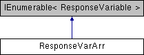

# ResponseVarArr Class

**Namespace:** `Phoenix.Optimization`

## Overview

summary> Get/set flag indicatining if response variable array has error /summary>

## Inheritance



## Declaration

```csharp
class ResponseVarArr
```

## Description

summary> Get/set flag indicatining if response variable array has error /summary>


## Public Member Functions

|Type|Name|Description|
|-----|-----|-----|
|[ResponseVariable]() |`AddNew (string name, bool isInMC, bool isItOutput)`|  |
|bool |`CheckIndexAndDuplicatedNames (bool doPopulateErrText)`|  |
|void |`Clear ()`|  |
|void |`CopyTo (ResponseVarArr arrTo)`|  |
|[ResponseVariable]() |`FindByName (string name)`|  |
|[ResponseVariable]() |`FindOrCreateNewVar (string name, bool isInMC=true, bool isItOutput=true)`|  |
|IEnumerator< ResponseVariable > |`GetEnumerator ()`|  |
|bool |`IsEqualTo (ResponseVarArr varArrToCompare)`|  |
|ResponseVarArr |`MakeCopy ()`|  |
|bool |`RemoveVar (int varIndex, bool doRebuildIndexAndCheckName=true)`|  |
|bool |`RemoveVar (ResponseVariable var, bool doRebuildIndexAndCheckName=true)`|  |
| |`ResponseVarArr ()`| summary> Get/set flag indicatining if response variable array has error /summary> |

## Properties
|Type|Name|Description|
|-----|-----|-----|
|int |`Count [get]`|  |
|string |`ErrText [get, set]`| summary> Gets "Count" /summary> |
|bool |`HasErrors [get, set]`| summary> Get/Set Error text /summary> |
|[ResponseVariable]() |`this[int index] [get]`|  |
|[ResponseVariable]() |`this[string name] [get]`| Return the first occurence of the |

## Constructor & Destructor Documentation

### ResponseVarArr()
```csharp
ResponseVarArr ( )
```

summary> Get/set flag indicatining if response variable array has error /summary>

## Member Function Documentation

### CheckIndexAndDuplicatedNames
```csharp
bool CheckIndexAndDuplicatedNames ( bool doPopulateErrText)
```

**Returns:**

- true if there is duplicated names otherwise returns false

### ErrText
```csharp
string ErrText
```

summary> Gets "Count" /summary>

### HasErrors
```csharp
bool HasErrors
```

summary> Get/Set Error text /summary>

### this
```csharp
ResponseVariable this[string name]
```

Return the first occurence of the

**Parameters:**

- `name` - 

## Property Documentation

### ErrText
```csharp
string ErrText
```

summary> Gets "Count" /summary>

### HasErrors
```csharp
bool HasErrors
```

summary> Get/Set Error text /summary>

### this
```csharp
ResponseVariable this[string name]
```

Return the first occurence of the
