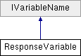

# ResponseVariable Class

**Namespace:** `Phoenix.Optimization`

## Overview

Class to hold information about a design variable  
 

## Inheritance



## Declaration

```csharp
class ResponseVariable
```

## Description

Class to hold information about a design variable  
 


## Public Member Functions

|Type|Name|Description|
|-----|-----|-----|
| |`ResponseVariable (string name, bool isNameInMC, bool isDuplicated, bool isItOutput)`| Creates new a variable with the given name and status of presence in MC |
|void |`UpdateMe (string name, bool isNameInMc, bool isItOutput)`|  |

## Properties
|Type|Name|Description|
|-----|-----|-----|
|string |`ErrText [get]`|  |
|bool |`HasError [get]`|  |
|int |`Index [get, set]`|  |
|bool |`IsDuplicated [get, set]`| summary> Gets a value indicating whether the variable "HasError" /summary> |
|bool |`IsItOutput [get, set]`|  |
|bool |`IsNameInMc [get, set]`| summary> Gets a or sets value indicating whether the "IsDuplicated" has a #. |
|bool |`IsSelected [get, set]`| summary> Gets or sets a reference to "IsNameInMc" /summary> |
|string |`Name [get, set]`| Name of the design variable |

### Properties inherited from [IVariableName]()
|Type|Name|Description|
|-----|-----|-----|
|string |`Name [get]`| The name of the variable |

## Constructor & Destructor Documentation

### ResponseVariable()
```csharp
ResponseVariable ( string name, bool isNameInMC, bool isDuplicated, bool isItOutput )
```

Creates new a variable with the given name and status of presence in MC summary> Gets a reference to "Index" /summary>

**Parameters:**

- `name` - name
- `isNameInMC` - does MC has this variable name

## Member Function Documentation

### IsDuplicated
```csharp
bool IsDuplicated
```

summary> Gets a value indicating whether the variable "HasError" /summary>

### IsNameInMc
```csharp
bool IsNameInMc
```

summary> Gets a or sets value indicating whether the "IsDuplicated" has a #. /summary>

### IsSelected
```csharp
bool IsSelected
```

summary> Gets or sets a reference to "IsNameInMc" /summary>

### Name
```csharp
string Name
```

Name of the design variable summary> Gets or sets a reference to "IsSelected" /summary>

Implements IVariableName.

## Property Documentation

### IsDuplicated
```csharp
bool IsDuplicated
```

summary> Gets a value indicating whether the variable "HasError" /summary>

### IsNameInMc
```csharp
bool IsNameInMc
```

summary> Gets a or sets value indicating whether the "IsDuplicated" has a #. /summary>

### IsSelected
```csharp
bool IsSelected
```

summary> Gets or sets a reference to "IsNameInMc" /summary>

### Name
```csharp
string Name
```

Name of the design variable summary> Gets or sets a reference to "IsSelected" /summary>

Implements IVariableName.
