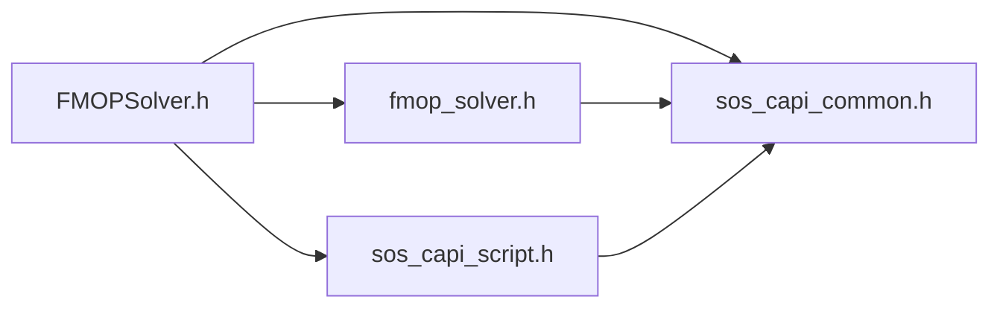

# File FMOPSolver.h

![][C++]

**Location**: `FMOPSolver.h`

## Includes

* [fmop_solver.h](fmop__solver_8h.md#fmop__solver_8h)
* [sos_capi_common.h](sos__capi__common_8h.md#sos__capi__common_8h)
* [sos_capi_script.h](sos__capi__script_8h.md#sos__capi__script_8h)



## Source

```cpp
#include "fmop_solver.h"  
#include "sos_capi_common.h"  
#include "sos_capi_script.h"

```

[public]: https://img.shields.io/badge/-public-brightgreen (public)
[C++]: https://img.shields.io/badge/language-C%2B%2B-blue (C++)