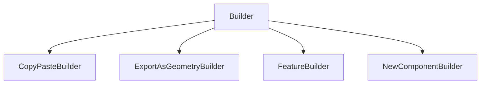

# Builder

## Class Inheritance

**Classes:**

- [Builder](class-builder.md)
- [CopyPasteBuilder](class-copypastebuilder.md)
- [ExportAsGeometryBuilder](class-exportasgeometrybuilder.md)
- [FeatureBuilder](class-featurebuilder.md)
- [NewComponentBuilder](class-newcomponentbuilder.md)

## Description

A base class for all Builders.

## Member Summary

| Member | Type |
| --- | --- |
| [Commit](#commit) | public |

## Public Member Functions

### Commit

`void Commit(self)`

Commits any edits that have been applied to the builder.

Commits any edits that have been applied to the feature being edited, or a new feature if the builder is being used in creation mode.
