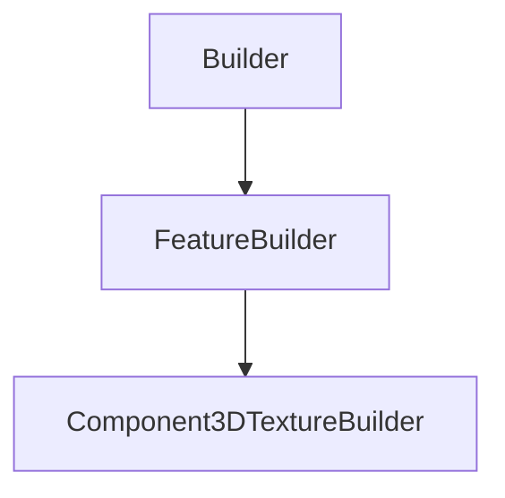

# Component3DTextureBuilder

## Class Inheritance

**Classes:**

- [Builder](class-builder.md)
- [FeatureBuilder](class-featurebuilder.md)
- [Component3DTextureBuilder](class-component3dtexturebuilder.md)

## Description

Represents a 3D Texture component Builder.

## Member Summary

| Member | Type | Description |
| --- | --- | --- |
| [Texture3DMappingFilePath](#texture3dmappingfilepath) | public | Gets or sets the texture 3D Mapping file path. |
| [MappingType](#mappingtype) | public | Gets or sets the mapping. |
| [Orientation](#orientation) | public | Gets or sets the pattern orientation. |
| [BooleanOperation](#booleanoperation) | public | Gets or sets the boolean operation. |
| [GlobaleScale](#globalescale) | public | Gets or sets the global scale of the pattern. |
| [RectangularMappingAreaXLength](#rectangularmappingareaxlength) | public | Gets or sets the area X Length for rectangular mapping. |
| [RectangularMappingAreaYLength](#rectangularmappingareaylength) | public | Gets or sets the area Y Length for rectangular mapping. |
| [RectangularXDistance](#rectangularxdistance) | public | Gets or sets the X distance between patterns for rectangular mapping. |
| [RectangularYDistance](#rectangularydistance) | public | Gets or sets the Y distance between patterns for rectangular mapping. |
| [RectangularXAngle](#rectangularxangle) | public | Gets or sets the X direction angle for rectangular mapping. |
| [RectangularYAngle](#rectangularyangle) | public | Gets or sets the Y direction angle for rectangular mapping. |
| [CircularRadialDistance](#circularradialdistance) | public | Gets or sets the radial distance for circular mapping. |
| [CircularMappingAreaRadius](#circularmappingarearadius) | public | Gets or sets the mapping area radius for circular mapping. |
| [CircularRingsDistance](#circularringsdistance) | public | Gets or sets the distance between two rings for circular mapping. |
| [CircularXAngle](#circularxangle) | public | Gets or sets the angle for circular mapping. |
| [HexagonalXWidth](#hexagonalxwidth) | public | Gets or sets the hexagon width for hexagonal mapping. |
| [HexagonalYHeight](#hexagonalyheight) | public | Gets or sets the hexagon height for hexagonal mapping. |
| [HexagonalMappingAreaXLength](#hexagonalmappingareaxlength) | public | Gets or sets the mapping area X length for hexagonal mapping. |
| [HexagonalMappingAreaYLength](#hexagonalmappingareaylength) | public | Gets or sets the mapping area Y length for hexagonal mapping. |
| [HexagonalXAngle](#hexagonalxangle) | public | Gets or sets the X angle for hexagonal mapping. |
| [HexagonalYAngle](#hexagonalyangle) | public | Gets or sets the Y angle for hexagonal mapping. |
| [HexagonalEdgeLength](#hexagonaledgelength) | public | Gets or sets the hexagon edge length for hexagonal mapping. |
| [HexagonalCentersDistance](#hexagonalcentersdistance) | public | Gets or sets the hexagon distance between centers for hexagonal mapping. |
| [HexagonalCentralPoint](#hexagonalcentralpoint) | public | Gets or sets the central point property for hexagonal mapping. |
| [HexagonalRegularMapping](#hexagonalregularmapping) | public | Gets or sets the central point property for hexagonal mapping. |
| [VariablePitchesMappingAreaXLength](#variablepitchesmappingareaxlength) | public | Gets or sets the mapping area X length for variable pitches mapping. |
| [VariablePitchesMappingAreaYLength](#variablepitchesmappingareaylength) | public | Gets or sets the mapping area Y length for variable pitches mapping. |
| [VariablePitchesXAngle](#variablepitchesxangle) | public | Gets or sets the X angle for variable pitches mapping. |
| [VariablePitchesYAngle](#variablepitchesyangle) | public | Gets or sets the Y angle for variable pitches mapping. |
| [VariablePitchesXPitchRatio](#variablepitchesxpitchratio) | public | Gets or sets the X pitch ratio for variable pitches mapping. |
| [VariablePitchesYPitchRatio](#variablepitchesypitchratio) | public | Gets or sets the Y pitch ratio for variable pitches mapping. |
| [ShiftScaleRatio](#shiftscaleratio) | public | Gets or sets the shift scale ratio. |
| [XScaleRatio](#xscaleratio) | public | Gets or sets the X scale ratio. |
| [YScaleRatio](#yscaleratio) | public | Gets or sets the Y scale ratio. |
| [ZScaleRatio](#zscaleratio) | public | Gets or sets the Z scale ratio. |
| [StartIndex](#startindex) | public | Gets or sets the start index. |
| [EndIndex](#endindex) | public | Gets or sets the end index. |
| [MaxPointToDisplay](#maxpointtodisplay) | public | Gets or sets the max point to display. |

## Public Static Attributes

### Texture3DMappingFilePath

`FilePath Texture3DMappingFilePath`

Gets or sets the texture 3D Mapping file path.

**Value type**: String.  
  
The default value is an empty file path (string).

---

### MappingType

`int MappingType`

Gets or sets the mapping.

Each type describes a way to create a virtual grid that is going to be projected on a part's surface.  
  
The values are:  
0 - Rectangular.  
1 - Circular.  
2 - Hexagonal.  
3 - Variable Pitches.  
4 - Library.  
  
**Value type**: Integer.  
  
The default value is 0.

---

### Orientation

`int Orientation`

Gets or sets the pattern orientation.

The values are:  
0 - Constant, orientates the pattern according to the support of the 3D Texture.  
1 - Normal, orientates the pattern according to the normal of the surface.  
  
**Value type**: Integer.  
  
The default value is 0.

---

### BooleanOperation

`int BooleanOperation`

Gets or sets the boolean operation.

The values are:  
0 - Remove.  
1 - Add on same material.  
2 - Add on different material.  
3 - Add in.  
4 - Insert.  
  
**Value type**: Integer.  
  
The default value is 1.

---

### GlobaleScale

`float GlobaleScale`

Gets or sets the global scale of the pattern.

**Value type**: Double.  
**Range**: The value must be superior to 0.0.  
  
The default value is 1.0.

---

### RectangularMappingAreaXLength

`float RectangularMappingAreaXLength`

Gets or sets the area X Length for rectangular mapping.

**Prerequisite**: The MappingType property must be 0.  
  
**Value type**: Double (in mm).  
**Range**: The value must be superior to 0.0.  
  
The default value is 100.0 mm.

---

### RectangularMappingAreaYLength

`float RectangularMappingAreaYLength`

Gets or sets the area Y Length for rectangular mapping.

**Prerequisite**: The MappingType property must be 0.  
  
**Value type**: Double (in mm).  
**Range**: The value must be superior to 0.0.  
  
The default value is 100.0 mm.

---

### RectangularXDistance

`float RectangularXDistance`

Gets or sets the X distance between patterns for rectangular mapping.

**Prerequisite**: The MappingType property must be 0.  
  
**Value type**: Double (in mm).  
**Range**: The value must be superior to 0.0.  
  
The default value is 1.0 mm.

---

### RectangularYDistance

`float RectangularYDistance`

Gets or sets the Y distance between patterns for rectangular mapping.

**Prerequisite**: The MappingType property must be 0.  
  
**Value type**: Double (in mm).  
**Range**: The value must be superior to 0.0.  
  
The default value is 1.0 mm.

---

### RectangularXAngle

`float RectangularXAngle`

Gets or sets the X direction angle for rectangular mapping.

**Prerequisite**: The MappingType property must be 0.  
  
**Value type**: Double (in degree).  
  
The default value is 0.0 degree.

---

### RectangularYAngle

`float RectangularYAngle`

Gets or sets the Y direction angle for rectangular mapping.

**Prerequisite**: The MappingType property must be 0.  
  
**Value type**: Double (in degree).  
  
The default value is 0.0 degree.

---

### CircularRadialDistance

`float CircularRadialDistance`

Gets or sets the radial distance for circular mapping.

**Prerequisite**: The MappingType property must be 1.  
  
**Value type**: Double (in mm).  
**Range**: The value must be superior to 0.0.  
  
The default value is 1.0 mm.

---

### CircularMappingAreaRadius

`float CircularMappingAreaRadius`

Gets or sets the mapping area radius for circular mapping.

**Prerequisite**: The MappingType property must be 1.  
  
**Value type**: Double (in mm).  
**Range**: The value must be superior to 0.0.  
  
The default value is 100.0 mm.

---

### CircularRingsDistance

`float CircularRingsDistance`

Gets or sets the distance between two rings for circular mapping.

**Prerequisite**: The MappingType property must be 1.  
  
**Value type**: Double (in mm).  
**Range**: The value must be superior to 0.0.  
  
The default value is 1.0 mm.

---

### CircularXAngle

`float CircularXAngle`

Gets or sets the angle for circular mapping.

**Prerequisite**: The MappingType property must be 1.  
  
**Value type**: Double (in degree).  
  
The default value is 0.0 degree.

---

### HexagonalXWidth

`float HexagonalXWidth`

Gets or sets the hexagon width for hexagonal mapping.

**Prerequisite**: The MappingType property must be 2.  
  
**Value type**: Double (in mm).  
**Range**: The value must be superior to 0.0.  
  
The default value is 0.7 mm.

---

### HexagonalYHeight

`float HexagonalYHeight`

Gets or sets the hexagon height for hexagonal mapping.

**Prerequisite**: The MappingType property must be 2.  
  
**Value type**: Double (in mm).  
**Range**: The value must be superior to 0.0.  
  
The default value is 0.7 mm.

---

### HexagonalMappingAreaXLength

`float HexagonalMappingAreaXLength`

Gets or sets the mapping area X length for hexagonal mapping.

**Prerequisite**: The MappingType property must be 2.  
  
**Value type**: Double (in mm).  
**Range**: The value must be superior to 0.0.  
  
The default value is 100.0 mm.

---

### HexagonalMappingAreaYLength

`float HexagonalMappingAreaYLength`

Gets or sets the mapping area Y length for hexagonal mapping.

**Prerequisite**: The MappingType property must be 2.  
  
**Value type**: Double (in mm).  
**Range**: The value must be superior to 0.0.  
  
The default value is 100.0 mm.

---

### HexagonalXAngle

`float HexagonalXAngle`

Gets or sets the X angle for hexagonal mapping.

**Prerequisite**: The MappingType property must be 2.  
  
**Value type**: Double (in degree).  
  
The default value is 0.0 degree.

---

### HexagonalYAngle

`float HexagonalYAngle`

Gets or sets the Y angle for hexagonal mapping.

**Prerequisite**: The MappingType property must be 2.  
  
**Value type**: Double (in degree).  
  
The default value is 0.0 degree.

---

### HexagonalEdgeLength

`float HexagonalEdgeLength`

Gets or sets the hexagon edge length for hexagonal mapping.

**Prerequisite**: The MappingType property must be 2.  
  
**Value type**: Double (in mm).  
**Range**: The value must be superior to 0.0.  
  
The default value is 1.0 mm.

---

### HexagonalCentersDistance

`float HexagonalCentersDistance`

Gets or sets the hexagon distance between centers for hexagonal mapping.

**Prerequisite**: The MappingType property must be 2.  
  
**Value type**: Double (in mm).  
**Range**: The value must be superior to 0.0.  
  
The default value is 100.0 mm.

---

### HexagonalCentralPoint

`bool HexagonalCentralPoint`

Gets or sets the central point property for hexagonal mapping.

**Prerequisite**: The MappingType property must be 2.  
  
True: Enables Central Point.  
False: Disables Central Point.  
  
**Value type**: Boolean.  
  
The default value is False.

---

### HexagonalRegularMapping

`bool HexagonalRegularMapping`

Gets or sets the central point property for hexagonal mapping.

**Prerequisite**: The MappingType property must be 2.  
  
True: Enables Regular Mapping.  
False: Disables Regular Mapping.  
  
**Value type**: Boolean.  
  
The default value is False.

---

### VariablePitchesMappingAreaXLength

`float VariablePitchesMappingAreaXLength`

Gets or sets the mapping area X length for variable pitches mapping.

**Prerequisite**: The MappingType property must be 3.  
  
**Value type**: Double (in mm).  
**Range**: The value must be superior to 0.0.  
  
The default value is 100.0 mm.

---

### VariablePitchesMappingAreaYLength

`float VariablePitchesMappingAreaYLength`

Gets or sets the mapping area Y length for variable pitches mapping.

**Prerequisite**: The MappingType property must be 3.  
  
**Value type**: Double (in mm).  
**Range**: The value must be superior to 0.0.  
  
The default value is 100.0 mm.

---

### VariablePitchesXAngle

`float VariablePitchesXAngle`

Gets or sets the X angle for variable pitches mapping.

**Prerequisite**: The MappingType property must be 3.  
  
**Value type**: Double (in degree).  
  
The default value is 0.0 degree.

---

### VariablePitchesYAngle

`float VariablePitchesYAngle`

Gets or sets the Y angle for variable pitches mapping.

**Prerequisite**: The MappingType property must be 3.  
  
**Value type**: Double (in degree).  
  
The default value is 0.0 degree.

---

### VariablePitchesXPitchRatio

`float VariablePitchesXPitchRatio`

Gets or sets the X pitch ratio for variable pitches mapping.

**Prerequisite**: The MappingType property must be 3.  
  
**Value type**: Double.  
**Range**: The value must be superior to 0.0.  
  
The default value is 1.0.

---

### VariablePitchesYPitchRatio

`float VariablePitchesYPitchRatio`

Gets or sets the Y pitch ratio for variable pitches mapping.

**Prerequisite**: The MappingType property must be 3.  
  
**Value type**: Double.  
**Range**: The value must be superior to 0.0.  
  
The default value is 1.0.

---

### ShiftScaleRatio

`float ShiftScaleRatio`

Gets or sets the shift scale ratio.

**Value type**: Double.  
  
The default value is 1.0.

---

### XScaleRatio

`float XScaleRatio`

Gets or sets the X scale ratio.

**Value type**: Double.  
  
The default value is 1.0.

---

### YScaleRatio

`float YScaleRatio`

Gets or sets the Y scale ratio.

**Value type**: Double.  
  
The default value is 1.0.

---

### ZScaleRatio

`float ZScaleRatio`

Gets or sets the Z scale ratio.

**Value type**: Double.  
  
The default value is 1.0.

---

### StartIndex

`int StartIndex`

Gets or sets the start index.

**Value type**: Integer.  
**Range**: The value must be superior to 0 and inferior to the EndIndex property.  
  
The default value is 1.

---

### EndIndex

`int EndIndex`

Gets or sets the end index.

**Value type**: Integer.  
**Range**: The value must be superior to the StartIndex property.  
  
The default value is 2.

---

### MaxPointToDisplay

`int MaxPointToDisplay`

Gets or sets the max point to display.

**Value type**: Integer.  
  
The default value is 10000.
