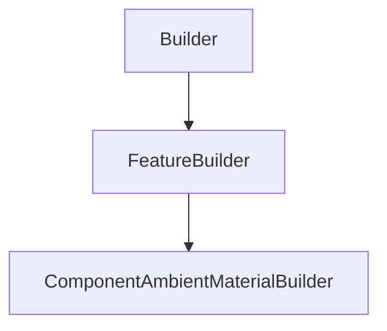

# ComponentAmbientMaterialBuilder

## Class Inheritance

**Classes:**

- [Builder](class-builder.md)
- [FeatureBuilder](class-featurebuilder.md)
- [ComponentAmbientMaterialBuilder](class-componentambientmaterialbuilder.md)

## Description

Represents an ambient material component builder.

## Member Summary

| Member | Type |
| --- | --- |
| [Type](#type) | public |
| [Index](#index) | public |
| [Absorption](#absorption) | public |
| [UseConstringence](#useconstringence) | public |
| [Constringence](#constringence) | public |
| [LibraryFilePath](#libraryfilepath) | public |

## Public Static Attributes

### Type

`int Type`

Gets or sets the type of Ambient Material.

The values are:  
0 - Optic.  
2 - Library.  
  
**Value type**: Integer.  
  
The default value is Optic (0).

---

### Index

`float Index`

Gets or sets the index property.

**Prerequisite**: The Type property must be 0.  
  
**Value type**: Double.  
**Range**: The value must be superior or equal to 1.  
  
The default value is 1.5.

---

### Absorption

`float Absorption`

Gets or sets the absorption property.

**Prerequisite**: The Type property must be 0.  
  
**Value type**: Double.  
**Range**: The value must be superior or equal to 0.  
  
The default value is 0.0.

---

### UseConstringence

`bool UseConstringence`

Gets or sets the use of constringence property.

**Prerequisite**: The Type property must be 0.  
  
True: Enables constringence.  
False: Disables constringence.  
  
**Value type**: Boolean.  
  
The default value is False.

---

### Constringence

`float Constringence`

Gets or sets the constringence property.

**Prerequisite**: The UseConstringence property must be True.  
  
**Value type**: Double.  
**Range**: The value must be superior or equal to 20.0.  
  
The default value is 60.0

---

### LibraryFilePath

`FilePath LibraryFilePath`

Gets or sets the library file path.

**Prerequisite**: The Type property must be 2.  
  
**value type**: String.  
  
The default value is an empty string.
