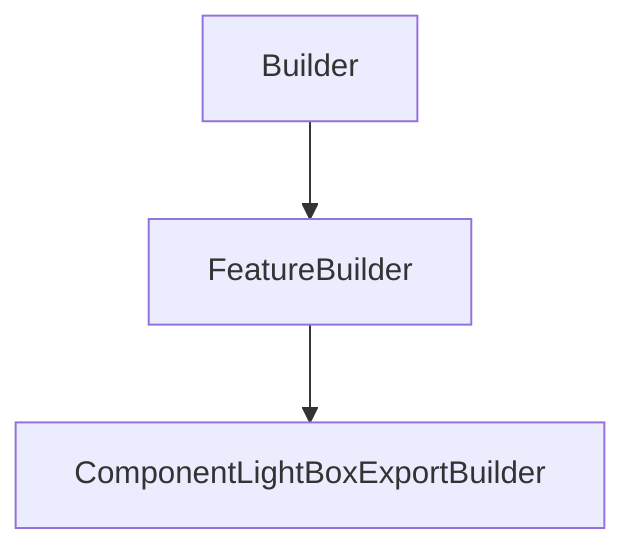

# ComponentLightBoxExportBuilder

## Class Inheritance

**Classes:**

- [Builder](class-builder.md)
- [FeatureBuilder](class-featurebuilder.md)
- [ComponentLightBoxExportBuilder](class-componentlightboxexportbuilder.md)

## Description

Represents a light box export component builder.

## Member Summary

| Member | Type | Description |
| --- | --- | --- |
| [MeshingSagMode](#meshingsagmode) | public | Gets or sets the meshing sag mode. |
| [MeshingSagValue](#meshingsagvalue) | public | Gets or sets the meshing sag value. |
| [MeshingStepMode](#meshingstepmode) | public | Gets or sets the meshing step mode. |
| [MeshingStepValue](#meshingstepvalue) | public | Gets or sets the meshing step fixed value. |
| [MeshingAngle](#meshingangle) | public | Gets or sets the meshing angle. |
| [SpecificFacetEdgesParameters](#specificfacetedgesparameters) | public | Gets or sets the specific parameters property for facet edges. |
| [MeshingEdgeSag](#meshingedgesag) | public | Gets or sets the meshing edge sag value. |
| [MeshingEdgeAngle](#meshingedgeangle) | public | Gets or sets the meshing edge angle. |
| [CustomAxisSystem](#customaxissystem) | public | Gets or sets the property to enable custom axis system. |
| [AxisSystem](#axissystem) | public | Gets the axis system. |
| [Sources](#sources) | public | Gets source features. |
| [Geometries](#geometries) | public | Gets geometries tag. |
| [GeometriesOptions](#geometriesoptions) | public | Gets the list of geometry options. |
| [EnablePassword](#enablepassword) | public | Gets or sets the property to enable password. |
| [BlackBox](#blackbox) | public | Gets or sets the property to enable BlackBox. |
| [RemoveSources](#removesources) | public | Deletes sources from the simulation. |
| [RemoveGeometries](#removegeometries) | public | Deletes geometries from the component. |
| [GeneratePassword](#generatepassword) | public | Generates and store a new password. **Prerequisite** The EnablePassword property must be True. |

## Public Static Attributes

### MeshingSagMode

`int MeshingSagMode`

Gets or sets the meshing sag mode.

The values are:  
0 - Proportional, the value adapts and adjusts to the size of each face of the object.  
1 - Fixed, the value will remain unchanged no matter the size or shape of the object.  
  
**Value type**: Integer.  
  
The default value is 0.

---

### MeshingSagValue

`float MeshingSagValue`

Gets or sets the meshing sag value.

**Value type**: Double (in mm).  
**Range**: The value must be superior to 0.0.  
  
The default value is 0.5 mm.

---

### MeshingStepMode

`int MeshingStepMode`

Gets or sets the meshing step mode.

The values are:  
0 - Proportional, the value adapts and adjusts to the size of each face of the object.  
1 - Fixed, the value will remain unchanged no matter the size or shape of the object.  
  
**Value type**: Integer.  
  
The default value is 0.

---

### MeshingStepValue

`float MeshingStepValue`

Gets or sets the meshing step fixed value.

**Value type**: Double (in mm).  
**Range**: The value must be superior to 0.  
  
The default value is 1.0 mm.

---

### MeshingAngle

`float MeshingAngle`

Gets or sets the meshing angle.

**Value type**: Double (in degrees).  
**Range**: (0.0, 90.0).  
  
The default value is 15.0 degrees.

---

### SpecificFacetEdgesParameters

`bool SpecificFacetEdgesParameters`

Gets or sets the specific parameters property for facet edges.

Allows to control the precision of the meshing on the edges of the faces.  
  
True: Enables specific parameters for facet edges.  
False: Disables specific parameters for facet edges.  
  
**Value type**: Boolean.  
  
The default value is False.

---

### MeshingEdgeSag

`float MeshingEdgeSag`

Gets or sets the meshing edge sag value.

**Prerequisite** The SpecificFacetEdgesParameters property must be True.  
  
Defines the maximum distance between the geometry and the meshing on the edges. The Meshing edge sag value always uses the Fixed mode.  
  
**Value type**: Double (in mm).  
**Range**: The value must be superior to 0.  
  
The default value is 0.1 mm.

---

### MeshingEdgeAngle

`float MeshingEdgeAngle`

Gets or sets the meshing edge angle.

**Prerequisite** The SpecificFacetEdgesParameters property must be True.  
  
Defines the maximum angular variation in degrees between successive tangents for all points along a solid edge.  
  
**Value type**: Double (in degrees).  
**Range**: (0.0, 90.0).  
  
The default value is 10.0 degrees.

---

### CustomAxisSystem

`bool CustomAxisSystem`

Gets or sets the property to enable custom axis system.

True: Enables custom axis system.  
False: Disables custom axis system.  
  
**Value type**: Boolean.  
  
The default value is False.

---

### AxisSystem

`DataModels::CAxisSystem AxisSystem`

Gets the axis system.

**Prerequisite** The CustomAxisSystem property must be True.  
  
**Value type**: AxisSystem object.

---

### Sources

`list[Feature] Sources`

Gets source features.

Gets the current source features that are in the component.  
  
**Value type**: List of Feature object.

---

### Geometries

`list[int] Geometries`

Gets geometries tag.

The Geometries property returns a list of feature tag.

---

### GeometriesOptions

`list[DataModels::CGeometryOptions] GeometriesOptions`

Gets the list of geometry options.

Allows to Activate/Deactivate specific options for each geometry.  
  
**Value type**: List of CGeometryOptions.  
  
The default value is an empty list.

---

### EnablePassword

`bool EnablePassword`

Gets or sets the property to enable password.

True: Enables password.  
False: Disables password.  
  
**Value type**: Boolean.  
  
The default value is False.

---

### BlackBox

`bool BlackBox`

Gets or sets the property to enable BlackBox.

True: Enables BlackBox.  
False: Disables BlackBox.  
  
**Value type**: Boolean.  
  
The default value is False.

## Public Member Functions

### RemoveSources

`void RemoveSources(self, sources)`

Deletes sources from the simulation.

**Parameters**:

- `list[Feature] sources`: List of Feature object

---

### RemoveGeometries

`void RemoveGeometries(self, tags)`

Deletes geometries from the component.

The DeleteGeometries function takes a list of geometry tag as parameter.

**Parameters**:

- `list[int] tags`: List of tags.

---

### GeneratePassword

`str GeneratePassword(self)`

Generates and store a new password.  
  
**Prerequisite** The EnablePassword property must be True.
