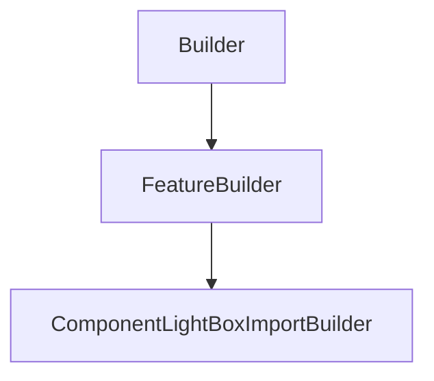

# ComponentLightBoxImportBuilder

## Class Inheritance

**Classes:**

- [Builder](class-builder.md)
- [FeatureBuilder](class-featurebuilder.md)
- [ComponentLightBoxImportBuilder](class-componentlightboximportbuilder.md)

## Description

Represents a Component Light Box Import Builder.

## Member Summary

| Member | Type | Description |
| --- | --- | --- |
| [SpeosLightBoxFilePath](#speoslightboxfilepath) | public | Gets or sets the Speos light box file path. |
| [PasswordRequired](#passwordrequired) | public | Gets the property to know if a password is required to read the Speos light box file. |
| [PreviewMode](#previewmode) | public | Gets or sets the preview mode. |
| [CustomAxisSystem](#customaxissystem) | public | Gets or sets the property to activate or deactivate the use of a custom axis system. |
| [BlackBox](#blackbox) | public | Gets the property to know if the Speos light box file is protected. |
| [Trajectory](#trajectory) | public | Gets or sets the property to activate or deactivate the use of the trajectory. |
| [TrajectoryFilePath](#trajectoryfilepath) | public | Gets or sets the trajectory file path. |

## Public Static Attributes

### SpeosLightBoxFilePath

`LightBoxFilePath SpeosLightBoxFilePath`

Gets or sets the Speos light box file path.

**Value type**: String.  
  
The default value is an empty file path (string).

---

### PasswordRequired

`bool PasswordRequired`

Gets the property to know if a password is required to read the Speos light box file.

Returns true if a password is required to read the Speos light box file, otherwise returns false.  
  
**Value type**: Boolean.  
  
The default value is false.

---

### PreviewMode

`int PreviewMode`

Gets or sets the preview mode.

The values are:  
0 - Meshing.  
1 - Bounding Box.  
  
**Value type**: Integer.  
  
The default value is 1.

---

### CustomAxisSystem

`bool CustomAxisSystem`

Gets or sets the property to activate or deactivate the use of a custom axis system.

True: Enables custom axis system.  
False: Disables custom axis system.  
  
**Value type**: Boolean.  
  
The default value is False.

---

### BlackBox

`bool BlackBox`

Gets the property to know if the Speos light box file is protected.

Returns true if the Speos light box file is protected, otherwise returns false.  
  
**Value type**: Boolean.  
  
The default value is false.

---

### Trajectory

`bool Trajectory`

Gets or sets the property to activate or deactivate the use of the trajectory.

True: Enables the trajectory.  
False: Disables the trajectory.  
  
**Value type**: Boolean.  
  
The default value is False.

---

### TrajectoryFilePath

`FilePath TrajectoryFilePath`

Gets or sets the trajectory file path.

**Value type**: String.  
  
The default value is an empty file path (string).
