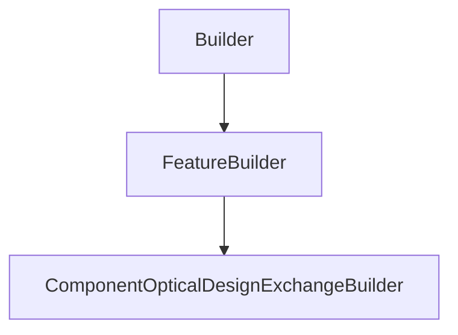

# ComponentOpticalDesignExchangeBuilder

## Class Inheritance

**Classes:**

- [Builder](class-builder.md)
- [FeatureBuilder](class-featurebuilder.md)
- [ComponentOpticalDesignExchangeBuilder](class-componentopticaldesignexchangebuilder.md)

## Description

Represents a Component Optical Design Exchange Builder.

## Member Summary

| Member | Type |
| --- | --- |
| [FeatureOpticalDesignExchange](#featureopticaldesignexchange) | public |
| [FilePath](#filepath) | public |
| [OnlyUpdateMaterials](#onlyupdatematerials) | public |
| [CustomAxisSystem](#customaxissystem) | public |

## Public Static Attributes

### FeatureOpticalDesignExchange

`ComponentOpticalDesignExchangeFeature FeatureOpticalDesignExchange`

Gets the Optical Design Exchange feature object.

Gets the Optical Design Exchange feature.  
**Value type**: ComponentOpticalDesignExchangeFeature object.

---

### FilePath

`str FilePath`

Gets or sets the ODX file path.

**Value type**: String.  
  
The default value is an empty file path (string).

---

### OnlyUpdateMaterials

`bool OnlyUpdateMaterials`

Gets or sets the property to enable or disable the option to update only materials.

True: Enables the option. Only materials will be updated.  
False: Disables the option.  
**Value type**: Boolean.  
  
The default value is false.

---

### CustomAxisSystem

`bool CustomAxisSystem`

Gets or sets the property to activate or deactivate the use of a custom axis system.

True: Enables custom axis system.  
False: Disables custom axis system.  
**Value type**: Boolean.  
  
The default value is False.
