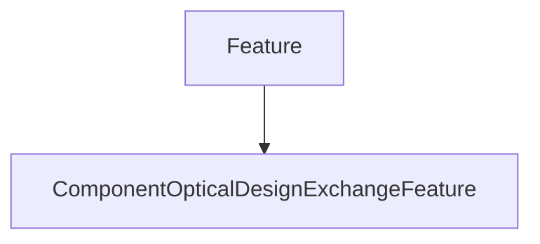

# ComponentOpticalDesignExchangeFeature

## Class Inheritance

**Classes:**

- [Feature](class-feature.md)
- [ComponentOpticalDesignExchangeFeature](class-componentopticaldesignexchangefeature.md)

## Description

Represents a Speos Optical Component Design Exchange feature.

## Member Summary

| Member | Type |
| --- | --- |
| [Results](#results) | public |

## Public Static Attributes

### Results

`ComponentOpticalDesignExchangeResultCollection Results`

Gets the result collection.

Returns the [ComponentOpticalDesignExchangeResultCollection](class-componentopticaldesignexchangeresultcollection.md) belonging to this feature.
