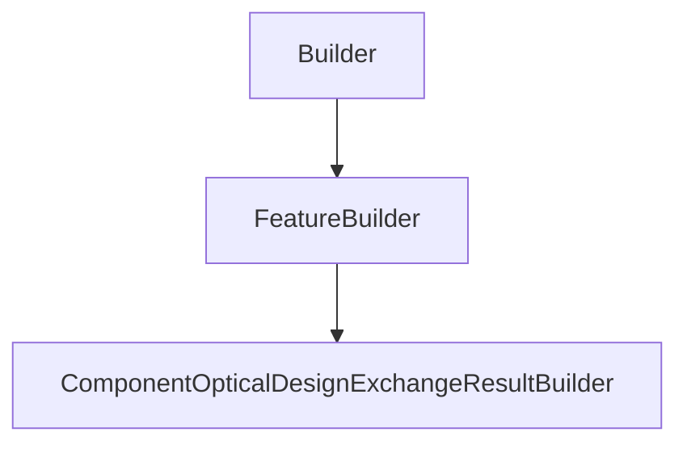

# ComponentOpticalDesignExchangeResultBuilder

## Class Inheritance

**Classes:**

- [Builder](class-builder.md)
- [FeatureBuilder](class-featurebuilder.md)
- [ComponentOpticalDesignExchangeResultBuilder](class-componentopticaldesignexchangeresultbuilder.md)

## Description

Represents a Component Optical Design Exchange Result Builder.

## Member Summary

| Member | Type |
| --- | --- |
| [FeatureComponentOpticalDesignExchangeResult](#featurecomponentopticaldesignexchangeresult) | public |
| [Attribute](#attribute) | public |

## Public Static Attributes

### FeatureComponentOpticalDesignExchangeResult

`ComponentOpticalDesignExchangeResultFeature FeatureComponentOpticalDesignExchangeResult`

Gets the Optical Design Exchange Result feature object.  
**Value type**: ComponentOpticalDesignExchangeResultFeature object.

## Public Member Functions

### Attribute

`PythonVariant Attribute(self, attribute)`

Gets Attribute value.

- if **Result.Type is Lens**:  
  - Thickness  
- if **Result.Type is Surface**:  
  - if **Aperture.Type is Rectangular**:  
    - Half width along X  
    - Half width along Y  
    - Decenter along X  
    - Decenter along Y  
  - if **Aperture.Type is Elliptical**:  
    - Half width along X  
    - Half width along Y  
    - Decenter along X  
    - Decenter along Y  
  - if **Aperture.Type is Circular**:  
    - Minimum radius  
    - Maximum radius  
    - Decenter along X  
    - Decenter along Y  
  - if **Surface.Type is Standard**:  
    - Radius of curvature  
    - Clear aperture radius  
    - Edge aperture radius  
    - Conic constant  
  - if **Surface.Type is Biconic**:  
    - Radius of curvature along X  
    - Conic constant along X  
    - Radius of curvature along Y  
    - Conic constant along Y  
    - Clear aperture radius  
  - if **Surface.Type is Asphere**:  
    - Radius of curvature  
    - Clear aperture radius  
    - Edge aperture radius  
    - Conic constant  
    - Normalization radius  
    - Aspheric coefficients.n (n start to 1)  
  - if **Surface.Type is Extended Polynomial**:  
    - Radius of curvature  
    - Clear aperture radius  
    - Conic constant  
    - Normalization radius  
    - Polynomial coefficients.n (n start to 1)  
  - if **Surface.Type is Q-Type Asphere**:  
    - Radius of curvature  
    - Clear aperture radius  
    - Edge aperture radius  
    - Conic constant  
    - Normalization radius  
    - Type (Qbfs, Qcon)  
    - Coefficients.n (n start to 1)  
  - if **Surface.Type is Zernike**:  
    - Radius of curvature  
    - Clear aperture radius  
    - Conic constant  
    - Normalization radius  
    - Extrapolate  
    - Type (Zernike Standard Sag, Zernike Fringe Sag)  
    - Decenter along X  
    - Decenter along Y  
    - Aspheric coefficients.n (n start to 1)  
    - Zernike terms.n (n start to 1)  
  - if **Surface.Type is Biconic Zernike**:  
    - Radius of curvature along X  
    - Conic constant along X  
    - Radius of curvature along Y  
    - Conic constant along Y  
    - Clear aperture radius  
    - Biconic decenter along X  
    - Biconic decenter along Y  
    - Normalization radius  
    - Extrapolate  
    - Zernike decenter along X  
    - Zernike decenter along Y  
    - Aspheric coefficients along X.n (n start to 1)  
    - Aspheric coefficients along Y.n (n start to 1)  
    - Zernike terms.n (n start to 1)  
  - if **Surface.Type is Annulus**:  
    - Maximum half width along X  
    - Minimum half width along X  
    - Maximum half width along Y  
    - Minimum half width along Y  
  - if **Surface.Type is Off-Axis Conic Freeform**:  
    - Radius of curvature  
    - Clear aperture radius  
    - Conic constant  
    - Offset  
    - Normalization radius  
    - Polynomial coefficients.n (n start to 1)

**Parameters**:

- `str attribute`: The name of the attribute.
