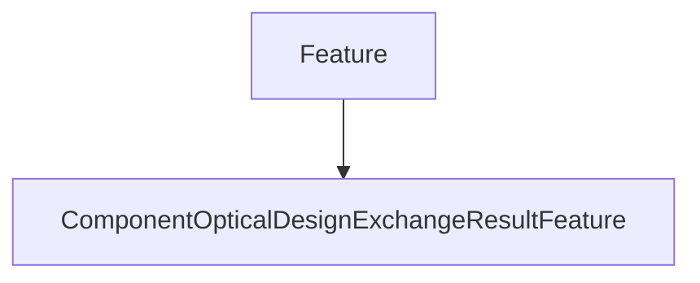

# ComponentOpticalDesignExchangeResultFeature

## Class Inheritance

**Classes:**

- [Feature](class-feature.md)
- [ComponentOpticalDesignExchangeResultFeature](class-componentopticaldesignexchangeresultfeature.md)

## Description

Represents a Speos Optical Design Exchange result feature.

## Member Summary

| Member | Type |
| --- | --- |
| [Results](#results) | public |

## Public Static Attributes

### Results

`Feature Results`

Gets the result collection.

Returns the @link ResultCollection @endlink belonging to this feature.
