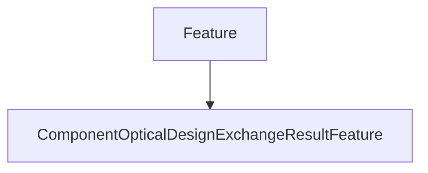

# ComponentOpticalDesignExchangeResultFeature

## Class Inheritance

**Classes:**

- [Feature](class-feature.md)
- [ComponentOpticalDesignExchangeResultFeature](class-componentopticaldesignexchangeresultfeature.md)

## Description

Represents a Speos Optical Design Exchange result feature.

A base class for all Speos Optical Design Exchange result features.  
  
This class provides the basic functionality common to all result features.  
To obtain an instance of this class, refer to @endlink and @link ComponjentOpticalDesignExchangeResultFeature::Results.

## Member Summary

| Member | Type | Description |
| --- | --- | --- |
| [Results](#results) | public | Gets the result collection. |

## Public Static Attributes

### Results

`ComponentOpticalDesignExchangeResultCollection Results`

Gets the result collection.

Returns the [ResultCollection](class-resultcollection.md) belonging to this feature.

**Returns**: The [ResultCollection](class-resultcollection.md).
