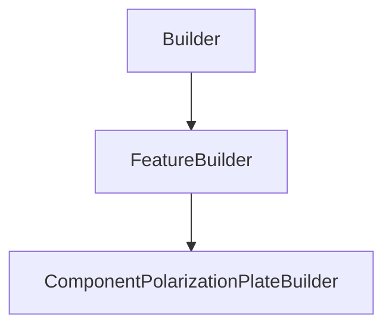

# ComponentPolarizationPlateBuilder

## Class Inheritance

**Classes:**

- [Builder](class-builder.md)
- [FeatureBuilder](class-featurebuilder.md)
- [ComponentPolarizationPlateBuilder](class-componentpolarizationplatebuilder.md)

## Description

Represents a Polarization Plate Component Builder.

## Member Summary

| Member | Type | Description |
| --- | --- | --- |
| [WavelengthIncidenceDependency](#wavelengthincidencedependency) | public | Gets or sets the wavelength and incidence dependency value. |
| [XStart](#xstart) | public | Gets or sets the component X start dimension value. |
| [YStart](#ystart) | public | Gets or sets the component Y start dimension value. |
| [XEnd](#xend) | public | Gets or sets the component X end dimension value. |
| [YEnd](#yend) | public | Gets or sets the component Y end dimension value. |
| [XMirroredExtent](#xmirroredextent) | public | Gets or sets the component X dimension mirrored extent value. |
| [YMirroredExtent](#ymirroredextent) | public | Gets or sets the component Y dimension mirrored extent value. |
| [PolarizationType](#polarizationtype) | public | Gets or sets the polarization type of the component. |
| [DiattenuatorType](#diattenuatortype) | public | Gets or sets the DiattenuatorType type of the component. |
| [DiattenuatorAngle](#diattenuatorangle) | public | Gets or sets the diattenuator angle value. |
| [PolarizerFilePath](#polarizerfilepath) | public | Gets or sets the polarizer file path. |
| [RetarderMaterialFilePath](#retardermaterialfilepath) | public | Gets or sets the retarder material file path. |
| [RetarderOptimalWavelength](#retarderoptimalwavelength) | public | Gets or sets the retarder optimal wavelength value. |
| [RetardanceMultiplicator](#retardancemultiplicator) | public | Gets or sets the retardance multiplicator value. |
| [RetardanceDivisor](#retardancedivisor) | public | Gets or sets the retardance deivisor value. |
| [Thickness](#thickness) | public | Gets the Thickness value. |

## Public Static Attributes

### WavelengthIncidenceDependency

`bool WavelengthIncidenceDependency`

Gets or sets the wavelength and incidence dependency value.

True: Uses Polarization.  
False: Uses Retarder and Diattenuator.  
  
**Value type**: Boolean.  
  
The default value is False.

---

### XStart

`float XStart`

Gets or sets the component X start dimension value.

**Value type**: Double (in mm).  
**Range**: The value must be inferior to XEnd  
  
The default value is -1.0 mm.

---

### YStart

`float YStart`

Gets or sets the component Y start dimension value.

**Value type**: Double (in mm).  
**Range**: The value must be inferior to YEnd  
  
The default value is -1.0 mm.

---

### XEnd

`float XEnd`

Gets or sets the component X end dimension value.

**Value type**: Double (in mm).  
**Range**: The value must be superior to XStart  
  
The default value is 1.0 mm.

---

### YEnd

`float YEnd`

Gets or sets the component Y end dimension value.

**Value type**: Double (in mm).  
**Range**: The value must be superior to YStart  
  
The default value is 1.0 mm.

---

### XMirroredExtent

`bool XMirroredExtent`

Gets or sets the component X dimension mirrored extent value.

True: XStart == -XEnd, you can only change the XEnd value.  
False: XStart and XEnd can have different value.  
  
**Value type**: Boolean.  
  
The default value is False.

---

### YMirroredExtent

`bool YMirroredExtent`

Gets or sets the component Y dimension mirrored extent value.

True: YStart == -YEnd, you can only change the YEnd value.  
False: YStart and YEnd can have different value.  
  
**Value type**: Boolean.  
  
The default value is False.

---

### PolarizationType

`int PolarizationType`

Gets or sets the polarization type of the component.

**Prerequisite**: The WavelengthIncidenceDependency property must be False.  
  
The values are:  
0 - Library.  
1 - Linear Polarizer.  
2 - Left Circular Polarizer.  
3 - Right Circular Polarizer.  
4 - Half Wave Plate.  
5 - Quarter Wave Plate.  
  
**Value type**: Integer.  
  
The default value is 1.

---

### DiattenuatorType

`int DiattenuatorType`

Gets or sets the DiattenuatorType type of the component.

**Prerequisite**: The WavelengthIncidenceDependency property must be True.  
  
The values are:  
0 - None.  
1 - Library.  
2 - Linear Polarizer.  
3 - Left Circular Polarizer.  
4 - Right Circular Polarizer.  
  
**Value type**: Integer.  
  
The default value is 2.

---

### DiattenuatorAngle

`float DiattenuatorAngle`

Gets or sets the diattenuator angle value.

**Prerequisite**: The PolarizationType property must be 0, 1, 4 or 5 ; or the DiattenuatorType property must be 1 or 2.  
  
**Value type**: Double (in degrees).  
  
The default value is 0.0.

---

### PolarizerFilePath

`FilePath PolarizerFilePath`

Gets or sets the polarizer file path.

**Prerequisite**: The PolarizationType property must be 0 or the DiattenuatorType property must be 1.  
  
**value type**: String.  
  
The default value is an empty string.

---

### RetarderMaterialFilePath

`FilePath RetarderMaterialFilePath`

Gets or sets the retarder material file path.

**Prerequisite**: The WavelengthIncidenceDependency property must be True.  
  
**value type**: String.  
  
The default value is an empty string.

---

### RetarderOptimalWavelength

`float RetarderOptimalWavelength`

Gets or sets the retarder optimal wavelength value.

**Prerequisite**: The WavelengthIncidenceDependency property must be True.  
  
**Value type**: Double (in nm).  
  
The default value is 500.0 nm.

---

### RetardanceMultiplicator

`int RetardanceMultiplicator`

Gets or sets the retardance multiplicator value.

**Prerequisite**: The WavelengthIncidenceDependency property must be True.  
  
**Value type**: Integer.  
  
The default value is 100.

---

### RetardanceDivisor

`float RetardanceDivisor`

Gets or sets the retardance deivisor value.

**Prerequisite**: The WavelengthIncidenceDependency property must be True.  
  
**Value type**: Double.  
  
The default value is 2.0.

---

### Thickness

`float Thickness`

Gets the Thickness value.

**Prerequisite**: The WavelengthIncidenceDependency property must be True.  
  
**Value type**: Double.
