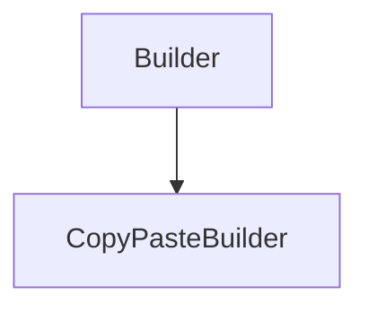

# CopyPasteBuilder

## Class Inheritance

**Classes:**

- [Builder](class-builder.md)
- [CopyPasteBuilder](class-copypastebuilder.md)

## Description

Represents a Copy/Paste Builder.

The Copy/Paste Builder creates a copy of the given feature for each commit.  
  
To create a new instance of this class, use [FeatureCollection::CreateCopyPasteBuilder](class-featurecollection.md#createcopypastebuilder).

## Member Summary

| Member | Type | Description |
| --- | --- | --- |
| [Feature](#feature) | public | Returns the copy of the feature. |

## Public Static Attributes

### Feature

`Feature Feature`

Returns the copy of the feature.

If the builder has not yet been commited, returns Null.

**Returns**: Returns the copy of the feature, or Null.
