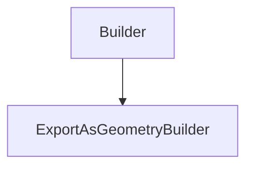

# ExportAsGeometryBuilder

## Class Inheritance

**Classes:**

- [Builder](class-builder.md)
- [ExportAsGeometryBuilder](class-exportasgeometrybuilder.md)

## Description

Represents a Export As Geometry Builder.

## Member Summary

| Member | Type |
| --- | --- |
| [Features](#features) | public |
| [ExportMode](#exportmode) | public |
| [PartName](#partname) | public |
| [ExportComponent](#exportcomponent) | public |
| [ExportTemplateName](#exporttemplatename) | public |

## Public Static Attributes

### Features

`list[Feature] Features`

Gets or sets features to export as geometry.

The Features property takes and returns a list of feature objects.  
**Value type**: List of Feature objects.  
  
The default value is an empty list.

---

### ExportMode

`int ExportMode`

Gets or sets the export mode.

The values are:  
0 - Export to a new part.  
1 - Export to an existing part.  
**Value type**: Integer.  
  
The default value is 0.

---

### PartName

`Name PartName`

Gets or sets the part name.

**Prerequisite**: The ExportMode property must be 0.  
**Value type**: String.  
  
The default value is Speos Export Part.

---

### ExportComponent

`Component ExportComponent`

Gets or sets the component used to export geometry.

**Prerequisite**: ExportMode must be 0 to set Component.  
The Features property takes and returns a list of feature objects.  
**Value type**: Component tag.  
  
The default value is an empty.

---

### ExportTemplateName

`Name ExportTemplateName`

Gets or sets the template name.

**Prerequisite**: The UseExportTemplate property must be True and ExportMode must be 0.  
**Value type**: String.  
  
The default value is an empty string.
