# Feature

## Class Inheritance

```mermaid
%%{init: {"securityLevel": "loose"}}%%
flowchart TD
    Feature["Feature"]
    click Feature "class-feature.md" "Open Feature"
    ComponentOpticalDesignExchangeFeature["ComponentOpticalDesignExchangeFeature"]
    click ComponentOpticalDesignExchangeFeature "class-componentopticaldesignexchangefeature.md" "Open ComponentOpticalDesignExchangeFeature"
    ComponentOpticalDesignExchangeResultFeature["ComponentOpticalDesignExchangeResultFeature"]
    click ComponentOpticalDesignExchangeResultFeature "class-componentopticaldesignexchangeresultfeature.md" "Open ComponentOpticalDesignExchangeResultFeature"
    FeatureSimulation["FeatureSimulation"]
    click FeatureSimulation "class-featuresimulation.md" "Open FeatureSimulation"
    MeasureFeature["MeasureFeature"]
    click MeasureFeature "class-measurefeature.md" "Open MeasureFeature"
    ResultFeature["ResultFeature"]
    click ResultFeature "class-resultfeature.md" "Open ResultFeature"
    RuleFeature["RuleFeature"]
    click RuleFeature "class-rulefeature.md" "Open RuleFeature"
    Feature --> ComponentOpticalDesignExchangeFeature
    Feature --> ComponentOpticalDesignExchangeResultFeature
    Feature --> FeatureSimulation
    Feature --> MeasureFeature
    Feature --> ResultFeature
    Feature --> RuleFeature
```

**Classes:**

- [Feature](class-feature.md)
- [ComponentOpticalDesignExchangeFeature](class-componentopticaldesignexchangefeature.md)
- [ComponentOpticalDesignExchangeResultFeature](class-componentopticaldesignexchangeresultfeature.md)
- [FeatureSimulation](class-featuresimulation.md)
- [MeasureFeature](class-measurefeature.md)
- [ResultFeature](class-resultfeature.md)
- [RuleFeature](class-rulefeature.md)

## Description

Represents a Speos feature.

## Member Summary

| Member | Type | Description |
| --- | --- | --- |
| [Update](#update) | public | Updates the feature. |
| [Delete](#delete) | public | Deletes the feature. |
| [IsOccurrence](#isoccurrence) | public | Returns True if the feature is an occurrence otherwise, returns False. |
| [Hide](#hide) | public | Hides the preview of the feature. |
| [Show](#show) | public | Shows the preview of the feature. |
| [Name](#name) | public | Returns the name of the feature. |
| [Tag](#tag) | public | Returns the NX tag for this feature. |

## Public Member Functions

### Update

`void Update(self)`

Updates the feature.

---

### Delete

`void Delete(self)`

Deletes the feature.

---

### IsOccurrence

`bool IsOccurrence(self)`

Returns True if the feature is an occurrence otherwise, returns False.

---

### Hide

`void Hide(self)`

Hides the preview of the feature.

---

### Show

`void Show(self)`

Shows the preview of the feature.

## Public Static Attributes

### Name

`str Name`

Returns the name of the feature.

**Value type**: String.

---

### Tag

`int Tag`

Returns the NX tag for this feature.

**Value type**: Integer.
