# FeatureBuilder

## Class Inheritance

```mermaid
%%{init: {"securityLevel": "loose"}}%%
flowchart LR
    Builder["Builder"]
    click Builder "class-builder.md" "Open Builder"
    FeatureBuilder["FeatureBuilder"]
    click FeatureBuilder "class-featurebuilder.md" "Open FeatureBuilder"
    Component3DTextureBuilder["Component3DTextureBuilder"]
    click Component3DTextureBuilder "class-component3dtexturebuilder.md" "Open Component3DTextureBuilder"
    ComponentAmbientMaterialBuilder["ComponentAmbientMaterialBuilder"]
    click ComponentAmbientMaterialBuilder "class-componentambientmaterialbuilder.md" "Open ComponentAmbientMaterialBuilder"
    ComponentLightBoxExportBuilder["ComponentLightBoxExportBuilder"]
    click ComponentLightBoxExportBuilder "class-componentlightboxexportbuilder.md" "Open ComponentLightBoxExportBuilder"
    ComponentLightBoxImportBuilder["ComponentLightBoxImportBuilder"]
    click ComponentLightBoxImportBuilder "class-componentlightboximportbuilder.md" "Open ComponentLightBoxImportBuilder"
    ComponentOpticalDesignExchangeBuilder["ComponentOpticalDesignExchangeBuilder"]
    click ComponentOpticalDesignExchangeBuilder "class-componentopticaldesignexchangebuilder.md" "Open ComponentOpticalDesignExchangeBuilder"
    ComponentOpticalDesignExchangeResultBuilder["ComponentOpticalDesignExchangeResultBuilder"]
    click ComponentOpticalDesignExchangeResultBuilder "class-componentopticaldesignexchangeresultbuilder.md" "Open ComponentOpticalDesignExchangeResultBuilder"
    ComponentPolarizationPlateBuilder["ComponentPolarizationPlateBuilder"]
    click ComponentPolarizationPlateBuilder "class-componentpolarizationplatebuilder.md" "Open ComponentPolarizationPlateBuilder"
    FolderBuilder["FolderBuilder"]
    click FolderBuilder "class-folderbuilder.md" "Open FolderBuilder"
    LightExpertSensorGroupBuilder["LightExpertSensorGroupBuilder"]
    click LightExpertSensorGroupBuilder "class-lightexpertsensorgroupbuilder.md" "Open LightExpertSensorGroupBuilder"
    OpticalPropertiesBuilder["OpticalPropertiesBuilder"]
    click OpticalPropertiesBuilder "class-opticalpropertiesbuilder.md" "Open OpticalPropertiesBuilder"
    ResultLXPBuilder["ResultLXPBuilder"]
    click ResultLXPBuilder "class-resultlxpbuilder.md" "Open ResultLXPBuilder"
    Sensor3DEnergyDensityBuilder["Sensor3DEnergyDensityBuilder"]
    click Sensor3DEnergyDensityBuilder "class-sensor3denergydensitybuilder.md" "Open Sensor3DEnergyDensityBuilder"
    Sensor3DIrradianceBuilder["Sensor3DIrradianceBuilder"]
    click Sensor3DIrradianceBuilder "class-sensor3dirradiancebuilder.md" "Open Sensor3DIrradianceBuilder"
    SensorCameraBuilder["SensorCameraBuilder"]
    click SensorCameraBuilder "class-sensorcamerabuilder.md" "Open SensorCameraBuilder"
    SensorCommonBuilder["SensorCommonBuilder"]
    click SensorCommonBuilder "class-sensorcommonbuilder.md" "Open SensorCommonBuilder"
    SensorHumanEyeBuilder["SensorHumanEyeBuilder"]
    click SensorHumanEyeBuilder "class-sensorhumaneyebuilder.md" "Open SensorHumanEyeBuilder"
    SensorLiDARBuilder["SensorLiDARBuilder"]
    click SensorLiDARBuilder "class-sensorlidarbuilder.md" "Open SensorLiDARBuilder"
    SensorLightFieldBuilder["SensorLightFieldBuilder"]
    click SensorLightFieldBuilder "class-sensorlightfieldbuilder.md" "Open SensorLightFieldBuilder"
    SensorObserverBuilder["SensorObserverBuilder"]
    click SensorObserverBuilder "class-sensorobserverbuilder.md" "Open SensorObserverBuilder"
    SensorPhysicalCameraBuilder["SensorPhysicalCameraBuilder"]
    click SensorPhysicalCameraBuilder "class-sensorphysicalcamerabuilder.md" "Open SensorPhysicalCameraBuilder"
    SensorVRImmersiveBuilder["SensorVRImmersiveBuilder"]
    click SensorVRImmersiveBuilder "class-sensorvrimmersivebuilder.md" "Open SensorVRImmersiveBuilder"
    SimulationCommonBuilder["SimulationCommonBuilder"]
    click SimulationCommonBuilder "class-simulationcommonbuilder.md" "Open SimulationCommonBuilder"
    SimulationLiDARBuilder["SimulationLiDARBuilder"]
    click SimulationLiDARBuilder "class-simulationlidarbuilder.md" "Open SimulationLiDARBuilder"
    SourceAmbientCommonBuilder["SourceAmbientCommonBuilder"]
    click SourceAmbientCommonBuilder "class-sourceambientcommonbuilder.md" "Open SourceAmbientCommonBuilder"
    SourceAmbientEnvironmentBuilder["SourceAmbientEnvironmentBuilder"]
    click SourceAmbientEnvironmentBuilder "class-sourceambientenvironmentbuilder.md" "Open SourceAmbientEnvironmentBuilder"
    SourceDisplayBuilder["SourceDisplayBuilder"]
    click SourceDisplayBuilder "class-sourcedisplaybuilder.md" "Open SourceDisplayBuilder"
    SourceGroupBuilder["SourceGroupBuilder"]
    click SourceGroupBuilder "class-sourcegroupbuilder.md" "Open SourceGroupBuilder"
    SourceInteractiveBuilder["SourceInteractiveBuilder"]
    click SourceInteractiveBuilder "class-sourceinteractivebuilder.md" "Open SourceInteractiveBuilder"
    SourceLightFieldBuilder["SourceLightFieldBuilder"]
    click SourceLightFieldBuilder "class-sourcelightfieldbuilder.md" "Open SourceLightFieldBuilder"
    SourceLuminaireBuilder["SourceLuminaireBuilder"]
    click SourceLuminaireBuilder "class-sourceluminairebuilder.md" "Open SourceLuminaireBuilder"
    SourceRayFileBuilder["SourceRayFileBuilder"]
    click SourceRayFileBuilder "class-sourcerayfilebuilder.md" "Open SourceRayFileBuilder"
    SourceSurfaceBuilder["SourceSurfaceBuilder"]
    click SourceSurfaceBuilder "class-sourcesurfacebuilder.md" "Open SourceSurfaceBuilder"
    SourceSurfaceThermicBuilder["SourceSurfaceThermicBuilder"]
    click SourceSurfaceThermicBuilder "class-sourcesurfacethermicbuilder.md" "Open SourceSurfaceThermicBuilder"
    SpeosPatternBuilder["SpeosPatternBuilder"]
    click SpeosPatternBuilder "class-speospatternbuilder.md" "Open SpeosPatternBuilder"
    VirtualBSDFBenchBuilder["VirtualBSDFBenchBuilder"]
    click VirtualBSDFBenchBuilder "class-virtualbsdfbenchbuilder.md" "Open VirtualBSDFBenchBuilder"
    Builder --> FeatureBuilder
    FeatureBuilder --> Component3DTextureBuilder
    FeatureBuilder --> ComponentAmbientMaterialBuilder
    FeatureBuilder --> ComponentLightBoxExportBuilder
    FeatureBuilder --> ComponentLightBoxImportBuilder
    FeatureBuilder --> ComponentOpticalDesignExchangeBuilder
    FeatureBuilder --> ComponentOpticalDesignExchangeResultBuilder
    FeatureBuilder --> ComponentPolarizationPlateBuilder
    FeatureBuilder --> FolderBuilder
    FeatureBuilder --> LightExpertSensorGroupBuilder
    FeatureBuilder --> OpticalPropertiesBuilder
    FeatureBuilder --> ResultLXPBuilder
    FeatureBuilder --> Sensor3DEnergyDensityBuilder
    FeatureBuilder --> Sensor3DIrradianceBuilder
    FeatureBuilder --> SensorCameraBuilder
    FeatureBuilder --> SensorCommonBuilder
    FeatureBuilder --> SensorHumanEyeBuilder
    FeatureBuilder --> SensorLiDARBuilder
    FeatureBuilder --> SensorLightFieldBuilder
    FeatureBuilder --> SensorObserverBuilder
    FeatureBuilder --> SensorPhysicalCameraBuilder
    FeatureBuilder --> SensorVRImmersiveBuilder
    FeatureBuilder --> SimulationCommonBuilder
    FeatureBuilder --> SimulationLiDARBuilder
    FeatureBuilder --> SourceAmbientCommonBuilder
    FeatureBuilder --> SourceAmbientEnvironmentBuilder
    FeatureBuilder --> SourceDisplayBuilder
    FeatureBuilder --> SourceGroupBuilder
    FeatureBuilder --> SourceInteractiveBuilder
    FeatureBuilder --> SourceLightFieldBuilder
    FeatureBuilder --> SourceLuminaireBuilder
    FeatureBuilder --> SourceRayFileBuilder
    FeatureBuilder --> SourceSurfaceBuilder
    FeatureBuilder --> SourceSurfaceThermicBuilder
    FeatureBuilder --> SpeosPatternBuilder
    FeatureBuilder --> VirtualBSDFBenchBuilder
```

**Classes:**

- [Builder](class-builder.md)
- [FeatureBuilder](class-featurebuilder.md)
- [Component3DTextureBuilder](class-component3dtexturebuilder.md)
- [ComponentAmbientMaterialBuilder](class-componentambientmaterialbuilder.md)
- [ComponentLightBoxExportBuilder](class-componentlightboxexportbuilder.md)
- [ComponentLightBoxImportBuilder](class-componentlightboximportbuilder.md)
- [ComponentOpticalDesignExchangeBuilder](class-componentopticaldesignexchangebuilder.md)
- [ComponentOpticalDesignExchangeResultBuilder](class-componentopticaldesignexchangeresultbuilder.md)
- [ComponentPolarizationPlateBuilder](class-componentpolarizationplatebuilder.md)
- [FolderBuilder](class-folderbuilder.md)
- [LightExpertSensorGroupBuilder](class-lightexpertsensorgroupbuilder.md)
- [OpticalPropertiesBuilder](class-opticalpropertiesbuilder.md)
- [ResultLXPBuilder](class-resultlxpbuilder.md)
- [Sensor3DEnergyDensityBuilder](class-sensor3denergydensitybuilder.md)
- [Sensor3DIrradianceBuilder](class-sensor3dirradiancebuilder.md)
- [SensorCameraBuilder](class-sensorcamerabuilder.md)
- [SensorCommonBuilder](class-sensorcommonbuilder.md)
- [SensorHumanEyeBuilder](class-sensorhumaneyebuilder.md)
- [SensorLiDARBuilder](class-sensorlidarbuilder.md)
- [SensorLightFieldBuilder](class-sensorlightfieldbuilder.md)
- [SensorObserverBuilder](class-sensorobserverbuilder.md)
- [SensorPhysicalCameraBuilder](class-sensorphysicalcamerabuilder.md)
- [SensorVRImmersiveBuilder](class-sensorvrimmersivebuilder.md)
- [SimulationCommonBuilder](class-simulationcommonbuilder.md)
- [SimulationLiDARBuilder](class-simulationlidarbuilder.md)
- [SourceAmbientCommonBuilder](class-sourceambientcommonbuilder.md)
- [SourceAmbientEnvironmentBuilder](class-sourceambientenvironmentbuilder.md)
- [SourceDisplayBuilder](class-sourcedisplaybuilder.md)
- [SourceGroupBuilder](class-sourcegroupbuilder.md)
- [SourceInteractiveBuilder](class-sourceinteractivebuilder.md)
- [SourceLightFieldBuilder](class-sourcelightfieldbuilder.md)
- [SourceLuminaireBuilder](class-sourceluminairebuilder.md)
- [SourceRayFileBuilder](class-sourcerayfilebuilder.md)
- [SourceSurfaceBuilder](class-sourcesurfacebuilder.md)
- [SourceSurfaceThermicBuilder](class-sourcesurfacethermicbuilder.md)
- [SpeosPatternBuilder](class-speospatternbuilder.md)
- [VirtualBSDFBenchBuilder](class-virtualbsdfbenchbuilder.md)

## Description

A base class for all feature Builders.

## Member Summary

| Member | Type | Description |
| --- | --- | --- |
| [ShowResult](#showresult) | public | Updates the feature to reflect the result of an edit to the feature for all builders that support showing results. |
| [Feature](#feature) | public | Returns the feature being edited, or the created feature if the builder is being used in creation mode. |
| [Status](#status) | public | Returns the status of the feature being edited. |
| [Name](#name) | public | Gets or sets the name of the feature being edited. |
| [FullName](#fullname) | public | Gets the full name of the feature being edited. |
| [NameWithContext](#namewithcontext) | public | Gets the name with context of the feature being edited. |

## Public Member Functions

### ShowResult

`void ShowResult(self)`

Updates the feature to reflect the result of an edit to the feature for all builders that support showing results.

## Public Static Attributes

### Feature

`Feature Feature`

Returns the feature being edited, or the created feature if the builder is being used in creation mode.

Returns the feature currently being edited by this builder.  
If a new feature is being created, and the builder has not yet been commited, returns Null.

---

### Status

`int Status`

Returns the status of the feature being edited.

Returns a value corresponding to the status of the feature being edited.  
  
**Value type**: Integer.

---

### Name

`str Name`

Gets or sets the name of the feature being edited.

**Value type**: String.  
  
The default value is the current feature name.

---

### FullName

`Name FullName`

Gets the full name of the feature being edited.

**Value type**: String.  
  
The default value is the current feature full name.

---

### NameWithContext

`str NameWithContext`

Gets the name with context of the feature being edited.

**Value type**: String.
