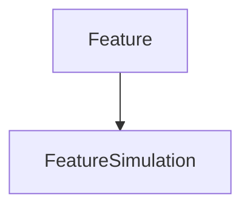

# FeatureSimulation

## Class Inheritance

**Classes:**

- [Feature](class-feature.md)
- [FeatureSimulation](class-featuresimulation.md)

## Description

Represents a Speos simulation feature.

## Member Summary

| Member | Type | Description |
| --- | --- | --- |
| [Results](#results) | public | Gets the result collection. |
| [GPUSimulationMode](#gpusimulationmode) | public | Sets the simulation mode. |
| [Isolate](#isolate) | public | Isolates the simulation and its results. |
| [Export](#export) | public | Exports the simulation to a specified location. |
| [LinkedExport](#linkedexport) | public | Exports the simulation to the Speos isolated folder. |
| [UpdateSpeosHPC](#updatespeoshpc) | public | Runs the simulation on the Speos HPC cluster. |

## Public Static Attributes

### Results

`ResultCollection Results`

Gets the result collection.

Returns the [ResultCollection](class-resultcollection.md) belonging to this simulation.

---

### GPUSimulationMode

`bool GPUSimulationMode`

Sets the simulation mode.

True: GPU simulation.  
False: CPU simulation.  
  
**Value type**: Boolean.  
  
The default value is False.

## Public Member Functions

### Isolate

`void Isolate(self)`

Isolates the simulation and its results.

**Prerequisite**: The simulation must be updated.

---

### Export

`void Export(self, path)`

Exports the simulation to a specified location.

**Prerequisite**: The simulation must be updated.

**Parameters**:

- `str path`: The output folder.

---

### LinkedExport

`void LinkedExport(self)`

Exports the simulation to the Speos isolated folder.

Exports the simulation to the folder "./Speos isolated folder/"

---

### UpdateSpeosHPC

`void UpdateSpeosHPC(self)`

Runs the simulation on the Speos HPC cluster.

**Prerequisite**: The Speos HPC cluster must be configured.
