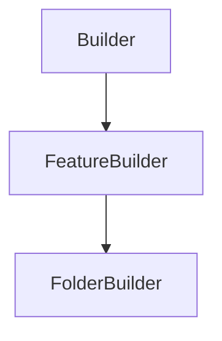

# FolderBuilder

## Class Inheritance

**Classes:**

- [Builder](class-builder.md)
- [FeatureBuilder](class-featurebuilder.md)
- [FolderBuilder](class-folderbuilder.md)

## Description

Represents a Folder Builder.

## Member Summary

| Member | Type |
| --- | --- |
| [Features](#features) | public |
| [Category](#category) | public |
| [Remove](#remove) | public |
| [RemoveFeatures](#removefeatures) | public |
| [Add](#add) | public |
| [Insert](#insert) | public |
| [IsCompatible](#iscompatible) | public |

## Public Static Attributes

### Features

`list[Feature] Features`

Gets or sets features belonging to this folder.

The Features property takes and returns a list of feature objects.  
  
**Value type**: List of Feature objects.  
  
The default value is an empty list.

---

### Category

`int Category`

Gets or sets the category type of the folder.

The values are:  
0 - None.  
1 - Properties.  
2 - Sources.  
3 - Sensors.  
4 - Simulations.  
  
**Value type**: Integer.  
  
The default value is None (0). A category type other than None (0) must be defined.

## Public Member Functions

### Remove

`void Remove(self, feature)`

Removes the specified feature object from the folder.

The specified feature object must be a member of the folder to be removed from it.

**Parameters**:

- `Feature feature`: the feature object.

---

### RemoveFeatures

`void RemoveFeatures(self, features)`

Removes the specified feature objects from the folder.

The specified feature objects must be members of the folder to be removed from it.

**Parameters**:

- `list[Feature] features`: the list of Feature objects.

---

### Add

`bool Add(self, feature)`

Adds the specified feature object into the folder.

**Parameters**:

- `Feature feature`: the feature object.

---

### Insert

`bool Insert(self, feature, after)`

Inserts the specified feature object into the folder after another specified feature.

**Parameters**:

- `Feature feature`: the feature object to add.

- `Feature after`: a feature object after which the feature object should be insert.

---

### IsCompatible

`bool IsCompatible(self, feature)`

Checks if the specified feature object is compatible with this folder.

**Parameters**:

- `Feature feature`: the feature object.
