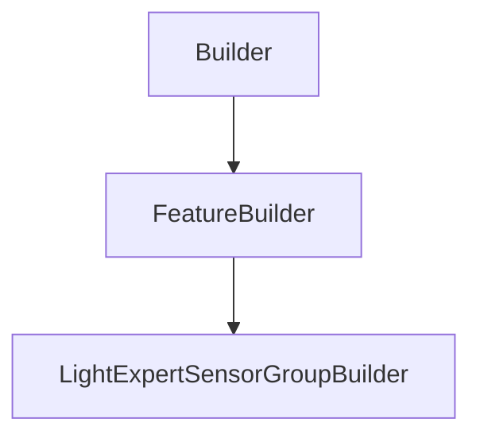

# LightExpertSensorGroupBuilder

## Class Inheritance

**Classes:**

- [Builder](class-builder.md)
- [FeatureBuilder](class-featurebuilder.md)
- [LightExpertSensorGroupBuilder](class-lightexpertsensorgroupbuilder.md)

## Description

Represents a light expert sensor group builder.

The light expert sensor group builder is used to create and edit light expert sensor group features.  
  
To create a new instance of this class, use [FeatureCollection::CreateLightExpertSensorGroupBuilder](class-featurecollection.md#createlightexpertsensorgroupbuilder)

## Member Summary

| Member | Type | Description |
| --- | --- | --- |
| [Sensors](#sensors) | public | Gets or sets sensor features. |
| [RemoveSensors](#removesensors) | public | Removes the sensors from the group. |

## Public Static Attributes

### Sensors

`list[Feature] Sensors`

Gets or sets sensor features.

This property takes or returns a list of sensors.  
  
**Value type**: List of Feature object.

## Public Member Functions

### RemoveSensors

`void RemoveSensors(self, sensors)`

Removes the sensors from the group.

**Parameters**:

- `list[Feature] sensors`: List of Feature object.

**Returns**: void.
