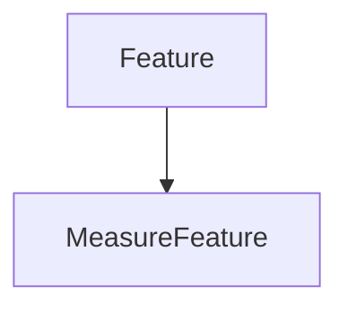

# MeasureFeature

## Class Inheritance

**Classes:**

- [Feature](class-feature.md)
- [MeasureFeature](class-measurefeature.md)

## Description

Represents a Speos measure feature.

## Member Summary

| Member | Type |
| --- | --- |
| [Value](#value) | public |

## Public Static Attributes

### Value

`float Value`

Gets the measure value.

**Value type**: Double.  
  
The default value is 0.
