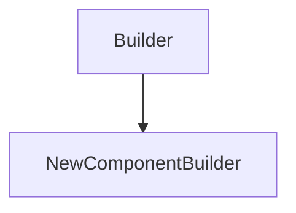

# NewComponentBuilder

## Class Inheritance

**Classes:**

- [Builder](class-builder.md)
- [NewComponentBuilder](class-newcomponentbuilder.md)

## Description

Represents a builder to create new assembly components.

## Member Summary

| Member | Type |
| --- | --- |
| [Name](#name) | public |
| [ReferenceSetName](#referencesetname) | public |
| [NewComponent](#newcomponent) | public |

## Public Static Attributes

### Name

`str Name`

Gets or sets the name of the new component to create.

**Value type**: String.  
  
The default value is an empty string.

---

### ReferenceSetName

`str ReferenceSetName`

Gets or sets the name of the NX reference set to use.

**Value type**: String.  
  
The default value is "Entire Part" Reference Set.

---

### NewComponent

`Component NewComponent`

Returns the created component tag.

**Value type**: Component tag.  
  
The default value is 0.
