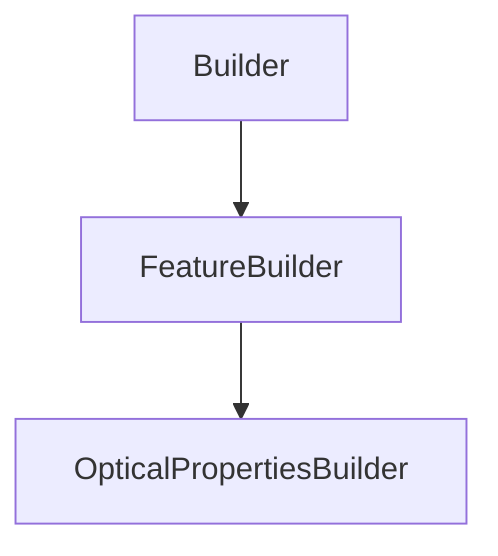

# OpticalPropertiesBuilder

## Class Inheritance

**Classes:**

- [Builder](class-builder.md)
- [FeatureBuilder](class-featurebuilder.md)
- [OpticalPropertiesBuilder](class-opticalpropertiesbuilder.md)

## Description

Represents the builder for optical properties

## Member Summary

| Member | Type |
| --- | --- |
| [OpticalPropertiesGeometry](#opticalpropertiesgeometry) | public |
| [UseOpticalProperties](#useopticalproperties) | public |
| [VOPType](#voptype) | public |
| [VOPIndex](#vopindex) | public |
| [VOPAbsorption](#vopabsorption) | public |
| [UseVOPConstringence](#usevopconstringence) | public |
| [VOPConstringence](#vopconstringence) | public |
| [VOPLibraryFilePath](#voplibraryfilepath) | public |
| [SOPType](#soptype) | public |
| [SOPReflectance](#sopreflectance) | public |
| [SOPLibraryFilePath](#soplibraryfilepath) | public |
| [SOPPluginFilePath](#soppluginfilepath) | public |
| [SOPPluginParametersFilePath](#soppluginparametersfilepath) | public |
| [UseMeshingProperties](#usemeshingproperties) | public |
| [MeshingAngle](#meshingangle) | public |
| [MeshingSagMode](#meshingsagmode) | public |
| [MeshingSagValue](#meshingsagvalue) | public |
| [MeshingStepMode](#meshingstepmode) | public |
| [MeshingStepValue](#meshingstepvalue) | public |
| [UseMeshingSpecificParametersFacetEdges](#usemeshingspecificparametersfacetedges) | public |
| [MeshingEdgeSagValue](#meshingedgesagvalue) | public |
| [MeshingEdgeAngle](#meshingedgeangle) | public |

## Public Static Attributes

### OpticalPropertiesGeometry

`OpticalPropertiesGeometry OpticalPropertiesGeometry`

Gets optical properties geometry.

**Value type**: OpticalPropertiesGeometry object.

---

### UseOpticalProperties

`bool UseOpticalProperties`

Gets or sets the optical properties property.

True: Enables optical properties.  
False: Disables optical properties.  
**Value type**: Boolean.  
  
The default value is True.

---

### VOPType

`int VOPType`

Gets or sets the volume optical properties type.

**Prerequisite**: The IsOpticalProperties property must be True.  
  
The values are:  
0 - Optic, uses transparent colorless part without bulk scattering.  
1 - Opaque (Solid Body), uses non transparent part.  
2 - Library, with this value the VOPLibraryFile property is available and must be defined.  
3 - None, does not apply a volume optical properties on surface in case you have a surface geometry.  
**Value type**: Integer.  
  
The default value is 1.

---

### VOPIndex

`float VOPIndex`

Gets or sets the volume optical properties index.

**Prerequisite**: The VOPType property must be 0.  
**Value type**: Double.  
**Range**: The value must be superior or equal to 1.  
  
The default value is 1.5.

---

### VOPAbsorption

`float VOPAbsorption`

Gets or sets the volume optical properties absorption.

**Prerequisite**: The VOPType property must be 0.  
**Value type**: Double.  
**Range**: The value must be superior or equal to 0.  
  
The default value is 0.0.

---

### UseVOPConstringence

`bool UseVOPConstringence`

Gets or sets the volume optical properties constringence property.

**Prerequisite**: The VOPType property must be 0.  
  
True: Enables constringence.  
False: Disables constringence.  
**Value type**: Boolean.  
  
The default value is False.

---

### VOPConstringence

`float VOPConstringence`

Gets or sets the volume optical properties constringence.

**Prerequisite**: The IsVOPConstringence property must be True.  
**Value type**: Double.  
**Range**: The value must be superior or equal to 20.0.  
  
The default value is 60.0

---

### VOPLibraryFilePath

`str VOPLibraryFilePath`

Gets or sets the volume optical properties library file.

**Prerequisite**: The VOPType property must be 2.  
**value type**: String.  
  
The default value is an empty string.

---

### SOPType

`int SOPType`

Gets or sets the surface optical properties.

**Prerequisite**: The IsOpticalProperties property must be True.  
  
The values are:  
0 - Optical Polished, uses a transparent or perfectly polished material (glass, plastic).  
1 - Mirror, uses a perfect specular surface and edits the Reflectance value if needed.  
2 - Library, with this value the SOPLibraryFile property is available and must be defined.  
3 - Plug-in, selects a custom made \*.sop plug-in as File and the Parameters file for the plug-in.  
**Value type**: Integer.  
  
The default value is 1.

---

### SOPReflectance

`float SOPReflectance`

Gets or sets the surface optical properties reflectance.

**Prerequisite**: The SOPType property must be 1.  
**Value type**: Double.  
**Range**: [0.0, 100.0].  
  
The default value is 100.0.

---

### SOPLibraryFilePath

`str SOPLibraryFilePath`

Gets or sets the surface optical properties library file.

**Prerequisite**: The SOPType property must be 2.  
**Value type**: String.  
  
The default value is an empty string.

---

### SOPPluginFilePath

`str SOPPluginFilePath`

Gets or sets the surface optical properties plug-in file.

**Prerequisite**: The SOPType property must be 3.  
**Value type**: String.  
  
The default value is an empty string.

---

### SOPPluginParametersFilePath

`str SOPPluginParametersFilePath`

Gets or sets the surface optical properties parameters file.

**Prerequisite**: The SOPType property must be 3.  
**Value type**: String.  
  
The default value is an empty string.

---

### UseMeshingProperties

`bool UseMeshingProperties`

Gets or sets the meshing properties property.

True: Enables meshing properties.  
False: Disables meshing properties.  
**Value type**: Boolean.  
  
The default value is False.

---

### MeshingAngle

`float MeshingAngle`

Gets or sets the meshing angle.

**Prerequisite**: The IsMeshingProperties property must be True.  
**Value type**: Double (in degrees).  
**Range**: (0.0, 90.0).  
  
The default value is 15.0 degrees.

---

### MeshingSagMode

`int MeshingSagMode`

Gets or sets the meshing sag mode.

**Prerequisite**: The IsMeshingProperties property must be True.  
  
The values are:  
0 - Proportional, the value adapts and adjusts to the size of each face of the object.  
1 - Fixed, the value will remain unchanged no matter the size or shape of the object.  
**Value type**: Integer.  
  
The default value is 1.

---

### MeshingSagValue

`float MeshingSagValue`

Gets or sets the meshing sag value.

**Value type**: Double (in mm).  
**Range**: The value must be superior to 0.  
  
The default value is 0.5 mm.

---

### MeshingStepMode

`int MeshingStepMode`

Gets or sets the meshing step mode.

**Prerequisite**: The IsMeshingProperties property must be True.  
  
The values are:  
0 - Proportional, the value adapts and adjusts to the size of each face of the object.  
1 - Fixed, the value will remain unchanged no matter the size or shape of the object.  
**Value type**: Integer.  
  
The default value is 1.

---

### MeshingStepValue

`float MeshingStepValue`

Gets or sets the meshing step value.

**Value type**: Double (in mm).  
**Range**: The value must be superior to 0.  
  
The default value is 1.0 mm.

---

### UseMeshingSpecificParametersFacetEdges

`bool UseMeshingSpecificParametersFacetEdges`

Gets or sets the specific parameters property for facet edges.

**Prerequisite**: The IsMeshingProperties property must be True.  
  
Allows you to control the precision of the meshing on the edges of the faces.  
  
True: Enables specific parameters for facet edges.  
False: Disables specific parameters for facet edges.  
**Value type**: Boolean.  
  
The default value is False.

---

### MeshingEdgeSagValue

`float MeshingEdgeSagValue`

Gets or sets the meshing edge sag value.

**Prerequisite**: The IsSpecificParametersFacetEdges property must be True.  
  
Defines the maximum distance between the geometry and the meshing on the edges. The Meshing edge sag value always uses the Fixed mode.  
**Value type**: Double (in mm).  
**Range**: The value must be superior to 0.  
  
The default value is 0.1 mm.

---

### MeshingEdgeAngle

`float MeshingEdgeAngle`

Gets or sets the meshing angle.

**Prerequisite**: The IsSpecificParametersFacetEdges property must be True.  
  
Defines the maximum angular variation in degrees between successive tangents for all points along a solid edge.  
**Value type**: Double (in degrees).  
**Range**: (0.0, 90.0).  
  
The default value is 10.0 degrees.
