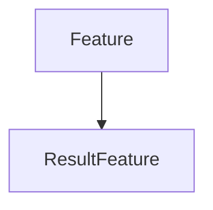

# ResultFeature

## Class Inheritance

**Classes:**

- [Feature](class-feature.md)
- [ResultFeature](class-resultfeature.md)

## Description

Represents a Speos result feature.

A base class for all Speos result features.  
  
This class provides the basic functionality common to all result features.  
To obtain an instance of this class, refer to FeatureSimulation::GetResults.

## Member Summary

| Member | Type | Description |
| --- | --- | --- |
| [Filename](#filename) | public | Gets the result file name with its extension. |
| [AssociatedLPFResult](#associatedlpfresult) | public | Returns the LPF result feature associated to this XMP result feature. |
| [Measures](#measures) | public | Returns the collection of measures belonging to this result. |
| [Rules](#rules) | public | Returns the collection of rules belonging to this result. |

## Public Static Attributes

### Filename

`str Filename`

Gets the result file name with its extension.

**Value type**: String.  
  
The default value is an empty string.

---

### AssociatedLPFResult

`ResultFeature AssociatedLPFResult`

Returns the LPF result feature associated to this XMP result feature.

**Prerequisite**: The result feature must be an XMP result.

**Returns**: The result feature or None.

---

### Measures

`MeasureCollection Measures`

Returns the collection of measures belonging to this result.

**Returns**: The collection of measures.

---

### Rules

`RuleCollection Rules`

Returns the collection of rules belonging to this result.

**Returns**: The collection of rules.
