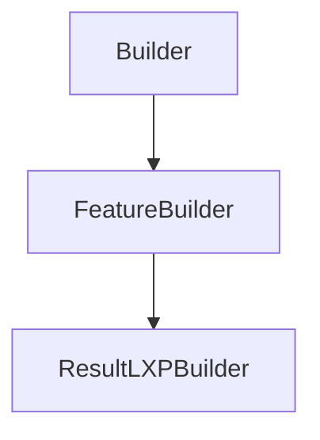

# ResultLXPBuilder

## Class Inheritance

**Classes:**

- [Builder](class-builder.md)
- [FeatureBuilder](class-featurebuilder.md)
- [ResultLXPBuilder](class-resultlxpbuilder.md)

## Description

Represents a Result Light Expert builder.

## Member Summary

| Member | Type |
| --- | --- |
| [NumberOfRays](#numberofrays) | public |
| [DrawingOptions](#drawingoptions) | public |
| [InfiniteRayLength](#infiniteraylength) | public |
| [SelectedRaysMode](#selectedraysmode) | public |
| [RequiredFaces](#requiredfaces) | public |
| [RequiredFacesMode](#requiredfacesmode) | public |
| [RejectedFaces](#rejectedfaces) | public |
| [CreateAreaRectangle](#createarearectangle) | public |
| [CreateAreaEllipse](#createareaellipse) | public |
| [CreateAreaPolygon](#createareapolygon) | public |
| [RetrieveMeasureValue](#retrievemeasurevalue) | public |

## Public Static Attributes

### NumberOfRays

`int NumberOfRays`

Gets or sets the number of rays.

Number of rays calculate.  
**Value type**: Integer.  
**Range**: The value must be superior to 0.  
  
The default value is 200.

---

### DrawingOptions

`int DrawingOptions`

Gets or sets the drawing options.

The values are:  
1 - Rays.  
2 - Impact.  
3 - Rays and Impacts.  
**Value type**: Integer.  
  
The default value is 0.

---

### InfiniteRayLength

`float InfiniteRayLength`

Gets or sets the infinite ray length.

Length used to draw infinite rays.  
**Value type**: Double (in mm).  
**Range**: The value must be superior or equal to 0.0.  
  
The default value is calculated based on the system bounding box.

---

### SelectedRaysMode

`int SelectedRaysMode`

Gets or sets the selected rays mode.

The values are:  
0 - IN.  
1 - OUT.  
**Value type**: Integer.  
  
The default value is 0.

---

### RequiredFaces

`list RequiredFaces`

Gets or sets requiered faces tag.

The RequiredFaces property returns a list of feature tag.

---

### RequiredFacesMode

`int RequiredFacesMode`

Gets or sets the required faces mode.

The values are:  
0 - AND.  
1 - OR.  
**Value type**: Integer.  
  
The default value is 0.

---

### RejectedFaces

`list RejectedFaces`

Gets or sets rejected faces tag.

The RejectedFaces property returns a list of feature tag.

## Public Member Functions

### CreateAreaRectangle

`void CreateAreaRectangle(self, sensorIndex, xCenter, yCenter, width, height)`

Create a rectangle area.

**Parameters**:

- `int sensorIndex`: index of XMP in the sensor group (must be 0 for non group sensor). 

- `float xCenter`: Center position X of the rectangle area. 

- `float yCenter`: Center position Y of the rectangle area. 

- `float width`: Width of the rectangle area. 

- `float height`: Height of the rectangle area.  The default value is no reactangle area.

---

### CreateAreaEllipse

`void CreateAreaEllipse(self, sensorIndex, xCenter, yCenter, xRadius, yRadius)`

Create an ellipse area.

**Parameters**:

- `int sensorIndex`: index of XMP in the sensor group (must be 0 for non group sensor). 

- `float xCenter`: Center position X of the ellipse area. 

- `float yCenter`: Center position Y of the ellipse area. 

- `float xRadius`: Radius X of the ellipse area. 

- `float yRadius`: Radius Y of the ellipse area.  The default value is no reactangle area.

---

### CreateAreaPolygon

`void CreateAreaPolygon(self, sensorIndex, xPts, yPts)`

Create an polygon area.

**Parameters**:

- `int sensorIndex`: index of XMP in the sensor group (must be 0 for non group sensor). 

- `list[float] xPts`: List of X position of the polygon area. 

- `list[float] yPts`: List of Y position of the polygon area.  The default value is no reactangle area.

---

### RetrieveMeasureValue

`float RetrieveMeasureValue(self, sensorIndex, measureType)`

Retrieve measure value.

RetrieveMeasureValue return measure value by Type.

**Parameters**:

- `int sensorIndex`: index of XMP in the sensor group (must be 0 for non group sensor). 

- `int measureType`: the type of value to retrieve.  The values are:  1 - Maximum  2 - Maximum position X  3 - Maximum position Y  4 - Minimum  5 - Minimum position X  6 - Minimum position Y  7 - Average  8 - Flux  9 - Barycentre position X  10 - Barycentre position Y  11 - Sigma  12 - Sigma position X  13 - Sigma position Y  14 - Contrast  15 - RMS Contrast  16 - Eye Irradiance  17 - Range  19 - Range position X  20 - Range position Y  21 - Area  22 - UGR117  28 - Deviation Min  29 - Deviation Max  30 - Deviation Average 
