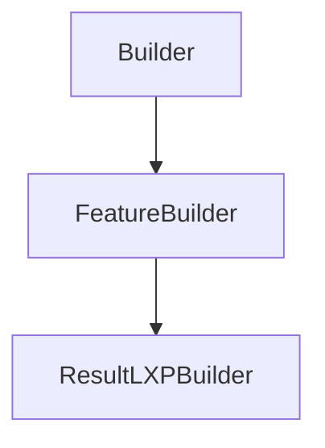

# ResultLXPBuilder

## Class Inheritance

**Classes:**

- [Builder](class-builder.md)
- [FeatureBuilder](class-featurebuilder.md)
- [ResultLXPBuilder](class-resultlxpbuilder.md)

## Description

Represents a Result Light Expert builder.

## Member Summary

| Member | Type | Description |
| --- | --- | --- |
| [NumberOfRays](#numberofrays) | public | Gets or sets the number of rays. |
| [DrawingOptions](#drawingoptions) | public | Gets or sets the drawing options. |
| [InfiniteRayLength](#infiniteraylength) | public | Gets or sets the infinite ray length. |
| [SelectedRaysMode](#selectedraysmode) | public | Gets or sets the selected rays mode. |
| [RequiredFaces](#requiredfaces) | public | Gets or sets requiered faces tag. |
| [RequiredFacesMode](#requiredfacesmode) | public | Gets or sets the required faces mode. |
| [RejectedFaces](#rejectedfaces) | public | Gets or sets rejected faces tag. |
| [CreateAreaRectangle](#createarearectangle) | public | Create a rectangle area. |
| [CreateAreaEllipse](#createareaellipse) | public | Create an ellipse area. |
| [CreateAreaPolygon](#createareapolygon) | public | Create an polygon area. |
| [RetrieveMeasureValue](#retrievemeasurevalue) | public | Retrieve measure value. |

## Public Static Attributes

### NumberOfRays

`int NumberOfRays`

Gets or sets the number of rays.

Number of rays calculate.  
  
**Value type**: Integer.  
**Range**: The value must be superior to 0.  
  
The default value is 200.

---

### DrawingOptions

`int DrawingOptions`

Gets or sets the drawing options.

The values are:  
1 - Rays.  
2 - Impact.  
3 - Rays and Impacts.  
  
**Value type**: Integer.  
  
The default value is 0.

---

### InfiniteRayLength

`float InfiniteRayLength`

Gets or sets the infinite ray length.

Length used to draw infinite rays.  
  
**Value type**: Double (in mm).  
**Range**: The value must be superior or equal to 0.0.  
  
The default value is calculated based on the system bounding box.

---

### SelectedRaysMode

`int SelectedRaysMode`

Gets or sets the selected rays mode.

The values are:  
0 - IN.  
1 - OUT.  
  
**Value type**: Integer.  
  
The default value is 0.

---

### RequiredFaces

`list[int] RequiredFaces`

Gets or sets requiered faces tag.

The RequiredFaces property returns a list of feature tag.

---

### RequiredFacesMode

`int RequiredFacesMode`

Gets or sets the required faces mode.

The values are:  
0 - AND.  
1 - OR.  
  
**Value type**: Integer.  
  
The default value is 0.

---

### RejectedFaces

`list[int] RejectedFaces`

Gets or sets rejected faces tag.

The RejectedFaces property returns a list of feature tag.

## Public Member Functions

### CreateAreaRectangle

`void CreateAreaRectangle(self, sensorIndex, xCenter, yCenter, width, height)`

Create a rectangle area.

**Parameters**:

- `int sensorIndex`: index of XMP in the sensor group (must be 0 for non group sensor).

- `float xCenter`: Center position X of the rectangle area.

- `float yCenter`: Center position Y of the rectangle area.

- `float width`: Width of the rectangle area.

- `float height`: Height of the rectangle area.  
  
The default value is no reactangle area.

---

### CreateAreaEllipse

`void CreateAreaEllipse(self, sensorIndex, xCenter, yCenter, xRadius, yRadius)`

Create an ellipse area.

**Parameters**:

- `int sensorIndex`: index of XMP in the sensor group (must be 0 for non group sensor).

- `float xCenter`: Center position X of the ellipse area.

- `float yCenter`: Center position Y of the ellipse area.

- `float xRadius`: Radius X of the ellipse area.

- `float yRadius`: Radius Y of the ellipse area.  
  
The default value is no reactangle area.

---

### CreateAreaPolygon

`void CreateAreaPolygon(self, sensorIndex, xPts, yPts)`

Create an polygon area.

**Parameters**:

- `int sensorIndex`: index of XMP in the sensor group (must be 0 for non group sensor).

- `list[float] xPts`: List of X position of the polygon area.

- `list[float] yPts`: List of Y position of the polygon area.  
  
The default value is no reactangle area.

---

### RetrieveMeasureValue

`float RetrieveMeasureValue(self, sensorIndex, measureType)`

Retrieve measure value.

RetrieveMeasureValue return measure value by Type.

**Parameters**:

- `int sensorIndex`: index of XMP in the sensor group (must be 0 for non group sensor).

- `int measureType`: the type of value to retrieve.  
The values are:  
1 - Maximum  
2 - Maximum position X  
3 - Maximum position Y  
4 - Minimum  
5 - Minimum position X  
6 - Minimum position Y  
7 - Average  
8 - Flux  
9 - Barycentre position X  
10 - Barycentre position Y  
11 - Sigma  
12 - Sigma position X  
13 - Sigma position Y  
14 - Contrast  
15 - RMS Contrast  
16 - Eye Irradiance  
17 - Range  
19 - Range position X  
20 - Range position Y  
21 - Area  
22 - UGR117  
28 - Deviation Min  
29 - Deviation Max  
30 - Deviation Average
