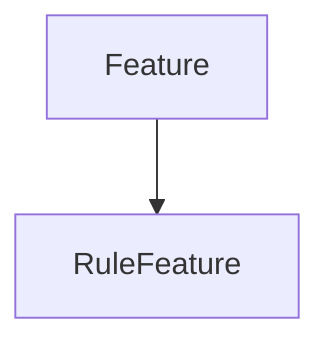

# RuleFeature

## Class Inheritance

**Classes:**

- [Feature](class-feature.md)
- [RuleFeature](class-rulefeature.md)

## Description

Represents a Speos rule feature.

## Member Summary

| Member | Type |
| --- | --- |
| [Status](#status) | public |

## Public Static Attributes

### Status

`bool Status`

Gets the rule status.

**Value type**: Boolean.  
  
The default value is false.
