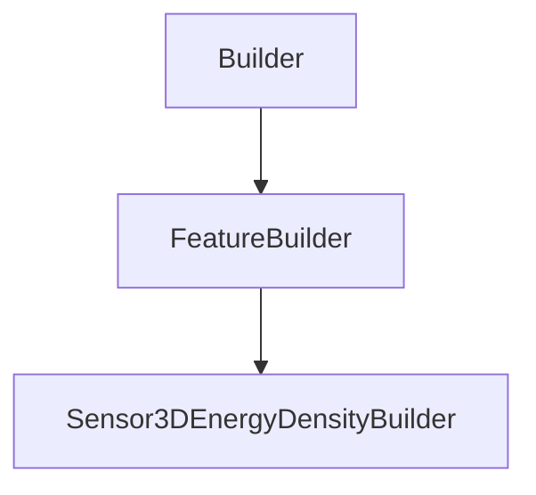

# Sensor3DEnergyDensityBuilder

## Class Inheritance

**Classes:**

- [Builder](class-builder.md)
- [FeatureBuilder](class-featurebuilder.md)
- [Sensor3DEnergyDensityBuilder](class-sensor3denergydensitybuilder.md)

## Description

Represents the builder for a 3D energy density sensor.

## Member Summary

| Member | Type | Description |
| --- | --- | --- |
| [Type](#type) | public | Gets or sets the sensor type. |
| [XSize](#xsize) | public | Gets or sets the X size. |
| [XSampling](#xsampling) | public | Gets or sets the X sampling. |
| [YSize](#ysize) | public | Gets or sets the Y size. |
| [YSampling](#ysampling) | public | Gets or sets the Y sampling. |
| [ZSize](#zsize) | public | Gets or sets the Z size. |
| [ZSampling](#zsampling) | public | Gets or sets the Z sampling. |

## Public Static Attributes

### Type

`int Type`

Gets or sets the sensor type.

The values are:  
0 - Photometric. The sensor considers the visible spectrum.  
1 - Radiometric. The sensor considers the entire spectrum.  
  
**Value type**: Integer.  
  
The default value is 0.

---

### XSize

`float XSize`

Gets or sets the X size.

**Value type**: Double (in mm).  
**Range** The value must be superior to 0.0.  
  
The default value is 50.0 mm.

---

### XSampling

`int XSampling`

Gets or sets the X sampling.

**Value type**: Integer.  
**Range** The value must be superior to 0.  
  
The default value is 100.

---

### YSize

`float YSize`

Gets or sets the Y size.

**Value type**: Double (in mm).  
**Range** The value must be superior to 0.0.  
  
The default value is 50.0 mm.

---

### YSampling

`int YSampling`

Gets or sets the Y sampling.

**Value type**: Integer.  
**Range** The value must be superior to 0.  
  
The default value is 100.

---

### ZSize

`float ZSize`

Gets or sets the Z size.

**Value type**: Double (in mm).  
**Range** The value must be superior to 0.0.  
  
The default value is 50.0 mm.

---

### ZSampling

`int ZSampling`

Gets or sets the Z sampling.

**Value type**: Integer.  
**Range** The value must be superior to 0.  
  
The default value is 100.
