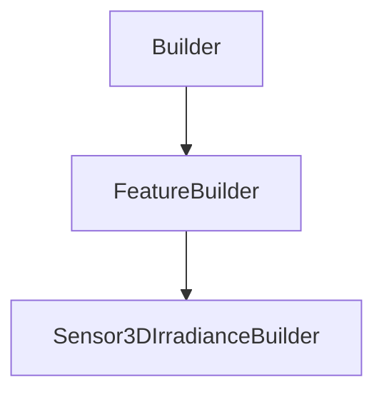

# Sensor3DIrradianceBuilder

## Class Inheritance

**Classes:**

- [Builder](class-builder.md)
- [FeatureBuilder](class-featurebuilder.md)
- [Sensor3DIrradianceBuilder](class-sensor3dirradiancebuilder.md)

## Description

Represents the builder for a 3D irradiance sensor.

## Member Summary

| Member | Type | Description |
| --- | --- | --- |
| [MeasureType](#measuretype) | public | Gets or sets the measure type. |
| [UseRayFile](#userayfile) | public | Gets or sets the property to enable or disable use of ray file. |
| [RayFileFormat](#rayfileformat) | public | Gets or sets the ray file format. |
| [IntegrationType](#integrationtype) | public | Gets or sets the integration type. |
| [Selections](#selections) | public | Gets or sets the selected faces or bodies. |
| [LayerType](#layertype) | public | Gets or sets the layer type. |
| [Reflection](#reflection) | public | Gets or sets the reflection property. |
| [Transmission](#transmission) | public | Gets or sets the transmission property. |
| [Absorption](#absorption) | public | Gets or sets the absorption property. |
| [UseTemplateFile](#usetemplatefile) | public | Gets or sets the property to enable or disable use of XM3 template file. |
| [TemplateFilePath](#templatefilepath) | public | Gets or sets the XM3 template file. |
| [WavelengthStart](#wavelengthstart) | public | Gets or sets the lower value of the wavelength range to be considered by the sensor. |
| [WavelengthEnd](#wavelengthend) | public | Gets or sets the higher value of the wavelength range to be considered by the sensor. |

## Public Static Attributes

### MeasureType

`int MeasureType`

Gets or sets the measure type.

The values are:  
0 - Photometric to compute the luminous intensity and generate an extended map for Virtual 3D Photometric Lab.  
1 - Colorimetric to compute the radiant intensity and generate an extended map for Virtual 3D Photometric Lab.  
2 - Radiometric to compute the color results without any spectral layer separation and generate a spectral map for Virtual 3D Photometric Lab.  
  
**Value type**: Integer.  
  
The default value is 0.

---

### UseRayFile

`bool UseRayFile`

Gets or sets the property to enable or disable use of ray file.

True: Uses ray file.  
False: Does not use ray file.  
  
**Value type**: Boolean.  
  
The default value is False.

---

### RayFileFormat

`int RayFileFormat`

Gets or sets the ray file format.

**Prerequisite**: The UseRayFile property must be True.  
  
Defines the type of ray file. The simulation creates the ray file.  
  
The values are:  
0 - Speos without Polarization.  
1 - Speos with Polarization.  
2 - IES TM-25 without Polarization.  
3 - IES TM-25 with Polarization.  
  
**Value type**: Integer.  
  
The default value is 0.

---

### IntegrationType

`int IntegrationType`

Gets or sets the integration type.

The values are:  
0 - Planar. Integration that is made orthogonally with the sensor plan.  
1 - Radial. Follows specific street lighting illumination regulations.  
  
**Value type**: Integer.  
  
The default value is 0.

---

### Selections

`list[int] Selections`

Gets or sets the selected faces or bodies.

The Selections property takes and returns a list of feature tags.  
  
**Value type**: List of integer.  
  
The default value is an empty list.

---

### LayerType

`int LayerType`

Gets or sets the layer type.

The values are:  
0 - None.  
1 - Source.  
  
**Value type**: Integer.  
  
The default value is 0.

---

### Reflection

`bool Reflection`

Gets or sets the reflection property.

**Prerequisite**: The property MeasureType must be 0 or 2, and IntegrationType must be 0.  
  
**Value type**: Boolean.  
  
The default value is True.

---

### Transmission

`bool Transmission`

Gets or sets the transmission property.

**Prerequisite**: The property MeasureType must be 0 or 2, and IntegrationType must be 0.  
  
**Value type**: Boolean.  
  
The default value is True.

---

### Absorption

`bool Absorption`

Gets or sets the absorption property.

**Prerequisite**: The property MeasureType must be 0 or 2, and IntegrationType must be 0.  
  
**Value type**: Boolean.  
  
The default value is True.

---

### UseTemplateFile

`bool UseTemplateFile`

Gets or sets the property to enable or disable use of XM3 template file.

True: Uses XM3 template file.  
False: Does not use XM3 template file.  
  
**Value type**: Boolean.  
  
The default value is False.

---

### TemplateFilePath

`FilePath TemplateFilePath`

Gets or sets the XM3 template file.

**Prerequisite**: The property TemplateFile must be True.  
  
**Value type**: String.  
  
The default value is an empty string.

---

### WavelengthStart

`float WavelengthStart`

Gets or sets the lower value of the wavelength range to be considered by the sensor.

**Prerequisite**: The property MeasureType must be 1.  
  
The sensor does not take into account wavelengths beyond the borders that you define.  
  
**Value type**: Double (in nm).  
  
The default value is 400.0 nm.

---

### WavelengthEnd

`float WavelengthEnd`

Gets or sets the higher value of the wavelength range to be considered by the sensor.

**Prerequisite**: The property MeasureType must be 1.  
  
The sensor does not take into account wavelengths beyond the borders that you define.  
  
**Value type**: Double (in nm).  
  
The default value is 700.0 nm.
