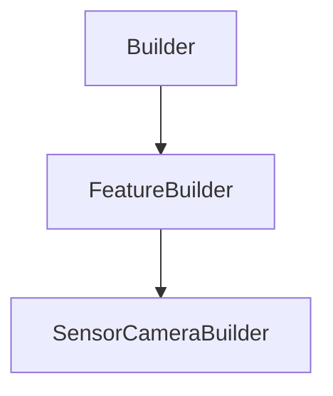

# SensorCameraBuilder

## Class Inheritance

**Classes:**

- [Builder](class-builder.md)
- [FeatureBuilder](class-featurebuilder.md)
- [SensorCameraBuilder](class-sensorcamerabuilder.md)

## Description

Represents a Camera Sensor Builder.

## Member Summary

| Member | Type |
| --- | --- |
| [CameraMode](#cameramode) | public |
| [LayerType](#layertype) | public |
| [DisplayCameraField](#displaycamerafield) | public |
| [DisplayObjectField](#displayobjectfield) | public |
| [VisualizationRadius](#visualizationradius) | public |
| [DisplayAperture](#displayaperture) | public |
| [HorizontalFOV](#horizontalfov) | public |
| [VerticalFOV](#verticalfov) | public |
| [FocalLength](#focallength) | public |
| [FNumber](#fnumber) | public |
| [ImagerDistance](#imagerdistance) | public |
| [DistortionFilePath](#distortionfilepath) | public |
| [ConsiderDiffractionEffects](#considerdiffractioneffects) | public |
| [TransmittanceFilePath](#transmittancefilepath) | public |
| [HorizontalPixels](#horizontalpixels) | public |
| [VerticalPixels](#verticalpixels) | public |
| [Width](#width) | public |
| [Height](#height) | public |
| [ColorMode](#colormode) | public |
| [WhiteBalanceMode](#whitebalancemode) | public |
| [GammaCorrection](#gammacorrection) | public |
| [PNGBits](#pngbits) | public |
| [SensitivityMonochromaticSpectrumFilePath](#sensitivitymonochromaticspectrumfilepath) | public |
| [SensitivityRedSpectrumFilePath](#sensitivityredspectrumfilepath) | public |
| [SensitivityGreenSpectrumFilePath](#sensitivitygreenspectrumfilepath) | public |
| [SensitivityBlueSpectrumFilePath](#sensitivitybluespectrumfilepath) | public |
| [WhiteBalanceRedSpectrumFilePath](#whitebalanceredspectrumfilepath) | public |
| [WhiteBalanceGreenSpectrumFilePath](#whitebalancegreenspectrumfilepath) | public |
| [WhiteBalanceBlueSpectrumFilePath](#whitebalancebluespectrumfilepath) | public |
| [RedGain](#redgain) | public |
| [GreenGain](#greengain) | public |
| [BlueGain](#bluegain) | public |
| [WavelengthStart](#wavelengthstart) | public |
| [WavelengthEnd](#wavelengthend) | public |
| [WavelengthSampling](#wavelengthsampling) | public |
| [WavelengthResolution](#wavelengthresolution) | public |
| [DistortionVersion](#distortionversion) | public |
| [DistortionWithDiffraction](#distortionwithdiffraction) | public |
| [UpdateWavelengthSamplingFromResolution](#updatewavelengthsamplingfromresolution) | public |

## Public Static Attributes

### CameraMode

`int CameraMode`

Gets or sets the camera mode.

The values are:  
0 - Geometric, it is a simplified version of the Camera Sensor definition parameters.  
1 - Photometric / Colorimetric, it allows you to set every Camera Sensor parameters, including the photometric definition parameters.  
**Value type**: Integer.  
  
The default value is 0.

---

### LayerType

`int LayerType`

Gets or sets the layer mode.

The values are:  
0 - None, the simulation generates a Speos360 file with one layer for all sources.  
1 - Data separated by Source, the result includes one layer per active source.  
**Value type**: Integer.  
  
The default value is 0.

---

### DisplayCameraField

`bool DisplayCameraField`

Gets or sets the property to enable the preview of the Camera Field.

True: Displays the Camera Field.  
False: Does not display the Camera Field  
**Value type**: Boolean.  
  
The default value is True.

---

### DisplayObjectField

`bool DisplayObjectField`

Gets or sets the property to enable the preview of the Object Field.

True: Displays the Object Field.  
False: Does not display the Object Field  
**Value type**: Boolean.  
  
The default value is True.

---

### VisualizationRadius

`float VisualizationRadius`

Gets or sets the Visualization radius.

Changes the radius of the Object field of the camera.  
**Value type**: Double (in mm).  
**Range**: The parameter must be superior to 0.0.  
  
The default value is 1000.0 mm.

---

### DisplayAperture

`bool DisplayAperture`

Gets or sets the property to enable the preview of the Aperture.

True: Displays the Aperture.  
False: Does not display the Aperture  
**Value type**: Boolean.  
  
The default value is True.

---

### HorizontalFOV

`float HorizontalFOV`

Gets the Horizontal Field of View.

**Value type**: Double.

---

### VerticalFOV

`float VerticalFOV`

Gets the Vertical Field of View.

**Value type**: Double.

---

### FocalLength

`float FocalLength`

Gets or sets the focal length.

Distance between the center of the optical system and the focus.  
**Value type**: Double (in mm).  
**Range**: The value must be superior to 0.  
  
The default value is 15.0 mm.

---

### FNumber

`float FNumber`

Gets or sets the F number.

Represents the aperture of the front lens.  
**Value type**: Double.  
**Range**: The value must be superior to 0.  
  
The default value is 15.0.

---

### ImagerDistance

`float ImagerDistance`

Gets or sets the Image Distance.

**Value type**: Double (in mm).  
  
The default value is 15.0 mm.

---

### DistortionFilePath

`FilePath DistortionFilePath`

Gets or sets the distortion file path.

**Value type**: String.  
  
The default value is an empty file path (string).

---

### ConsiderDiffractionEffects

`bool ConsiderDiffractionEffects`

Gets or sets the property to consider the diffraction effects.

**Prerequisite**: This property is only considered when the distortion file is Binary version with diffraction related parameters.  
True: Consider the diffraction effects.  
False: Does not consider the diffraction effects.  
**Value type**: Boolean.  
  
The default value is False.

---

### TransmittanceFilePath

`FilePath TransmittanceFilePath`

Gets or sets the transmittance file path.

**Value type**: String.  
  
The default value is an empty file path (string).

---

### HorizontalPixels

`int HorizontalPixels`

Gets or sets the horizontal pixels .

Defines the horizontal pixels number corresponding to the camera resolution.  
**Value type**: Integer.  
**Range**: The value must be superior to 0.  
  
The default value is 640.

---

### VerticalPixels

`int VerticalPixels`

Gets or sets the vertical pixels .

Defines the vertical pixels number corresponding to the camera resolution.  
**Value type**: Integer.  
**Range**: The value must be superior to 0.  
  
The default value is 480.

---

### Width

`float Width`

Gets or sets the width .

Defines the sensor's width.  
**Value type**: Double (in mm).  
**Range**: The value must be superior to 0.  
  
The default value is 5.0 mm.

---

### Height

`float Height`

Gets or sets the height .

Defines the sensor's height.  
**Value type**: Double (in mm).  
**Range**: The value must be superior to 0.  
  
The default value is 5.0 mm.

---

### ColorMode

`int ColorMode`

Gets or sets the color mode.

**Prerequisite**: The CameraMode property must be 1.  
  
The values are:  
0 - Monochrome, the simulation results are available in grey scale.  
1 - Color, the simulation results are available in color according to the White Balance mode.  
**Value type**: Integer.  
  
The default value is 1.

---

### WhiteBalanceMode

`int WhiteBalanceMode`

Gets or sets the white balance mode.

**Prerequisite**: The ColorMode property must be 1.  
  
The values are:  
0 - None.  
1 - Grey World.  
2 - Use White Balance.  
3 - Display Primaries.  
**Value type**: Integer.  
  
The default value is 0.

---

### GammaCorrection

`float GammaCorrection`

Gets or sets the gamma correction.

**Prerequisite**: The CameraMode property must be 1.  
  
Compensates the curve before the display on the screen.  
**Value type**: Double.  
  
The default value is 2.2.

---

### PNGBits

`int PNGBits`

Gets or sets the PNG Bits.

**Prerequisite**: The CameraMode property must be 1.  
  
The values are:  
0 - 8 Bits.  
1 - 10 Bits.  
2 - 12 Bits.  
3 - 16 Bits.  
**Value type**: Integer.  
  
The default value is 3.

---

### SensitivityMonochromaticSpectrumFilePath

`SpectrumFilePath SensitivityMonochromaticSpectrumFilePath`

Gets or sets the sensitivity monochromatic spectrum file path.

**Prerequisite**: The ColorMode property must be 0.  
**Value type**: String.  
  
The default value is an empty file path (string).

---

### SensitivityRedSpectrumFilePath

`RedSpectrumFilePath SensitivityRedSpectrumFilePath`

Gets or sets the sensitivity red spectrum file path.

**Prerequisite**: The ColorMode property must be 1.  
**Value type**: String.  
  
The default value is an empty file path (string).

---

### SensitivityGreenSpectrumFilePath

`GreenSpectrumFilePath SensitivityGreenSpectrumFilePath`

Gets or sets the sensitivity green spectrum file path.

**Prerequisite**: The ColorMode property must be 1.  
**Value type**: String.  
  
The default value is an empty file path (string).

---

### SensitivityBlueSpectrumFilePath

`BlueSpectrumFilePath SensitivityBlueSpectrumFilePath`

Gets or sets the sensitivity blue spectrum file path.

**Prerequisite**: The ColorMode property must be 1.  
**Value type**: String.  
  
The default value is an empty file path (string).

---

### WhiteBalanceRedSpectrumFilePath

`RedSpectrumFilePath WhiteBalanceRedSpectrumFilePath`

Gets or sets the white balance red spectrum file path.

**Prerequisite**: The WhiteBalanceMode property must be 3.  
**Value type**: String.  
  
The default value is an empty file path (string).

---

### WhiteBalanceGreenSpectrumFilePath

`GreenSpectrumFilePath WhiteBalanceGreenSpectrumFilePath`

Gets or sets the white balance green spectrum file path.

**Prerequisite**: The WhiteBalanceMode property must be 3.  
**Value type**: String.  
  
The default value is an empty file path (string).

---

### WhiteBalanceBlueSpectrumFilePath

`BlueSpectrumFilePath WhiteBalanceBlueSpectrumFilePath`

Gets or sets the white balance blue spectrum file path.

**Prerequisite**: The WhiteBalanceMode property must be 3.  
**Value type**: String.  
  
The default value is an empty file path (string).

---

### RedGain

`float RedGain`

Gets or sets the red gain.

**Prerequisite**: The WhiteBalanceMode property must be 2.  
**Value type**: Double.  
  
The default value is 1.0.

---

### GreenGain

`float GreenGain`

Gets or sets the green gain.

**Prerequisite**: The WhiteBalanceMode property must be 2.  
**Value type**: Double.  
  
The default value is 1.0.

---

### BlueGain

`float BlueGain`

Gets or sets the blue gain.

**Prerequisite**: The WhiteBalanceMode property must be 2.  
**Value type**: Double.  
  
The default value is 1.0.

---

### WavelengthStart

`float WavelengthStart`

Gets or sets the lower value of the wavelength range to be considered by the sensor.

**Prerequisite**: The CameraMode property must be 1.  
  
The sensor does not take into account wavelengths beyond the borders that you define.  
**Value type**: Double (in nm).  
  
The default value is 400.0 nm.

---

### WavelengthEnd

`float WavelengthEnd`

Gets or sets the higher value of the wavelength range to be considered by the sensor.

**Prerequisite**: The CameraMode property must be 1.  
  
The sensor does not take into account wavelengths beyond the borders that you define.  
**Value type**: Double (in nm).  
  
The default value is 700.0 nm.

---

### WavelengthSampling

`int WavelengthSampling`

Gets or sets the wavelength sampling.

**Prerequisite**: The CameraMode property must be 1.  
**Value type**: Integer.  
**Range**: The value must be superior to 0.  
  
The default value is 13.

---

### WavelengthResolution

`float WavelengthResolution`

Gets the Wavelength resolution.

**Prerequisite**: The CameraMode property must be 1.  
**Value type**: Double.

---

### DistortionVersion

`float DistortionVersion`

Gets the distortion version.

**Value type**: Double.

---

### DistortionWithDiffraction

`bool DistortionWithDiffraction`

Gets whether the distortion file includes diffraction parameters.

**Value type**: Boolean.

## Public Member Functions

### UpdateWavelengthSamplingFromResolution

`void UpdateWavelengthSamplingFromResolution(self, resolution)`

Updates the wavelength sampling from a resolution.

**Parameters**:

- `float resolution`: the wavelength resolution. 
