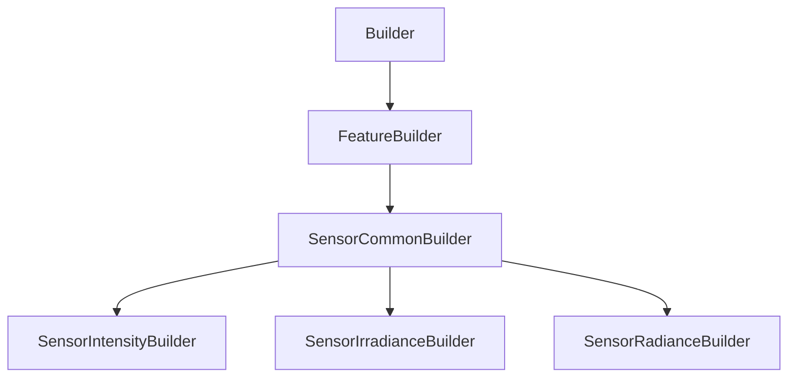

# SensorCommonBuilder

## Class Inheritance

**Classes:**

- [Builder](class-builder.md)
- [FeatureBuilder](class-featurebuilder.md)
- [SensorCommonBuilder](class-sensorcommonbuilder.md)
- [SensorIntensityBuilder](class-sensorintensitybuilder.md)
- [SensorIrradianceBuilder](class-sensorirradiancebuilder.md)
- [SensorRadianceBuilder](class-sensorradiancebuilder.md)

## Description

A base class for all Sensor Builders.

## Member Summary

| Member | Type | Description |
| --- | --- | --- |
| [Type](#type) | public | Gets or sets the type of the sensor. |
| [XStart](#xstart) | public | Gets or sets the Sensor X start dimension value. |
| [XEnd](#xend) | public | Gets or sets the Sensor X end dimension value. |
| [XSampling](#xsampling) | public | Gets or sets the Sensor X dimension sampling value. |
| [XResolution](#xresolution) | public | Gets or sets the Sensor X dimension resolution value. |
| [XMirroredExtent](#xmirroredextent) | public | Gets the Sensor X dimension mirrored extent value. |
| [YStart](#ystart) | public | Gets or sets the Sensor Y start dimension value. |
| [YEnd](#yend) | public | Gets or sets the Sensor Y end dimension value. |
| [YSampling](#ysampling) | public | Gets or sets the Sensor Y dimension sampling value. |
| [YResolution](#yresolution) | public | Gets or sets the Sensor Y dimension resolution value. |
| [YMirroredExtent](#ymirroredextent) | public | Gets the Sensor Y dimension mirrored extent value. |
| [WavelengthStart](#wavelengthstart) | public | Gets or sets the wavelength starting border. |
| [WavelengthEnd](#wavelengthend) | public | Gets or sets the wavelength ending border. |
| [WavelengthSampling](#wavelengthsampling) | public | Gets or sets the wavelength sampling. |
| [WavelengthResolution](#wavelengthresolution) | public | Gets or sets the Wavelength resolution |
| [UseTemplateFile](#usetemplatefile) | public | Gets or sets the property to enable the use of template file |
| [DimensionFromFile](#dimensionfromfile) | public | Gets or sets the property to enable the use of dimensions that come from File |
| [DisplayPropertiesFromFile](#displaypropertiesfromfile) | public | Gets or sets the property to enable the use of display properties that come from File. |
| [TemplateFilePath](#templatefilepath) | public | Gets or sets the template file's path. |
| [TemplateType](#templatetype) | public | Gets or sets the template type |
| [ShowGrid](#showgrid) | public | Gets or sets the property to enable grid preview. |
| [GridOriginX](#gridoriginx) | public | Gets or sets the grid X origin |
| [GridOriginY](#gridoriginy) | public | Gets or sets the grid Y origin |
| [GridStepX](#gridstepx) | public | Gets or sets the grid X step |
| [GridStepY](#gridstepy) | public | Gets or sets the grid Y step |
| [IsTemplateFileValid](#istemplatefilevalid) | public | Checks whether the template file is valid. |

## Public Static Attributes

### Type

`int Type`

Gets or sets the type of the sensor.

The values are:  
0 - Photometric, results in cd.  
1 - Colorimetric, color results in cd or W/sr.  
2 - Radiometric, results in W/sr.  
3 - Spectral, results in cd or W/sr.  
  
**Value type**: Integer.  
  
The default value is 0.

---

### XStart

`float XStart`

Gets or sets the Sensor X start dimension value.

**Value type**: Double (in mm).  
  
The default value is -50.0 mm.

---

### XEnd

`float XEnd`

Gets or sets the Sensor X end dimension value.

**Value type**: Double (in mm).  
  
The default value is 50.0 mm.

---

### XSampling

`int XSampling`

Gets or sets the Sensor X dimension sampling value.

**Value type**: Integer.  
  
The default value is 100.

---

### XResolution

`float XResolution`

Gets or sets the Sensor X dimension resolution value.

**Value type**: Double.

---

### XMirroredExtent

`bool XMirroredExtent`

Gets the Sensor X dimension mirrored extent value.

True: XStart == -XEnd, you can only change the XEnd value.  
False: XStart and XEnd can have different value.  
  
**Value type**: Boolean.  
  
The default value is False.

---

### YStart

`float YStart`

Gets or sets the Sensor Y start dimension value.

**Value type**: Double (in mm).  
  
The default value is -50.0 mm.

---

### YEnd

`float YEnd`

Gets or sets the Sensor Y end dimension value.

**Value type**: Double (in mm).  
  
The default value is 50.0 mm.

---

### YSampling

`int YSampling`

Gets or sets the Sensor Y dimension sampling value.

**Value type**: Integer.  
  
The default value is 100.

---

### YResolution

`float YResolution`

Gets or sets the Sensor Y dimension resolution value.

**Value type**: Double.

---

### YMirroredExtent

`bool YMirroredExtent`

Gets the Sensor Y dimension mirrored extent value.

True: YStart == -YEnd, you can only change the YEnd value.  
False: YStart and YEnd can have different value.  
  
**Value type**: Boolean.  
  
The default value is False.

---

### WavelengthStart

`float WavelengthStart`

Gets or sets the wavelength starting border.

**Prerequisite**: The Type property must be 1 or 3.  
  
The sensor does not take account wavelengths beyond the borders that you define.  
  
**Value type**: Double (in nm).  
  
The default value is 400.0 nm.

---

### WavelengthEnd

`float WavelengthEnd`

Gets or sets the wavelength ending border.

**Prerequisite**: The Type property must be 1 or 3.  
  
The sensor does not take account wavelengths beyond the borders that you define.  
  
**Value type**: Double (in nm).  
  
The default value is 700.0 nm.

---

### WavelengthSampling

`int WavelengthSampling`

Gets or sets the wavelength sampling.

**Prerequisite**: The Type property must be 1 or 3.  
  
**Value type**: Integer.  
**Range**: The value must be superior to 0.  
  
The default value is 13.

---

### WavelengthResolution

`float WavelengthResolution`

Gets or sets the Wavelength resolution

**Prerequisite**: The Type property must be 1 or 3.  
  
**Value type**: Double.

---

### UseTemplateFile

`bool UseTemplateFile`

Gets or sets the property to enable the use of template file

True: Enables Template File.  
False: Disables Template File.  
  
**Value type**: Boolean.

---

### DimensionFromFile

`bool DimensionFromFile`

Gets or sets the property to enable the use of dimensions that come from File

True: Uses the following values from the XMP template: type, X and Y size, Wavelength values.  
False: Does not use the dimension from file.  
  
**Value type**: Boolean.  
  
The default value is False.

---

### DisplayPropertiesFromFile

`bool DisplayPropertiesFromFile`

Gets or sets the property to enable the use of display properties that come from File.

True: Uses all the grid related values from the .xml file.  
False: Does not use the Display properties from file.  
  
**Value type**: Boolean.  
  
The default value is False.

---

### TemplateFilePath

`FilePath TemplateFilePath`

Gets or sets the template file's path.

**Value type**: String.  
  
The default value is an empty string.

---

### TemplateType

`int TemplateType`

Gets or sets the template type

The values are:  
0 - None  
1 - Measure  
2 - Template  
  
**Value type**: Integer.  
  
The default value is 0.

---

### ShowGrid

`bool ShowGrid`

Gets or sets the property to enable grid preview.

True: Displays a grid on the sensor.  
False: Does not display a grid on the sensor.  
  
**Value type**: Boolean.  
  
The default value is True.

---

### GridOriginX

`float GridOriginX`

Gets or sets the grid X origin

**Value type**: Double.  
  
The default value is 0.0.

---

### GridOriginY

`float GridOriginY`

Gets or sets the grid Y origin

**Value type**: Double.  
  
The default value is 0.0.

---

### GridStepX

`float GridStepX`

Gets or sets the grid X step

**Value type**: Double.  
**Range**: The value must be superior to 0.  
  
The default value is 10.0.

---

### GridStepY

`float GridStepY`

Gets or sets the grid Y step

**Value type**: Double.  
**Range**: The value must be superior to 0.  
  
The default value is 10.0.

## Public Member Functions

### IsTemplateFileValid

`bool IsTemplateFileValid(self)`

Checks whether the template file is valid.
