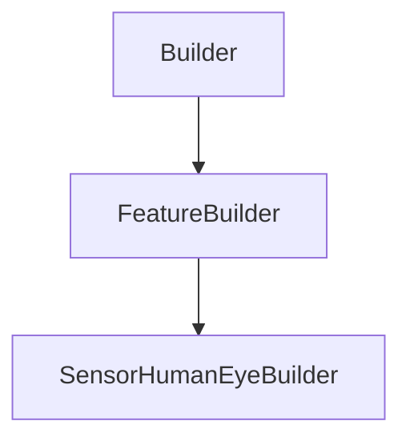

# SensorHumanEyeBuilder

## Class Inheritance

**Classes:**

- [Builder](class-builder.md)
- [FeatureBuilder](class-featurebuilder.md)
- [SensorHumanEyeBuilder](class-sensorhumaneyebuilder.md)

## Description

Represents a Human Eye Sensor Builder.

## Member Summary

| Member | Type | Description |
| --- | --- | --- |
| [Type](#type) | public | Gets or sets the sensor type. |
| [LayerType](#layertype) | public | Gets or sets the layer mode. |
| [VerticalDirectionReversed](#verticaldirectionreversed) | public | Gets or sets the reverse vertical direction. |
| [UseTemplateFile](#usetemplatefile) | public | Gets or sets the property to enable or disable use of XM3 template file. |
| [TemplateFilePath](#templatefilepath) | public | Gets or sets the XM3 template file. |
| [DisplayPropertiesFromFile](#displaypropertiesfromfile) | public | Gets or sets the property to enable the use of display properties that come from File. |
| [VisionFieldHorizontalStart](#visionfieldhorizontalstart) | public | Gets or sets the horizontal start for vision field. |
| [VisionFieldHorizontalEnd](#visionfieldhorizontalend) | public | Gets or sets the horizontal end for vision field. |
| [VisionFieldHorizontalSampling](#visionfieldhorizontalsampling) | public | Gets the horizontal sampling for vision field. |
| [VisionFieldHorizontalResolution](#visionfieldhorizontalresolution) | public | Gets or sets the horizontal resolution for vision field. |
| [VisionFieldHorizontalMirroredExtent](#visionfieldhorizontalmirroredextent) | public | Gets or sets the mirrored extent property for horizontal vision field. |
| [VisionFieldVerticalStart](#visionfieldverticalstart) | public | Gets or sets the vertical start for vision field. |
| [VisionFieldVerticalEnd](#visionfieldverticalend) | public | Gets or sets the vertical end for vision field. |
| [VisionFieldVerticalSampling](#visionfieldverticalsampling) | public | Gets the vertical sampling for vision field. |
| [VisionFieldVerticalResolution](#visionfieldverticalresolution) | public | Gets or sets the vertical resolution for vision field. |
| [VisionFieldVerticalMirroredExtent](#visionfieldverticalmirroredextent) | public | Gets or sets the mirrored extent property for vertical vision field. |
| [WavelengthStart](#wavelengthstart) | public | Gets the lower value of the wavelength range to be considered by the sensor. |
| [WavelengthEnd](#wavelengthend) | public | Gets the higher value of the wavelength range to be considered by the sensor. |
| [WavelengthSampling](#wavelengthsampling) | public | Gets or sets the wavelength sampling. |
| [WavelengthResolution](#wavelengthresolution) | public | Gets or sets the Wavelength resolution |
| [PupilDiameter](#pupildiameter) | public | Gets or sets the pupil diameter. |
| [ShowGrid](#showgrid) | public | Gets or sets the property to enable grid preview. |
| [GridOriginX](#gridoriginx) | public | Gets or sets the grid X origin |
| [GridStepX](#gridstepx) | public | Gets or sets the grid X step |
| [GridOriginY](#gridoriginy) | public | Gets or sets the grid Y origin |
| [GridStepY](#gridstepy) | public | Gets or sets the grid Y step |

## Public Static Attributes

### Type

`int Type`

Gets or sets the sensor type.

The values are:  
0 - Colorimetric to get the color results without any spectral layer separation.  
1 - Spectral to get the color results and spectral data separated by wavelength.  
  
**Value type**: Integer.  
  
The default value is 0.

---

### LayerType

`int LayerType`

Gets or sets the layer mode.

The values are:  
0 - None.  
1 - Data Separated by Source.  
  
**Value type**: Integer.  
  
The default value is 0.

---

### VerticalDirectionReversed

`bool VerticalDirectionReversed`

Gets or sets the reverse vertical direction.

Returns the flag to indicate the vertical direction is reversed.  
True: Reverses the vertical direction.  
False: Does not reverse the vertical direction.  
  
**Value type**: Boolean.  
  
The default value is False.

---

### UseTemplateFile

`bool UseTemplateFile`

Gets or sets the property to enable or disable use of XM3 template file.

True: Uses XM3 template file.  
False: Does not use XM3 template file.  
  
**Value type**: Boolean.  
  
The default value is False.

---

### TemplateFilePath

`FilePath TemplateFilePath`

Gets or sets the XM3 template file.

**Prerequisite**: The property TemplateFile must be True.  
  
**Value type**: String.  
  
The default value is an empty string.

---

### DisplayPropertiesFromFile

`bool DisplayPropertiesFromFile`

Gets or sets the property to enable the use of display properties that come from File.

**Prerequisite**: The property UseTemplateFile must be True.  
  
True: Uses all the grid related values from the .xml file.  
False: Does not use the Display properties from file.  
  
**Value type**: Boolean.  
  
The default value is False.

---

### VisionFieldHorizontalStart

`float VisionFieldHorizontalStart`

Gets or sets the horizontal start for vision field.

Vision Field corresponds to the surface on which are located observer positions around target point.  
  
**Value type**: Double (in degrees).  
**Range**: [-90.0, 90.0]  
  
The default value is -20.0 degrees.

---

### VisionFieldHorizontalEnd

`float VisionFieldHorizontalEnd`

Gets or sets the horizontal end for vision field.

Vision Field corresponds to the surface on which are located observer positions around target point.  
  
**Value type**: Double (in degrees).  
**Range**: [-90.0, 90.0]  
  
The default value is 20.0 degrees.

---

### VisionFieldHorizontalSampling

`int VisionFieldHorizontalSampling`

Gets the horizontal sampling for vision field.

Vision Field corresponds to the surface on which are located observer positions around target point.

---

### VisionFieldHorizontalResolution

`float VisionFieldHorizontalResolution`

Gets or sets the horizontal resolution for vision field.

Vision Field corresponds to the surface on which are located observer positions around target point.  
  
**Value type**: Double.  
**Range**: The value must be superior to 0.

---

### VisionFieldHorizontalMirroredExtent

`bool VisionFieldHorizontalMirroredExtent`

Gets or sets the mirrored extent property for horizontal vision field.

Vision Field corresponds to the surface on which are located observer positions around target point.  
  
True: VisionFieldHorizontalStart == -VisionFieldHorizontalEnd, you can only change the VisionFieldHorizontalEnd value.  
False: VisionFieldHorizontalStart and VisionFieldHorizontalEnd can have different value.  
  
**Value type**: Boolean.  
  
The default value is False.

---

### VisionFieldVerticalStart

`float VisionFieldVerticalStart`

Gets or sets the vertical start for vision field.

Vision Field corresponds to the surface on which are located observer positions around target point.  
  
**Value type**: Double (in degrees).  
**Range**: [-90.0, 90.0]  
  
The default value is -10.0 degrees.

---

### VisionFieldVerticalEnd

`float VisionFieldVerticalEnd`

Gets or sets the vertical end for vision field.

Vision Field corresponds to the surface on which are located observer positions around target point.  
  
**Value type**: Double (in degrees).  
**Range**: [-90.0, 90.0]  
  
The default value is 10.0 degrees.

---

### VisionFieldVerticalSampling

`int VisionFieldVerticalSampling`

Gets the vertical sampling for vision field.

Vision Field corresponds to the surface on which are located observer positions around target point.  
  
**Value type**: Integer.

---

### VisionFieldVerticalResolution

`float VisionFieldVerticalResolution`

Gets or sets the vertical resolution for vision field.

Vision Field corresponds to the surface on which are located observer positions around target point.  
  
**Value type**: Double.

---

### VisionFieldVerticalMirroredExtent

`bool VisionFieldVerticalMirroredExtent`

Gets or sets the mirrored extent property for vertical vision field.

Vision Field corresponds to the surface on which are located observer positions around target point.  
  
True: VisionFieldVerticalStart == -VisionFieldVerticalEnd, you can only change the VisionFieldVerticalEnd value.  
False: VisionFieldVerticalStart and VisionFieldVerticalEnd can have different value.  
  
**Value type**: Boolean.  
  
The default value is False.

---

### WavelengthStart

`float WavelengthStart`

Gets the lower value of the wavelength range to be considered by the sensor.

**Value type**: Double (in nm).  
  
The default value is 360.0 nm.

---

### WavelengthEnd

`float WavelengthEnd`

Gets the higher value of the wavelength range to be considered by the sensor.

**Value type**: Double (in nm).  
  
The default value is 830.0 nm.

---

### WavelengthSampling

`int WavelengthSampling`

Gets or sets the wavelength sampling.

**Value type**: Integer.  
**Range**: The value must be superior to 0.  
  
The default value is 13.

---

### WavelengthResolution

`float WavelengthResolution`

Gets or sets the Wavelength resolution

**Value type**: Double.

---

### PupilDiameter

`float PupilDiameter`

Gets or sets the pupil diameter.

**Value type**: Double.  
**Range**: The value must be superior to 0.0.  
  
The default value is 4.0.

---

### ShowGrid

`bool ShowGrid`

Gets or sets the property to enable grid preview.

True: Displays a grid on the sensor.  
False: Does not display a grid on the sensor.  
  
**Value type**: Boolean.  
  
The default value is True.

---

### GridOriginX

`float GridOriginX`

Gets or sets the grid X origin

**Value type**: Double.  
  
The default value is 0.0.

---

### GridStepX

`float GridStepX`

Gets or sets the grid X step

**Value type**: Double.  
**Range**: The value must be superior to 0.  
  
The default value is 10.0.

---

### GridOriginY

`float GridOriginY`

Gets or sets the grid Y origin

**Value type**: Double.  
  
The default value is 0.0.

---

### GridStepY

`float GridStepY`

Gets or sets the grid Y step

**Value type**: Double.  
**Range**: The value must be superior to 0.  
  
The default value is 10.0.
