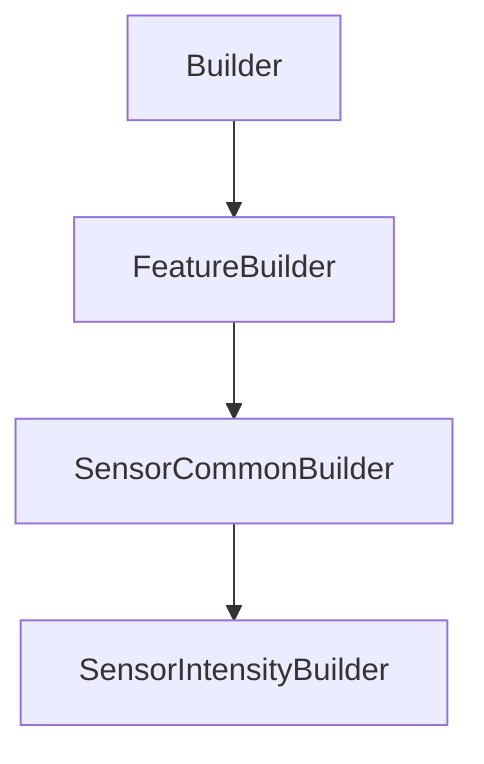

# SensorIntensityBuilder

## Class Inheritance

**Classes:**

- [Builder](class-builder.md)
- [FeatureBuilder](class-featurebuilder.md)
- [SensorCommonBuilder](class-sensorcommonbuilder.md)
- [SensorIntensityBuilder](class-sensorintensitybuilder.md)

## Description

Represents an Intensity Sensor Builder.

## Member Summary

| Member | Type |
| --- | --- |
| [Format](#format) | public |
| [Orientation](#orientation) | public |
| [AdaptiveSampling](#adaptivesampling) | public |
| [PolarFilePath](#polarfilepath) | public |
| [ConoscopicThetaMax](#conoscopicthetamax) | public |
| [ConoscopicSampling](#conoscopicsampling) | public |
| [ConoscopicResolution](#conoscopicresolution) | public |
| [PolarHStart](#polarhstart) | public |
| [PolarHEnd](#polarhend) | public |
| [PolarHSampling](#polarhsampling) | public |
| [PolarHResolution](#polarhresolution) | public |
| [PolarVStart](#polarvstart) | public |
| [PolarVEnd](#polarvend) | public |
| [PolarVSampling](#polarvsampling) | public |
| [PolarVResolution](#polarvresolution) | public |
| [NearField](#nearfield) | public |
| [CellDistance](#celldistance) | public |
| [CellDiameter](#celldiameter) | public |
| [IntensityResultViewingDirection](#intensityresultviewingdirection) | public |
| [IntegrationAngle](#integrationangle) | public |
| [Radius](#radius) | public |

## Public Static Attributes

### Format

`int Format`

Gets or sets the format type.

These formats correspond to light distribution standards and will generate different file formats as an output.  
  
The values are:  
0 - XMP  
1 - IESNA Type A.  
2 - IESNA Type B.  
3 - IESNA Type C.  
4 - Eulumdat.  
**Value type**: Integer.  
  
The default value is 0.

---

### Orientation

`int Orientation`

Gets or sets the orientation type.

**Prerequisite**: The FormatType property must be 0.  
  
The values are:  
0 - X as Parallel, Y as Meridian, for a polar parameterization with the poles along the X axis.  
1 - X as Meridian, Y as Parallel, for a polar parameterization with the poles along the Y axis.  
2 - Conoscopic, for a polar parameterization with the poles along the Z axis.  
**Value type**: Integer.  
  
The default value is 0.

---

### AdaptiveSampling

`bool AdaptiveSampling`

Gets or sets the property to enable adaptive sampling.

**Prerequisite**: The FormatType property must be 1, 2, 3 or 4.  
  
True: Activates adaptive Sampling.  
False: Deactivates adaptive Sampling.  
**Value type**: Boolean.  
  
The default value is False.

---

### PolarFilePath

`FilePath PolarFilePath`

Gets or sets the polar file path.

**Prerequisite**: The EnableAdaptiveSampling property must be True.  
**Value type**: String.  
  
The default value is an empty string.

---

### ConoscopicThetaMax

`float ConoscopicThetaMax`

Gets or sets the Conoscopic theta maximum value.

**Prerequisite**: The OrientationType property must be 2.  
**Value type**: Double.  
  
The default value is 90.0.

---

### ConoscopicSampling

`int ConoscopicSampling`

Gets or sets the Conoscopic sampling.

**Prerequisite**: The OrientationType property must be 2.  
**Value type**: Integer.  
**Range**: The value must be superior to 0.  
  
The default value is 90.

---

### ConoscopicResolution

`float ConoscopicResolution`

Gets or sets the Conoscopic resolution.

**Prerequisite**: The OrientationType property must be 2.  
**Value type**: Double.

---

### PolarHStart

`float PolarHStart`

Gets the polar H start.

**Prerequisite**: The FormatType property must be 1, 2, 3 or 4.  
**Value type**: Double.

---

### PolarHEnd

`float PolarHEnd`

Gets the polar H end.

**Prerequisite**: The FormatType property must be 1, 2, 3 or 4.  
**Value type**: Double.

---

### PolarHSampling

`int PolarHSampling`

Gets or sets the polar H sampling.

**Prerequisite**: The FormatType property must be 1, 2, 3 or 4.  
**Value type**: Integer.  
**Range**: The value must be superior to 0.  
  
The default value are:  
37 for IESNA Type A and IESNA Type B.  
36 for IESNA Type C and Eulumdat.

---

### PolarHResolution

`float PolarHResolution`

Gets or sets the polar H resolution.

**Prerequisite**: The FormatType property must be 1, 2, 3 or 4.  
**Value type**: Double.

---

### PolarVStart

`float PolarVStart`

Gets the polar V start.

**Prerequisite**: The FormatType property must be 1, 2, 3 or 4.  
**Value type**: Double.

---

### PolarVEnd

`float PolarVEnd`

Gets the polar V end.

**Prerequisite**: The FormatType property must be 1, 2, 3 or 4.  
**Value type**: Double.

---

### PolarVSampling

`int PolarVSampling`

Gets or sets the polar V sampling.

**Prerequisite**: The FormatType property must be 1, 2, 3 or 4.  
**Value type**: Integer.  
**Range**: The value must be superior to 0.  
  
The default value are:  
37 for IESNA Type A and IESNA Type B.  
19 for IESNA Type C and Eulumdat.

---

### PolarVResolution

`float PolarVResolution`

Gets or sets the polar V resolution.

**Prerequisite**: The FormatType property must be 1, 2, 3 or 4.  
**Value type**: Double.

---

### NearField

`bool NearField`

Gets or sets the property to enable near-field.

True: Enables Near Field.  
False: Disables Near Field.  
  
  **Value type**: Boolean.

---

### CellDistance

`float CellDistance`

Gets or sets the cell distance.

**Prerequisite**: The EnableNearField property must be True.  
**Value type**: Double.  
  
The default value is 1000.0 mm.

---

### CellDiameter

`float CellDiameter`

Gets or sets the cell diameter.

**Prerequisite**: The EnableNearField property must be True.  
**Value type**: Double.  
**Range**The value must be superior to 0.0.  
  
The default value is 174.9773 mm.

---

### IntensityResultViewingDirection

`int IntensityResultViewingDirection`

Gets or sets the intensity result viewing direction.

**Prerequisite**: The OrientationType property must be 0 or 1.  
  
The values are:  
0 - From source looking at sensor, The viewing direction of the observer is the same as the light direction emitted.  
1 - From sensor looking at source, The viewing direction of the observer is in the opposite of the light direction.  
**Value type**: Integer.  
  
The default value is 0.

---

### IntegrationAngle

`float IntegrationAngle`

Gets or sets the integration angle.

**Prerequisite**: The OrientationType property must be 1, 2, 3 or 4.  
  
This parameter appears only for IESNA and Eulumdat formats.  
**Value type**: Double (in degrees).  
**Range**: (0.0, 90.0)  
  
The default value is 5.0 degrees.

---

### Radius

`float Radius`

Gets or sets the radius.

**Value type**: Double (in mm).  
**Range**: The parameter must be superior to 0.0.  
  
The default value is 1000.0 mm.
