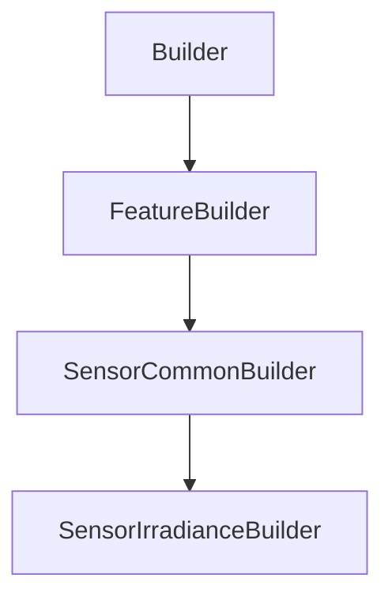

# SensorIrradianceBuilder

## Class Inheritance

**Classes:**

- [Builder](class-builder.md)
- [FeatureBuilder](class-featurebuilder.md)
- [SensorCommonBuilder](class-sensorcommonbuilder.md)
- [SensorIrradianceBuilder](class-sensorirradiancebuilder.md)

## Description

Represents an Irradiance Sensor Builder.

## Member Summary

| Member | Type |
| --- | --- |
| [UseRayFile](#userayfile) | public |
| [RayFileFormat](#rayfileformat) | public |
| [IntegrationType](#integrationtype) | public |
| [IntegrationDirectionReversed](#integrationdirectionreversed) | public |
| [OutputFaces](#outputfaces) | public |

## Public Static Attributes

### UseRayFile

`bool UseRayFile`

Gets or sets the property to enable ray file.

True: Enables Ray file.  
False: Disables Ray file.  
**Value type**: Boolean.  
  
The default value is False.

---

### RayFileFormat

`Format RayFileFormat`

Gets or sets the ray file format.

**Prerequisite**: The EnableRayFile property must be True.  
  
Defines the type of ray file.  
  
The values are:  
0 - Speos without Polarization.  
1 - Speos with Polarization.  
2 - IES TM-25 without Polarization.  
3 - IES TM-25 with Polarization.  
**Value type**: Integer.  
  
The default value is 0.

---

### IntegrationType

`Type IntegrationType`

Gets or sets the integration type.

The values are:  
0 - Planar.  
1 - Radial.  
2 - Hemishperical.  
3 - Cylindrical.  
4 - Semi-cylindrical.  
**Value type**: Integer.  
  
The default value is 0.

---

### IntegrationDirectionReversed

`bool IntegrationDirectionReversed`

Gets or sets the reverse direction of integration.

**Prerequisite**: The IntegrationType property must be 0, 2 or 4.  
  
True: Reverses the IntegrationDirection property  
False: Does not reverse the IntegrationDirection property  
**Value type**: Boolean.  
  
The default value is False.

---

### OutputFaces

`Faces OutputFaces`

Gets or sets the output faces.

The output faces property takes a list of feature tag and returns a list of feature tag.  
**Value type**: List of integer.  
  
The default value is an empty list.
