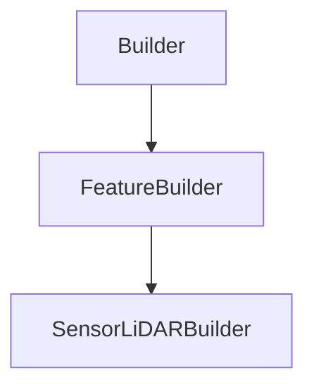

# SensorLiDARBuilder

## Class Inheritance

**Classes:**

- [Builder](class-builder.md)
- [FeatureBuilder](class-featurebuilder.md)
- [SensorLiDARBuilder](class-sensorlidarbuilder.md)

## Description

Represents a LiDAR sensor Builder.

## Member Summary

| Member | Type |
| --- | --- |
| [SensorType](#sensortype) | public |
| [DisplaySensorField](#displaysensorfield) | public |
| [DisplayObjectField](#displayobjectfield) | public |
| [ObjectFieldRadius](#objectfieldradius) | public |
| [DisplayPupil](#displaypupil) | public |
| [SourceScanningSequenceFilePath](#sourcescanningsequencefilepath) | public |
| [SourceRotatingSequenceFilePath](#sourcerotatingsequencefilepath) | public |
| [SourceUseTrajectoryFile](#sourceusetrajectoryfile) | public |
| [SourceTrajectoryFilePath](#sourcetrajectoryfilepath) | public |
| [SourceSpectrumType](#sourcespectrumtype) | public |
| [SourceWavelength](#sourcewavelength) | public |
| [SourceSpectrumFilePath](#sourcespectrumfilepath) | public |
| [SourceIntensityType](#sourceintensitytype) | public |
| [SourceIntensityFilePath](#sourceintensityfilepath) | public |
| [SourceIntensityTotalAngle](#sourceintensitytotalangle) | public |
| [SourceIntensityFWHMXAngle](#sourceintensityfwhmxangle) | public |
| [SourceIntensityFWHMYAngle](#sourceintensityfwhmyangle) | public |
| [SourcePulseEnergy](#sourcepulseenergy) | public |
| [SourceMinIntensityThreshold](#sourceminintensitythreshold) | public |
| [SensorDistortionFilePath](#sensordistortionfilepath) | public |
| [SensorTransmittance](#sensortransmittance) | public |
| [SensorTransmittanceFilePath](#sensortransmittancefilepath) | public |
| [SensorFocalLength](#sensorfocallength) | public |
| [SensorPupilDiameter](#sensorpupildiameter) | public |
| [SensorImagerWidth](#sensorimagerwidth) | public |
| [SensorImagerHeight](#sensorimagerheight) | public |
| [SensorResolution](#sensorresolution) | public |
| [SensorHorizontalPixels](#sensorhorizontalpixels) | public |
| [SensorVerticalPixels](#sensorverticalpixels) | public |
| [SensorStart](#sensorstart) | public |
| [SensorEnd](#sensorend) | public |
| [SensorSpatialAccuracy](#sensorspatialaccuracy) | public |
| [AimingArea](#aimingarea) | public |
| [AimingAreaType](#aimingareatype) | public |
| [AimingAreaWidth](#aimingareawidth) | public |
| [AimingAreaHeight](#aimingareaheight) | public |

## Public Static Attributes

### SensorType

`Type SensorType`

Gets or sets the sensor type.

The values are:  
0 - Static.  
1 - Scanning.  
2 - Rotating.  
**Value type**: Integer.  
  
The default value is 0.

---

### DisplaySensorField

`bool DisplaySensorField`

Gets or sets the property to display the sensor field.

True: Activates the visualization of the imager's field in the 3D view.  
False: Deactivates the visualization of the imager's field in the 3D view.  
**Value type**: Boolean.  
  
The default value is True.

---

### DisplayObjectField

`bool DisplayObjectField`

Gets or sets the property to display the object field.

True: Activates the visualization of the sensor's viewing angle in the 3D view.  
False: Deactivates the visualization of the sensor's viewing angle in the 3D view.  
**Value type**: Boolean.  
  
The default value is True.

---

### ObjectFieldRadius

`Radius ObjectFieldRadius`

Gets or sets the object field radius.

**Prerequisite**: The DisplayObjectField property must be True.  
**Value type**: Double (in mm).  
**Range**: The value must be superior to 0.0.  
  
The default value is 100.0 mm.

---

### DisplayPupil

`bool DisplayPupil`

Gets or sets the property to display the pupil.

True: Activates the visualization of the sensor's lens in the 3D view.  
False: Deactivates the visualization of the sensor's lens in the 3D view.  
**Value type**: Boolean.  
  
The default value is True.

---

### SourceScanningSequenceFilePath

`SequenceFilePath SourceScanningSequenceFilePath`

Gets or sets the scanning sequence file of the source.

The file must be a scanning sequence (.OPTScanSequence) or text (.txt).  
**Value type**: String.  
  
The default value is an empty string.

---

### SourceRotatingSequenceFilePath

`SequenceFilePath SourceRotatingSequenceFilePath`

Gets or sets the rotating sequence file of the source.

The file must be a text (.txt).  
**Value type**: String.  
  
The default value is an empty string.

---

### SourceUseTrajectoryFile

`bool SourceUseTrajectoryFile`

Gets or sets the property to activate or deactivate the use of the trajectory file.

True: Activates the use of the trajectory file.  
False: Deactivates the use of the trajectory file.  
**Value type**: Boolean.  
  
The default value is True.

---

### SourceTrajectoryFilePath

`TrajectoryFilePath SourceTrajectoryFilePath`

Gets or sets the trajectory file of the source.

The file must be a Json (.json).  
**Value type**: String.  
  
The default value is an empty string.

---

### SourceSpectrumType

`Type SourceSpectrumType`

Gets or sets the spectrum type of the source.

The values are:  
0 - Library.  
1 - Monochromatic.  
**Value type**: Integer.  
  
The default value is 1.

---

### SourceWavelength

`Wavelength SourceWavelength`

Gets or sets the wavelength of the source.

**Value type**: Double (in nm).  
**Range**: The value must be superior to 0.0.  
  
The default value is 940.0 nm.

---

### SourceSpectrumFilePath

`SpectrumFilePath SourceSpectrumFilePath`

Gets or sets the spectrum file of the source.

The file must be a spectrum (.spectrum).  
**Value type**: String.  
  
The default value is an empty string.

---

### SourceIntensityType

`IntensityType SourceIntensityType`

Gets or sets the intensity type of the source.

The values are:  
0 - Library.  
1 - Gaussian.  
**Value type**: Integer.  
  
The default value is 1.

---

### SourceIntensityFilePath

`IntensityFilePath SourceIntensityFilePath`

Gets or sets the intensity distribution file of the source.

The file must be an IES (.ies) or Eulumdat (.ldt).  
**Value type**: String.  
  
The default value is an empty string.

---

### SourceIntensityTotalAngle

`IntensityTotalAngle SourceIntensityTotalAngle`

Gets or sets the total angle of emission of the source.

**Value type**: Double (in degree).  
**Range**: [0.0, 180.0].  
  
The default value is 180 deg.

---

### SourceIntensityFWHMXAngle

`float SourceIntensityFWHMXAngle`

Gets or sets the FWHM angle for X direction of the source.

**Value type**: Double (in degree).  
**Range**: [0.0, 180.0].  
  
The default value is 0.2 deg.

---

### SourceIntensityFWHMYAngle

`float SourceIntensityFWHMYAngle`

Gets or sets the FWHM angle for Y direction of the source.

**Value type**: Double (in degree).  
**Range**: [0.0, 180.0].  
  
The default value is 0.2 deg.

---

### SourcePulseEnergy

`float SourcePulseEnergy`

Gets or sets the pulse energy of the source.

**Value type**: Double (in joule).  
**Range**: The value must be superior to 0.0.  
  
The default value is 0.0000003 j.

---

### SourceMinIntensityThreshold

`float SourceMinIntensityThreshold`

Gets or sets the minimum intensity threshold of the source.

**Value type**: Double.  
**Range**: [0.0, 100.0]  
  
The default value is 1.0.

---

### SensorDistortionFilePath

`DistortionFilePath SensorDistortionFilePath`

Gets or sets the distortion file of the sensor.

The file must be an .OPTDistortion file.  
**Value type**: String.  
  
The default value is an empty string.

---

### SensorTransmittance

`float SensorTransmittance`

Gets or sets the transmittance of the sensor.

**Value type**: Double.  
**Range**: The value must be superior to 0.0.  
  
The default value is 85.0.

---

### SensorTransmittanceFilePath

`TransmittanceFilePath SensorTransmittanceFilePath`

Gets or sets the transmittance file of the sensor.

**Prerequisite**: This property is only available for LiDAR sensor scanning or rotating with the SourceSpectrumType property sets to Library.  
  
The file must be a spectrum (.spectrum).  
**Value type**: String.  
  
The default value is an empty string.

---

### SensorFocalLength

`FocalLength SensorFocalLength`

Gets or sets the focal length of the sensor.

**Value type**: Double (in mm).  
**Range**: The value must be superior or equal to 0.0.  
  
The default value is 15.0 mm.

---

### SensorPupilDiameter

`PupilDiameter SensorPupilDiameter`

Gets or sets the pupil diameter of the sensor.

**Value type**: Double (in mm).  
**Range**: The value must be superior to 0.0.  
  
The default value is 10.0 mm.

---

### SensorImagerWidth

`Width SensorImagerWidth`

Gets or sets the image width of the sensor.

**Value type**: Double.  
**Range**: The value must be superior to 0.0.  
  
The default value is 3.2.

---

### SensorImagerHeight

`Height SensorImagerHeight`

Gets or sets the image height of the sensor.

**Value type**: Double.  
**Range**: The value must be superior to 0.0.  
  
The default value is 3.2.

---

### SensorResolution

`bool SensorResolution`

Gets or sets the property to activate or deactivate the use of the sensor resolution.

True: Activates the use of the sensor resolution.  
False: Deactivates the use of the sensor resolution.  
**Value type**: Boolean.  
  
The default value is False.

---

### SensorHorizontalPixels

`HorizontalPixels SensorHorizontalPixels`

Gets or sets the number of horizontal pixels of the sensor.

**Value type**: Integer.  
**Range**: The value must be superior to 0.  
  
The default value is 64.

---

### SensorVerticalPixels

`VerticalPixels SensorVerticalPixels`

Gets or sets the number of vertical pixels of the sensor.

**Value type**: Integer.  
**Range**: The value must be superior to 0.  
  
The default value is 64.

---

### SensorStart

`float SensorStart`

Gets or sets the start of the sensor.

**Value type**: Double.  
**Range**: The value must be superior or equal to 0.0.  
  
The default value is 0.0.

---

### SensorEnd

`float SensorEnd`

Gets or sets the end of the sensor.

**Value type**: Double.  
**Range**: The value must be superior or equal to 0.0.  
  
The default value is 0.0.

---

### SensorSpatialAccuracy

`float SensorSpatialAccuracy`

Gets or sets the spatial accuracy of the sensor.

**Value type**: Double.  
**Range**: The value must be superior to 0.0.  
  
The default value is 100.0.

---

### AimingArea

`bool AimingArea`

Gets or sets the property to define an Aiming Area for the sensor.

True: Activates the Aiming Area.  
False: Deactivates the Aiming Area.  
**Value type**: Boolean.  
  
The default value is False.

---

### AimingAreaType

`Type AimingAreaType`

Gets or sets the aiming area type.

The values are:  
0 - Rectangular.  
1 - Elliptic.  
**Value type**: Integer.  
  
The default value is 1.

---

### AimingAreaWidth

`Width AimingAreaWidth`

Gets or sets the aiming area width of the sensor.

**Value type**: Double.  
**Range**: The value must be superior to 0.0.  
  
The default value is 0.0.

---

### AimingAreaHeight

`Height AimingAreaHeight`

Gets or sets the aiming area height of the sensor.

**Value type**: Double.  
**Range**: The value must be superior to 0.0.  
  
The default value is 0.0.
