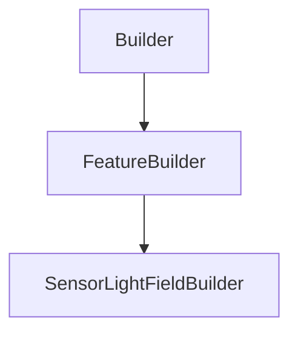

# SensorLightFieldBuilder

## Class Inheritance

**Classes:**

- [Builder](class-builder.md)
- [FeatureBuilder](class-featurebuilder.md)
- [SensorLightFieldBuilder](class-sensorlightfieldbuilder.md)

## Description

Represents a light field sensor builder.

## Member Summary

| Member | Type |
| --- | --- |
| [Type](#type) | public |
| [Selections](#selections) | public |
| [CustomAxisSystem](#customaxissystem) | public |
| [IncidentStart](#incidentstart) | public |
| [IncidentEnd](#incidentend) | public |
| [IncidentSampling](#incidentsampling) | public |
| [IncidentResolution](#incidentresolution) | public |
| [AzimuthStart](#azimuthstart) | public |
| [AzimuthEnd](#azimuthend) | public |
| [AzimuthSampling](#azimuthsampling) | public |
| [AzimuthResolution](#azimuthresolution) | public |
| [WavelengthStart](#wavelengthstart) | public |
| [WavelengthEnd](#wavelengthend) | public |
| [WavelengthSampling](#wavelengthsampling) | public |
| [WavelengthResolution](#wavelengthresolution) | public |
| [ArrowLength](#arrowlength) | public |

## Public Static Attributes

### Type

`int Type`

Gets or sets the sensor type.

The values are:  
0 - Photometric.  
1 - Radiometric.  
2 - Spectral.  
  
**Value type**: Integer.  
  
The default value is 1.

---

### Selections

`SensorLightFieldSelections Selections`

Returns the interface to select the oriented faces and bodies on which to measure the light distribution.

**Value type**: SensorLightFieldSelections object.

---

### CustomAxisSystem

`bool CustomAxisSystem`

Gets or sets the custom axis system property.

True: Enables custom axis system.  
False: Disables custom axis system.  
  
**Value type**: Boolean.  
  
The default value is False.

---

### IncidentStart

`float IncidentStart`

Gets the incident angle start.

**Value type**: Double (in degree).  
  
The default value is 0 deg.

---

### IncidentEnd

`float IncidentEnd`

Gets the incident angle end.

**Value type**: Double (in degree).  
  
The default value is 90 deg.

---

### IncidentSampling

`int IncidentSampling`

Gets or sets the incident sampling.

**Value type**: Integer.  
**Range**: The value must be superior or equal to 2.  
  
The default value is 10.

---

### IncidentResolution

`float IncidentResolution`

Gets or sets the incident resolution.

**Value type**: Double (in degree).  
**Range**: The value must be superior to 0.0.  
  
The default value is 9 deg.

---

### AzimuthStart

`float AzimuthStart`

Gets the azimuth start.

**Value type**: Double (in degree).  
  
The default value is 0 deg.

---

### AzimuthEnd

`float AzimuthEnd`

Gets the azimuth end.

**Value type**: Double (in degree).  
  
The default value is 360 deg.

---

### AzimuthSampling

`int AzimuthSampling`

Gets or sets the azimuth sampling.

**Value type**: Integer.  
**Range**: The value must be superior or equal to 2.  
  
The default value is 10.

---

### AzimuthResolution

`float AzimuthResolution`

Gets or sets the azimuth resolution.

**Value type**: Double (in degree).  
**Range**: The value must be superior to 0.0.  
  
The default value is 36 deg.

---

### WavelengthStart

`float WavelengthStart`

Gets the wavelength start.

**Value type**: Double (in nm).  
**Range**: The value must be superior to 0.0 and less than end value.  
  
The default value is 400 nm.

---

### WavelengthEnd

`float WavelengthEnd`

Gets the wavelength end.

**Value type**: Double (in nm).  
**Range**: The value must be superior to 0.0 and more than start value.  
  
The default value is 700 nm.

---

### WavelengthSampling

`int WavelengthSampling`

Gets or sets the wavelength sampling.

**Value type**: Integer.  
**Range**: The value must be superior or equal to 2.  
  
The default value is 13.

---

### WavelengthResolution

`float WavelengthResolution`

Gets or sets the wavelength resolution.

**Value type**: Double (in nm).  
**Range**: The value must be superior to 0.0.  
  
The default value is 25 nm.

---

### ArrowLength

`float ArrowLength`

Gets or sets the length of the arrow preview.

**Value type**: Double (in mm).  
**Range**: The value must be superior to 0.0.  
  
The default value is 10 mm.
