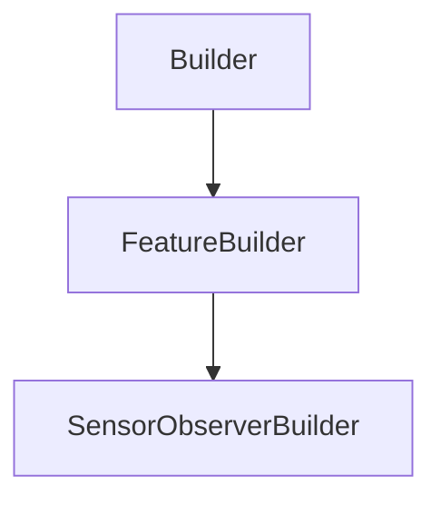

# SensorObserverBuilder

## Class Inheritance

**Classes:**

- [Builder](class-builder.md)
- [FeatureBuilder](class-featurebuilder.md)
- [SensorObserverBuilder](class-sensorobserverbuilder.md)

## Description

Represents the builder for an observer sensor.

## Member Summary

| Member | Type |
| --- | --- |
| [Distance](#distance) | public |
| [Focal](#focal) | public |
| [LayerType](#layertype) | public |
| [InterocularDistance](#interoculardistance) | public |
| [Stereo](#stereo) | public |
| [AxisSystem](#axissystem) | public |
| [WavelengthStart](#wavelengthstart) | public |
| [WavelengthEnd](#wavelengthend) | public |
| [WavelengthSampling](#wavelengthsampling) | public |
| [WavelengthResolution](#wavelengthresolution) | public |
| [VisionFieldHorizontalStart](#visionfieldhorizontalstart) | public |
| [VisionFieldHorizontalEnd](#visionfieldhorizontalend) | public |
| [VisionFieldHorizontalSampling](#visionfieldhorizontalsampling) | public |
| [VisionFieldHorizontalResolution](#visionfieldhorizontalresolution) | public |
| [VisionFieldHorizontalMirroredExtent](#visionfieldhorizontalmirroredextent) | public |
| [VisionFieldVerticalStart](#visionfieldverticalstart) | public |
| [VisionFieldVerticalEnd](#visionfieldverticalend) | public |
| [VisionFieldVerticalSampling](#visionfieldverticalsampling) | public |
| [VisionFieldVerticalResolution](#visionfieldverticalresolution) | public |
| [VisionFieldVerticalMirroredExtent](#visionfieldverticalmirroredextent) | public |
| [DimensionHorizontalStart](#dimensionhorizontalstart) | public |
| [DimensionHorizontalEnd](#dimensionhorizontalend) | public |
| [DimensionHorizontalSampling](#dimensionhorizontalsampling) | public |
| [DimensionHorizontalResolution](#dimensionhorizontalresolution) | public |
| [DimensionHorizontalMirroredExtent](#dimensionhorizontalmirroredextent) | public |
| [DimensionVerticalStart](#dimensionverticalstart) | public |
| [DimensionVerticalEnd](#dimensionverticalend) | public |
| [DimensionVerticalSampling](#dimensionverticalsampling) | public |
| [DimensionVerticalResolution](#dimensionverticalresolution) | public |
| [DimensionVerticalMirroredExtent](#dimensionverticalmirroredextent) | public |
| [UseAutomaticFraming](#useautomaticframing) | public |
| [AutomaticFramingHorizontal](#automaticframinghorizontal) | public |
| [AutomaticFramingVertical](#automaticframingvertical) | public |
| [IntegrationAngle](#integrationangle) | public |

## Public Static Attributes

### Distance

`float Distance`

Gets or sets the distance.

Adjusts the radius of the sphere to narrow or widen the global field of vision.  
**Value type**: Double (in mm).  
**Range**: The value must be superior to 0.  
  
The default value is 1000.0 mm.

---

### Focal

`float Focal`

Gets or sets the focal.

Adjusts the distance between the sensor radiance plan and the origin point of the observed object. The larger the focal, the closer to the object.  
**Value type**: Double (in mm).  
**Range**: The value must be superior to 0.  
  
The default value is 50.0 mm.

---

### LayerType

`int LayerType`

Gets or sets the layer type.

The values are:  
0 - None, the simulation generates a Speos360 file with one layer for all sources.  
1 - Source, the result includes one layer per active source.  
**Value type**: Integer.  
  
The default value is 0.

---

### InterocularDistance

`float InterocularDistance`

Gets or sets the interocular distance.

**Prerequisite**: The Stereo property must be True.  
**Value type**: Double (in mm).  
**Range**: The value must be superior to 0.0.  
  
The default value is 65.0 mm.

---

### Stereo

`bool Stereo`

gets or sets the stereo property.

When you define a stereo sensor, make sure that the Front direction is horizontal, the Top direction is vertical, and the Central resolution matches the intended 3D display.  
  
True: Enables stereo.  
False: Disables stereo.  
**Value type**: Boolean.  
  
The default value is False.

---

### AxisSystem

`AxisSystem AxisSystem`

Gets the axis system.

**Value type**: AxisSystem object.

---

### WavelengthStart

`float WavelengthStart`

Gets or sets the lower value of the wavelength range to be considered by the sensor.

The sensor does not take into account wavelengths beyond the borders that you define.  
**Value type**: Double (in nm).  
  
The default value is 400.0 nm.

---

### WavelengthEnd

`float WavelengthEnd`

Gets or sets the higher value of the wavelength range to be considered by the sensor.

The sensor does not take into account wavelengths beyond the borders that you define.  
**Value type**: Double (in nm).  
  
The default value is 700.0 nm.

---

### WavelengthSampling

`int WavelengthSampling`

Gets or sets the wavelength sampling.

**Value type**: Integer.  
**Range**: The value must be superior to 0.  
  
The default value is 13.

---

### WavelengthResolution

`float WavelengthResolution`

Gets or sets the Wavelength resolution

**Value type**: Double.

---

### VisionFieldHorizontalStart

`float VisionFieldHorizontalStart`

Gets or sets the horizontal start for vision field.

Vision Field corresponds to the surface on which are located observer positions around target point.  
**Value type**: Double (in degrees).  
**Range**: [-180.0, 180.0]  
  
The default value is -180.0 degrees.

---

### VisionFieldHorizontalEnd

`float VisionFieldHorizontalEnd`

Gets or sets the horizontal end for vision field.

Vision Field corresponds to the surface on which are located observer positions around target point.  
**Value type**: Double (in degrees).  
**Range**: [-180.0, 180.0]  
  
The default value is 180.0 degrees.

---

### VisionFieldHorizontalSampling

`int VisionFieldHorizontalSampling`

Gets or sets the horizontal sampling for vision field.

Vision Field corresponds to the surface on which are located observer positions around target point.  
**Value type**: Integer.  
**Range**: The value must be superior to 0.  
  
The default value is 9.

---

### VisionFieldHorizontalResolution

`float VisionFieldHorizontalResolution`

Gets or sets the horizontal resolution for vision field.

Vision Field corresponds to the surface on which are located observer positions around target point.  
**Value type**: Double.

---

### VisionFieldHorizontalMirroredExtent

`bool VisionFieldHorizontalMirroredExtent`

Gets or sets the mirrored extent property for horizontal vision field.

Vision Field corresponds to the surface on which are located observer positions around target point.  
  
True: VisionFieldHorizontalStart == -VisionFieldHorizontalEnd, you can only change the VisionFieldHorizontalEnd value.  
False: VisionFieldHorizontalStart and VisionFieldHorizontalEnd can have different value.  
**Value type**: Boolean.  
  
The default value is False.

---

### VisionFieldVerticalStart

`float VisionFieldVerticalStart`

Gets or sets the vertical start for vision field.

Vision Field corresponds to the surface on which are located observer positions around target point.  
**Value type**: Double (in degrees).  
**Range**: [-90.0, 90.0]  
  
The default value is -90.0 degrees.

---

### VisionFieldVerticalEnd

`float VisionFieldVerticalEnd`

Gets or sets the vertical end for vision field.

Vision Field corresponds to the surface on which are located observer positions around target point.  
**Value type**: Double (in degrees).  
**Range**: [-90.0, 90.0]  
  
The default value is 90.0 degrees.

---

### VisionFieldVerticalSampling

`int VisionFieldVerticalSampling`

Gets or sets the vertical sampling for vision field.

Vision Field corresponds to the surface on which are located observer positions around target point.  
**Value type**: Integer.  
**Range**: The value must be superior to 0.  
  
The default value is 5.

---

### VisionFieldVerticalResolution

`float VisionFieldVerticalResolution`

Gets or sets the vertical resolution for vision field.

Vision Field corresponds to the surface on which are located observer positions around target point.  
**Value type**: Double.

---

### VisionFieldVerticalMirroredExtent

`bool VisionFieldVerticalMirroredExtent`

Gets or sets the mirrored extent property for vertical vision field.

Vision Field corresponds to the surface on which are located observer positions around target point.  
  
True: VisionFieldVerticalStart == -VisionFieldVerticalEnd, you can only change the VisionFieldVerticalEnd value.  
False: VisionFieldVerticalStart and VisionFieldVerticalEnd can have different value.  
**Value type**: Boolean.  
  
The default value is False.

---

### DimensionHorizontalStart

`float DimensionHorizontalStart`

Gets or sets the horizontal start for dimension.

**Value type**: Double (in mm).  
  
The default value is -50.0 mm.

---

### DimensionHorizontalEnd

`float DimensionHorizontalEnd`

Gets or sets the horizontal end for dimension.

**Value type**: Double (in mm).  
  
The default value is 50.0 mm.

---

### DimensionHorizontalSampling

`int DimensionHorizontalSampling`

Gets or sets the horizontal sampling for dimension.

**Value type**: Integer.  
**Range**: The value must be superior to 0.  
  
The default value is 100.

---

### DimensionHorizontalResolution

`float DimensionHorizontalResolution`

Gets or sets the horizontal resolution for dimension.

**Value type**: Double.

---

### DimensionHorizontalMirroredExtent

`bool DimensionHorizontalMirroredExtent`

Gets or sets the mirrored extent property for horizontal dimension.

True: DimensionHorizontalStart == -DimensionHorizontalEnd, you can only change the DimensionHorizontalEnd value.  
False: DimensionHorizontalStart and DimensionHorizontalEnd can have different value.  
**Value type**: Boolean.  
  
The default value is False.

---

### DimensionVerticalStart

`float DimensionVerticalStart`

Gets or sets the vertical start for dimension.

**Value type**: Double (in mm).  
  
The default value is -50.0 mm.

---

### DimensionVerticalEnd

`float DimensionVerticalEnd`

Gets or sets the vertical end for dimension.

**Value type**: Double (in mm).  
  
The default value is 50.0 mm.

---

### DimensionVerticalSampling

`int DimensionVerticalSampling`

Gets or sets the vertical sampling for dimension.

**Value type**: Integer.  
**Range**: The value must be superior to 0.  
  
The default value is 100.

---

### DimensionVerticalResolution

`float DimensionVerticalResolution`

Gets or sets the vertical resolution for dimension.

**Value type**: Double.

---

### DimensionVerticalMirroredExtent

`bool DimensionVerticalMirroredExtent`

Gets or sets the mirrored extent property for vertical dimension.

True: DimensionVerticalStart == -DimensionVerticalEnd, you can only change the DimensionVerticalEnd value.  
False: DimensionVerticalStart and DimensionVerticalEnd can have different value.  
**Value type**: Boolean.  
  
The default value is False.

---

### UseAutomaticFraming

`bool UseAutomaticFraming`

Ativate or deactivate the automatic framing.

**Value type**: Boolean.  
  
The default value is false.

---

### AutomaticFramingHorizontal

`int AutomaticFramingHorizontal`

Gets or sets the automatic framing horizontal position.

**Value type**: Integer.  
**Range**: The value must be superior or equal to 0 and inferior or equal to the number of columns.  
  
The default value is 0.

---

### AutomaticFramingVertical

`int AutomaticFramingVertical`

Gets or sets the automatic framing horizontal position.

**Value type**: Integer.  
**Range**: The value must be superior or equal to 0 and inferior or equal to the number of lines.  
  
The default value is 0.

---

### IntegrationAngle

`float IntegrationAngle`

Gets or sets the integration angle.

**Value type**: Double (in degrees).  
  
The default value is 5.0 degrees.
