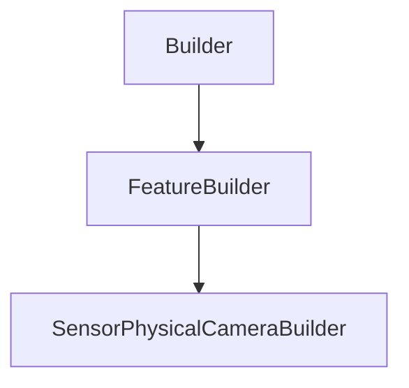

# SensorPhysicalCameraBuilder

## Class Inheritance

**Classes:**

- [Builder](class-builder.md)
- [FeatureBuilder](class-featurebuilder.md)
- [SensorPhysicalCameraBuilder](class-sensorphysicalcamerabuilder.md)

## Description

Represents a Sensor Physical Camera builder.

## Member Summary

| Member | Type |
| --- | --- |
| [LightBoxFilePath](#lightboxfilepath) | public |
| [UseSequenceFile](#usesequencefile) | public |
| [SequenceFilePath](#sequencefilepath) | public |
| [NumberOfSequences](#numberofsequences) | public |
| [Sensor](#sensor) | public |
| [RayTracerPrecisionType](#raytracerprecisiontype) | public |
| [PreviewMode](#previewmode) | public |

## Public Static Attributes

### LightBoxFilePath

`str LightBoxFilePath`

Gets or sets the property light box file path.

**Value type**: String.  
  
The default value is an empty file path (string).

---

### UseSequenceFile

`bool UseSequenceFile`

Gets or sets the property to enable the use of a sequence file

True: Enables Sequence File.  
False: Disables Sequence File.  
**Value type**: Boolean.

---

### SequenceFilePath

`str SequenceFilePath`

Gets or sets the property sequence file path.

**Prerequisite**: The UseSequenceFile property must be True.  
**Value type**: String.  
  
The default value is an empty file path (string).

---

### NumberOfSequences

`int NumberOfSequences`

Gets or sets the number of sequences.

**Value type**: Integer.  
**Range**: The value must be superior to 0.  
  
The default value is 10.

---

### Sensor

`int Sensor`

Gets or sets the irradiance sensor.

The Sensor property takes and returns a Tag from an irradiance.  
**Value type**: Integer.  
  
The default value is 0.

---

### RayTracerPrecisionType

`int RayTracerPrecisionType`

Gets or sets the ray tracer type.

The values are:  
0 - Double.  
1 - Single.  
**Value type**: Integer.  
  
The default value is Double.

---

### PreviewMode

`int PreviewMode`

Gets or sets the preview mode.

The values are:  
0 - Meshing.  
1 - BoundingBox.  
**Value type**: Integer.  
  
The default value is Meshing (0).
