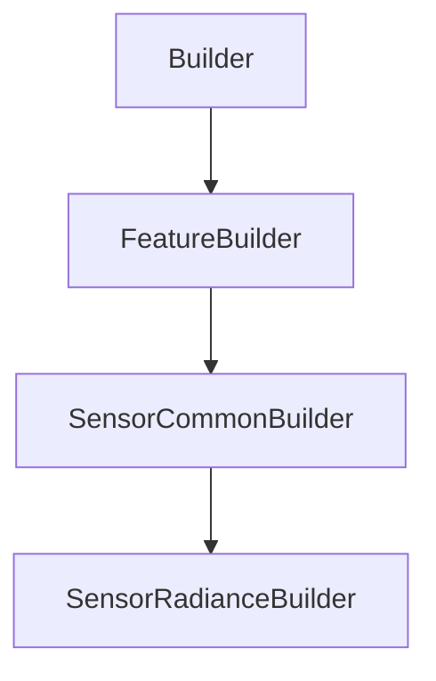

# SensorRadianceBuilder

## Class Inheritance

**Classes:**

- [Builder](class-builder.md)
- [FeatureBuilder](class-featurebuilder.md)
- [SensorCommonBuilder](class-sensorcommonbuilder.md)
- [SensorRadianceBuilder](class-sensorradiancebuilder.md)

## Description

Represents a Radiance Sensor Builder.

## Member Summary

| Member | Type |
| --- | --- |
| [Definition](#definition) | public |
| [CameraName](#cameraname) | public |
| [HVRatio](#hvratio) | public |
| [ObserverType](#observertype) | public |
| [Focal](#focal) | public |
| [FrameObserverPoint](#frameobserverpoint) | public |
| [IntegrationAngle](#integrationangle) | public |
| [ObserverPoint](#observerpoint) | public |
| [ObserverFrontDirection](#observerfrontdirection) | public |
| [ObserverTopDirection](#observertopdirection) | public |
| [ObserverFrontDirectionReversed](#observerfrontdirectionreversed) | public |
| [ObserverTopDirectionReversed](#observertopdirectionreversed) | public |
| [ObserverHorizontalFOV](#observerhorizontalfov) | public |
| [ObserverVerticalFOV](#obserververticalfov) | public |
| [ObserverHorizontalSampling](#observerhorizontalsampling) | public |
| [ObserverVerticalSampling](#obserververticalsampling) | public |
| [ObserverHorizontalResolution](#observerhorizontalresolution) | public |
| [ObserverVerticalResolution](#obserververticalresolution) | public |
| [UseAutomaticFraming](#useautomaticframing) | public |

## Public Static Attributes

### Definition

`int Definition`

Gets or sets the definition type.

The values are:  
0 - Frame.  
1 - Camera.  
2 - Observer.  
  
**Value type**: Integer.  
  
The default value is 0.

---

### CameraName

`Name CameraName`

Gets or sets the camera by its name.

**Prerequisite**: The DefinitionType property must be 1.  
  
**Value type**: String.  
  
The default value is an empty string.

---

### HVRatio

`float HVRatio`

Gets or sets the H/V ratio.

**Prerequisite**: The DefinitionType property must be 1.  
  
H/V Ratio modifies the X Start and X End values according to the Y Start and Y End values.  
  
**Value type**: Double.  
  
The default value is 1.33.

---

### ObserverType

`int ObserverType`

Gets or sets the observer type.

**Prerequisite**: The DefinitionType property must be 0.  
  
The values are:  
0 : Focal.  
1 : Observer.  
  
**Value type**: Integer.  
  
The default value is 0.

---

### Focal

`float Focal`

Gets or sets the focal.

**Prerequisite**: The DefinitionType property must be 2 or the ObserverType must be 0.  
  
Focal defines the distance between the sensor plane and the Observer point.  
  
**Value type**: Double (in mm).  
**Range**: The value must be superior to 0.  
  
The default value is 250.0 mm.

---

### FrameObserverPoint

`int FrameObserverPoint`

Gets or sets the frame observer point.

**Prerequisite**: The ObserverType must be 1.  
  
The property frame observer point takes a feature tag and returns a feature tag.  
Defines the location of the frame.  
  
**Value type**: Integer.  
  
The default value is 0.

---

### IntegrationAngle

`float IntegrationAngle`

Gets or sets the integration angle.

**Value type**: Double (in degrees).  
**Range**: (0.0, 90.0)  
  
The default value is 5.0 degrees.

---

### ObserverPoint

`int ObserverPoint`

Gets or sets the observer point.

**Prerequisite**: The DefinitionType must be 2.  
  
The property observer point takes a feature tag and returns a feature tag.  
Defines the location of the observer.  
  
**Value type**: Integer.  
  
The default value is 0.

---

### ObserverFrontDirection

`int ObserverFrontDirection`

Gets or sets the observer front direction.

**Prerequisite**: The DefinitionType must be 2.  
  
The property observer front direction takes a feature tag and returns a feature tag.  
  
**Value type**: Integer.  
  
The default value is 0.

---

### ObserverTopDirection

`int ObserverTopDirection`

Gets or sets the observer top direction.

**Prerequisite**: The DefinitionType must be 2.  
  
The property observer top direction takes a feature tag and returns a feature tag.  
  
**Value type**: Integer.  
  
The default value is 0.

---

### ObserverFrontDirectionReversed

`bool ObserverFrontDirectionReversed`

Gets or sets the reverse direction of observer front direction.

**Prerequisite**: The DefinitionType must be 2.  
  
True: Reverses the observer front direction.  
False: Does not reverse the Observer Front Direction.  
  
**Value type**: Boolean.  
  
The default value is False.

---

### ObserverTopDirectionReversed

`bool ObserverTopDirectionReversed`

Gets or sets the reverse direction of observer top direction.

**Prerequisite**: The DefinitionType must be 2.  
  
True: Reverses the Observer top Direction.  
False: Does not reverse the observer top direction.  
  
**Value type**: Boolean.  
  
The default value is False.

---

### ObserverHorizontalFOV

`float ObserverHorizontalFOV`

Gets or sets the observer horizontal field of view.

**Prerequisite**: The DefinitionType must be 2.  
  
**Value type**: Double (in degrees).  
**Range**: (0, 180)  
  
The default value is 2.0 degrees.

---

### ObserverVerticalFOV

`float ObserverVerticalFOV`

Gets or sets the observer vertical field of view.

**Prerequisite**: The DefinitionType must be 2.  
  
**Value type**: Double.  
**Range**: (0, 180)  
  
The default value is 2.0 degrees.

---

### ObserverHorizontalSampling

`int ObserverHorizontalSampling`

Gets or sets the observer horizontal sampling.

**Prerequisite**: The DefinitionType must be 2.  
  
**Value type**: Integer.  
**Range**: The value must be superior to 0.  
  
The default value is 100.

---

### ObserverVerticalSampling

`int ObserverVerticalSampling`

Gets or sets the observer vertical sampling.

**Prerequisite**: The DefinitionType must be 2.  
  
**Value type**: Integer.  
**Range**: The value must be superior to 0.  
  
The default value is 100.

---

### ObserverHorizontalResolution

`float ObserverHorizontalResolution`

Gets or sets the observer horizontal resolution.

**Prerequisite**: The DefinitionType must be 2.  
  
**Value type**: Integer.

---

### ObserverVerticalResolution

`float ObserverVerticalResolution`

Gets or sets the observer vertical resolution.

**Prerequisite**: The DefinitionType must be 2.  
  
**Value type**: Integer.

---

### UseAutomaticFraming

`bool UseAutomaticFraming`

Gets or sets the property to enable automatic framing.

**Prerequisite**: The DefinitionType must be 2 or the ObserverType must be 0.  
  
Automatic Framing reframes the camera on the radiance sensor.  
  
True : Enable Automatic Framing.  
False : Disable Automatic Framing.  
  
**Value type**: Boolean.  
  
The default value is False.
