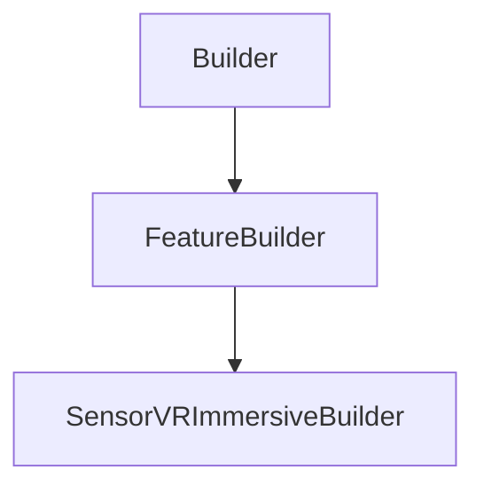

# SensorVRImmersiveBuilder

## Class Inheritance

**Classes:**

- [Builder](class-builder.md)
- [FeatureBuilder](class-featurebuilder.md)
- [SensorVRImmersiveBuilder](class-sensorvrimmersivebuilder.md)

## Description

Represents the builder for an immersive sensor.

## Member Summary

| Member | Type |
| --- | --- |
| [Sampling](#sampling) | public |
| [Resolution](#resolution) | public |
| [LayerType](#layertype) | public |
| [Stereo](#stereo) | public |
| [InterocularDistance](#interoculardistance) | public |
| [AxisSystem](#axissystem) | public |
| [Front](#front) | public |
| [Bottom](#bottom) | public |
| [Top](#top) | public |
| [Back](#back) | public |
| [Left](#left) | public |
| [Right](#right) | public |
| [UseAutomaticFraming](#useautomaticframing) | public |
| [AutomaticFramingFace](#automaticframingface) | public |
| [WavelengthStart](#wavelengthstart) | public |
| [WavelengthEnd](#wavelengthend) | public |
| [WavelengthSampling](#wavelengthsampling) | public |
| [WavelengthResolution](#wavelengthresolution) | public |
| [PreviewSize](#previewsize) | public |
| [IntegrationAngle](#integrationangle) | public |

## Public Static Attributes

### Sampling

`int Sampling`

Gets or sets the sampling.

Edits the value to compute the resolution of the result.  
  
**Value type**: Integer.  
**Range**: The value must be superior or equal to 0.  
  
The default value is 600.

---

### Resolution

`float Resolution`

Gets the resolution.

**Value type**: Double.

---

### LayerType

`int LayerType`

Gets or sets the layer type.

The values are:  
0 - None, the simulation generates a Speos360 file with one layer for all sources.  
1 - Source, the result includes one layer per active source.  
  
**Value type**: Integer.  
  
The default value is 0.

---

### Stereo

`bool Stereo`

gets or sets the stereo property.

When you define a stereo sensor, make sure that the Front direction is horizontal, the Top direction is vertical, and the Central resolution matches the intended 3D display.  
  
True: Enables stereo.  
False: Disables stereo.  
  
**Value type**: Boolean.  
  
The default value is False.

---

### InterocularDistance

`float InterocularDistance`

Gets or sets the interocular distance.

**Prerequisite**: The Stereo property must be True.  
  
**Value type**: Double (in mm).  
**Range**: The value must be superior to 0.0.  
  
The default value is 65.0 mm.

---

### AxisSystem

`DataModels::CAxisSystem AxisSystem`

Gets the axis system.

**Value type**: AxisSytem object.

---

### Front

`bool Front`

Gets or sets the front face property.

True: Enables front face in the simulation.  
False: Disables front face in the simulation.  
  
**Value type**: Boolean.  
  
The default value is True.

---

### Bottom

`bool Bottom`

Gets or sets the bottom face property.

True: Enables bottom face in the simulation.  
False: Disables bottom face in the simulation.  
  
**Value type**: Boolean.  
  
The default value is True.

---

### Top

`bool Top`

Gets or sets the top face property.

True: Enables top face in the simulation.  
False: Disables top face in the simulation.  
  
**Value type**: Boolean.  
  
The default value is True.

---

### Back

`bool Back`

Gets or sets the back face property.

True: Enables back face in the simulation.  
False: Disables back face in the simulation.  
  
**Value type**: Boolean.  
  
The default value is True.

---

### Left

`bool Left`

Gets or sets the left face property.

True: Enables left face in the simulation.  
False: Disables left face in the simulation.  
  
**Value type**: Boolean.  
  
The default value is True.

---

### Right

`bool Right`

Gets or sets the right face property.

True: Enables right face in the simulation.  
False: Disables right face in the simulation.  
  
**Value type**: Boolean.  
  
The default value is True.

---

### UseAutomaticFraming

`bool UseAutomaticFraming`

Gets or sets the automatic framing property.

True: Activates automatic framing.  
False: Deactivates automatic framing.  
  
**Value type**: Boolean.  
  
The default value is False.

---

### AutomaticFramingFace

`int AutomaticFramingFace`

Gets or sets the automatic framing face.

**Prerequisite**: The EnableFraming property must be True.  
Positions the camera, in the 3D view, according to the faces selected from the choice list.  
  
The values are:  
0 - FRONT.  
1 - BACK.  
2 - TOP.  
3 - BOTTOM.  
4 - LEFT.  
5 - RIGHT.  
  
**Value type**: Integer.  
  
The default value is 0.

---

### WavelengthStart

`float WavelengthStart`

Gets or sets the lower value of the wavelength range to be considered by the sensor.

The sensor does not take into account wavelengths beyond the borders that you define.  
  
**Value type**: Double (in nm).  
  
The default value is 400.0 nm.

---

### WavelengthEnd

`float WavelengthEnd`

Gets or sets the higher value of the wavelength range to be considered by the sensor.

The sensor does not take into account wavelengths beyond the borders that you define.  
  
**Value type**: Double (in nm).  
  
The default value is 700.0 nm.

---

### WavelengthSampling

`int WavelengthSampling`

Gets or sets the wavelength sampling.

**Value type**: Integer.  
**Range**: The value must be superior to 0.  
  
The default value is 13.

---

### WavelengthResolution

`float WavelengthResolution`

Gets or sets the Wavelength resolution

**Value type**: Double.

---

### PreviewSize

`float PreviewSize`

Gets or sets the preview arrows size.

**Value type**: Double (in nm).  
  
The default value is 500.0 nm.

---

### IntegrationAngle

`float IntegrationAngle`

Gets or sets the integration angle.

**Value type**: Double (in degrees).  
  
The default value is 5.0 degrees.
