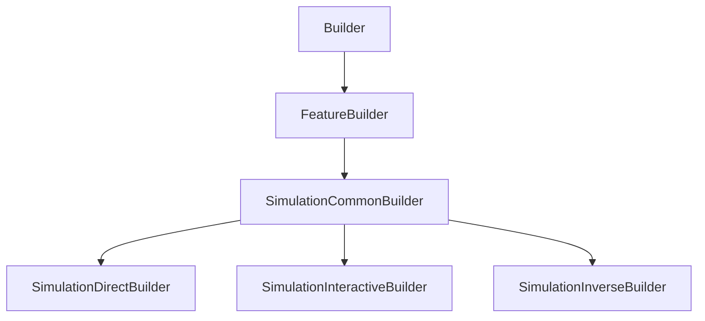

# SimulationCommonBuilder

## Class Inheritance

**Classes:**

- [Builder](class-builder.md)
- [FeatureBuilder](class-featurebuilder.md)
- [SimulationCommonBuilder](class-simulationcommonbuilder.md)
- [SimulationDirectBuilder](class-simulationdirectbuilder.md)
- [SimulationInteractiveBuilder](class-simulationinteractivebuilder.md)
- [SimulationInverseBuilder](class-simulationinversebuilder.md)

## Description

A base class for all Simulation Builders.

## Member Summary

| Member | Type |
| --- | --- |
| [FeatureSimulation](#featuresimulation) | public |
| [Sources](#sources) | public |
| [Geometries](#geometries) | public |
| [Sensors](#sensors) | public |
| [EstimatedRam](#estimatedram) | public |
| [LightExpert](#lightexpert) | public |
| [UseAmbientMaterial](#useambientmaterial) | public |
| [AmbientMaterial](#ambientmaterial) | public |
| [StandardDeviation](#standarddeviation) | public |
| [UsePresetSettings](#usepresetsettings) | public |
| [Preset](#preset) | public |
| [AllPreset](#allpreset) | public |
| [Settings](#settings) | public |
| [RemoveSources](#removesources) | public |
| [RemoveGeometries](#removegeometries) | public |
| [RemoveSensors](#removesensors) | public |

## Public Static Attributes

### FeatureSimulation

`FeatureSimulation FeatureSimulation`

Gets the simulation feature object.

Gets the simulation feature in order to launch simulations.  
**Value type**: FeatureSimulation object.

---

### Sources

`list[Feature] Sources`

Gets or sets source features.

Gets or sets the current source features that are in the simulation.  
**Value type**: List of Feature object.

---

### Geometries

`list[int] Geometries`

Gets or sets geometries tag.

The Geometries property returns a list of feature tag.

---

### Sensors

`list[Feature] Sensors`

Gets or sets sensor features.

Gets or sets the current sensor features that are in the simulation.  
**Value type**: List of Feature object.

---

### EstimatedRam

`str EstimatedRam`

Gets the estimated RAM usage.

**Value type**: String.

---

### LightExpert

`bool LightExpert`

Gets or sets the property to enable Light Expert.

True: Enables Light Expert.  
False: Disables Light Expert.  
**Value type**: Boolean.  
  
The default value is False.

---

### UseAmbientMaterial

`bool UseAmbientMaterial`

Gets or sets the property to enable ambient material.

True: Enables Ambient Material.  
False: Disables Ambient Material.  
**Value type**: Boolean.  
  
The default value is False.

---

### AmbientMaterial

`Feature AmbientMaterial`

Gets or sets the ambient material.

The AmbientMaterial property takes a feature and returns a feature.  
**Value type**: Feature object.  
  
The default value is None.

---

### StandardDeviation

`float StandardDeviation`

Gets or sets the standard deviation.

**Prerequisite**: Only available with the inverse simulation with Monte Carlo algorithm and Optimized Propagation sets to Relative or Absolute.  
**Value type**: Double.  
**Range**: ]0, 1[  
  
The default value is 0.05.

---

### UsePresetSettings

`bool UsePresetSettings`

Gets or sets the property to enable preset settings.

True: Enable Preset Settings  
False: Disable Preset Settings  
**Value type**: Boolean.  
  
The default value is False.

---

### Preset

`DataModels::CPreset Preset`

Gets or sets the Preset object.

A preset is a predefined set of the general simulation settings.  
**Value type**: Preset object.  
  
The default value is None.

---

### AllPreset

`list[DataModels::CPreset] AllPreset`

Gets all Preset.

**Value type**: List of Preset object.

---

### Settings

`DataModels::CSimulationSettings Settings`

Gets or sets the simulation settings.

**Value type**: SimulationSettings object.

## Public Member Functions

### RemoveSources

`void RemoveSources(self, sources)`

Deletes sources from the simulation.

**Parameters**:

- `list[Feature] sources`: List of Feature object

---

### RemoveGeometries

`void RemoveGeometries(self, tags)`

Deletes geometries from the simulation.

The DeleteGeometries function takes a list of feature tag as parameter.

**Parameters**:

- `list[int] tags`: List of tags.

---

### RemoveSensors

`void RemoveSensors(self, sensors)`

Deletes sensors from the simulation.

**Parameters**:

- `list[Feature] sensors`: List of Feature object.
