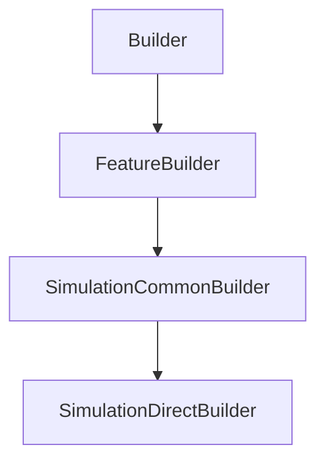

# SimulationDirectBuilder

## Class Inheritance

**Classes:**

- [Builder](class-builder.md)
- [FeatureBuilder](class-featurebuilder.md)
- [SimulationCommonBuilder](class-simulationcommonbuilder.md)
- [SimulationDirectBuilder](class-simulationdirectbuilder.md)

## Description

Represents an Direct Simulation Builder.

## Member Summary

| Member | Type |
| --- | --- |
| [StopOnRaysNumber](#stoponraysnumber) | public |
| [NumberOfRays](#numberofrays) | public |
| [NumberOfRaysMultiplier](#numberofraysmultiplier) | public |
| [StopOnDuration](#stoponduration) | public |
| [Duration](#duration) | public |
| [UseRayFile](#userayfile) | public |
| [RayFileFormat](#rayfileformat) | public |
| [MaximumNumberOfPaths](#maximumnumberofpaths) | public |
| [UsePartFamilies](#usepartfamilies) | public |
| [FamilySelection](#familyselection) | public |
| [GeometriesOptions](#geometriesoptions) | public |
| [SensorsOptions](#sensorsoptions) | public |

## Public Static Attributes

### StopOnRaysNumber

`bool StopOnRaysNumber`

Gets or sets the property to enable stop on rays number.

True: Enables stop on RaysNumber property.  
False: Disables stop on RaysNumber property.  
**Value type**: Boolean.  
  
The default value is True.

---

### NumberOfRays

`int NumberOfRays`

Gets or sets the number of rays.

**Prerequisite**: The StopOnRaysNumber property must be True.  
  
Number of rays necessary to reach for the simulation to end.  
**Value type**: Integer.  
**Range**: The value must be superior to 0.  
  
The default value is 200.

---

### NumberOfRaysMultiplier

`int NumberOfRaysMultiplier`

Gets or sets the number of rays multiplier.

**Prerequisite**: The StopOnRaysNumber property must be True.  
  
The values are:  
0 - Rays.  
1 - Kilo-Rays.  
2 - Mega-Rays.  
3 - Giga-Rays.  
**Value type**: Integer.  
  
The default value is 1.

---

### StopOnDuration

`bool StopOnDuration`

Gets or sets the property to stop on duration.

True: Enables stop on Duration property  
False: Disables stop on Duration property  
**Value type**: Boolean.  
  
The default value is False.

---

### Duration

`float Duration`

Gets or sets the duration.

**Prerequisite**: The StopOnDuration property must be True.  
  
Time necessary to reach for the simulation to end.  
**Value type**: Double (in second).  
**Range**: The value must be superior to 0.0.  
  
The default value is 1800.0 s.

---

### UseRayFile

`bool UseRayFile`

Gets or sets the property to enable ray file.

True: Enables Ray file.  
False: Disables Ray file.  
**Value type**: Boolean.  
  
The default value is False.

---

### RayFileFormat

`int RayFileFormat`

Gets or sets the ray file format.

**Prerequisite**: The EnableRayFile property must be True.  
  
Type of ray file that the simulation creates at the end.  
  
The values are:  
0 - Speos without Polarization.  
1 - Speos with Polarization.  
2 - IES TM-25 without Polarization.  
3 - IES TM-25 with Polarization.  
**Value type**: Integer.  
  
The default value is 0.

---

### MaximumNumberOfPaths

`int MaximumNumberOfPaths`

Gets or sets the maximum number of paths.

**Prerequisite**: The EnableLightExpert property must be True.  
  
The Maximum paths corresponds to the maximum number of rays the Light Path Finder file (\*.lpf or \*.lp3) can contain.  
**Value type**: Integer.  
**Range**: The value must be superior to 0.  
  
The default value is 100,000.

---

### UsePartFamilies

`bool UsePartFamilies`

Gets or sets the property to use family tables.

True: Enables multi-configuration to run in the simulation.  
False: Disables multi-configuration to run in the simulation.  
**Value type**: Boolean.  
  
The default value is False.

---

### FamilySelection

`list[str] FamilySelection`

Gets or sets the family selection list.

**Prerequisite**: The UseFamilyTables property must be True.  
  
Selects the configurations to run with the simulation.  
**Value type**: List of string.  
  
The default value is an empty list.

---

### GeometriesOptions

`list[GeometryOptions] GeometriesOptions`

Gets the list of geometry options.

Allows to Activate/Deactivate specific options for each geometry in the simulation.  
**Value type**: List of CGeometryOptions.  
  
The default value is an empty list.

---

### SensorsOptions

`list[SensorOptions] SensorsOptions`

Gets the list of sensor options.

Allows to Activate/Deactivate specific options for each sensor in the simulation.  
**Value type**: List of CSensorOptions.  
  
The default value is an empty list.
