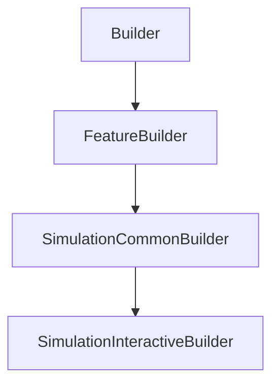

# SimulationInteractiveBuilder

## Class Inheritance

**Classes:**

- [Builder](class-builder.md)
- [FeatureBuilder](class-featurebuilder.md)
- [SimulationCommonBuilder](class-simulationcommonbuilder.md)
- [SimulationInteractiveBuilder](class-simulationinteractivebuilder.md)

## Description

Represents an Interactive Simulation Builder.

## Member Summary

| Member | Type | Description |
| --- | --- | --- |
| [InfiniteRayLength](#infiniteraylength) | public | Gets or sets the infinite ray length. |

## Public Static Attributes

### InfiniteRayLength

`float InfiniteRayLength`

Gets or sets the infinite ray length.

Defines the rays length displayed in the 3D view.  
  
**Value type**: Double (in mm).  
**Range**: The value must be superior or equal to 0.  
  
The default value is 75.0 mm.
